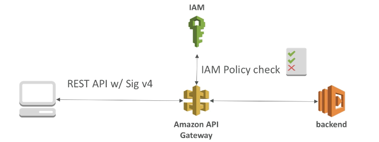
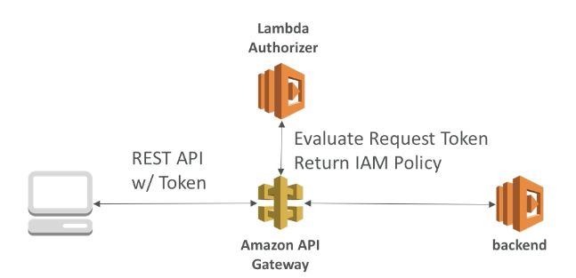
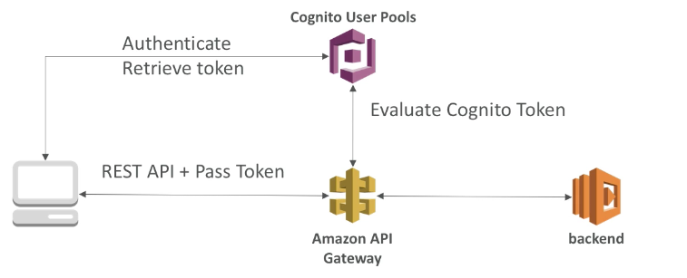

export const Quote = ({ children, color }) => (
	
		{children}
	
)

## I. Introduction

1. API Gateway acts as a “front door” for applications to access data, business logic, or functionality from your back-end services, such as applications running on EC2, ECS, Beanstalk etc
2. Can process thousands of concurrent API calls
3. Can create HTTP, REST or websocket API
4. **Lambda + Gateway = No infra to manage**
5. Support for websockets
6. Support for API versioning
7. Handle different env (dev, prod)
8. Handle security, protection from DDoS
9. Create API keys, handle request throttling
10. Swagger and OpenAPI support for quick docs
11. Transform and validate requests and responses
12. Generate SDK and API specs
13. Cache API responses
14. **Edge-optimized (default, global)**
    1. Requests are routed through the CloudFront edge locations
    2. The API Gateway still lives in one region

15. **Regional**
    1. For clients within same region
    2. Could manually combine with CloudFront (more control over caching)

16. **Private**
    1. Can only be accessed inside a VPC
    2. Use a resource policy to define access

17. IAM
    1. Create an IAM policy authorization and attach User/Role
    2. API Gateway verifies IAM permissions passed by the calling application
    3. Good to provide access within your own infrastructure
    4. Leverages sigv4 where IAM credentials are in the header

18. Lambda (custom) Authorizer
    1. Uses lambda to validate token in the header
    2. Option to cache result of auth, say 1 hour
    3. Helps to use OAuth/SAML/third-party auth
    4. Lambda must return a policy for the user

19. Cognito user pools
    1. Cognito fully manages user lifecycle
    2. API gateway verifies identity automatically from Cognito
    3. No custom implementation required
    4. Cognito only helps with authentication, not authorization

## II. Why API Gateway?

Amazon API Gateway provides developers with a simple, flexible, fully managed, pay-as-you-go service that handles all aspects of creating and operating robust APIs for application back ends.
1. **Metering** — API Gateway helps you define plans that meter and restrict third-party developer access to your APIs. You can define a set of plans, configure throttling, and quota limits on a per API key basis. API Gateway automatically meters traffic to your APIs and lets you extract utilization data for each API key.
2. **Security** — API Gateway allows you to leverage AWS administration and security tools, such as IAM and Cognito, to authorize access to your APIs. Can also help you verify incoming bearer tokens, removing authorization concerns from your backend code.
3. **Resiliency** — API Gateway helps you <Quote>manage traffic w/ throttling</Quote> so that backend operations can withstand traffic spikes. API Gateway also helps you improve the performance of your APIs and the latency your end users experience by **caching the output of API calls to avoid calling your backend every time.**
## III. API Gateway Tips
1. You can enable API caching in Amazon API Gateway to cache your endpoint's responses. With caching, you can reduce the number of calls made to your endpoint and also improve the latency of requests to your API.
2. **When you enable caching for a stage, API Gateway caches responses from your endpoint for a specified time-to-live (TTL) period, in seconds.** API Gateway then responds to the request by looking up the endpoint response from the cache instead of making a request to your endpoint. The default TTL value for API caching is 300 seconds. The maximum TTL value is 3600 seconds. TTL=0 means caching is disabled.
3. When request submissions exceed the steady-state request rate and burst limits, API Gateway fails the limit-exceeding requests and returns `429 Too Many Requests` error responses to the client.
4. <Quote>Per-client throttling limits are applied to clients</Quote> that use API keys associated with your usage policy as client identifier. This can be applied to the single customer that is issuing excessive API requests.
5. <Quote>Cache is enabled for stage, NOT for method.</Quote>
6. You can enable **throttling** && **result caching** to limit number of requests and prevent your backend from getting crashed.
7. API Gateway can execute lambda, step functions, Beanstalk and external HTTP services.
8. You can sell your API Gateway on Amazon Marketplace.
9. Integrated with CloudWatch so you get performance metrics like API calls, latency and error rates. Can set up custom alarms.
10. <Quote>Can enable WAF to protect against XSS and SQL Injection.</Quote>
11. You only pay for API calls you receive and the amount of data transferred out.
12. <Quote>You can use X-Ray to trace and analyze user requests as they travel through API Gateway.</Quote>
13. For using proxy integration, the lambda output MUST be JSON.
14. All API calls made to the Amazon API Gateway APIs to create, modify, delete, or deploy REST APIs are logged to CloudTrail in your AWS account.
15. Amazon API Gateway logs API calls, latency, and error rates to Amazon CloudWatch in your AWS account. Optionally, you can enable **detailed metrics** for each method in your REST API, billed to regular CloudWatch rates.

