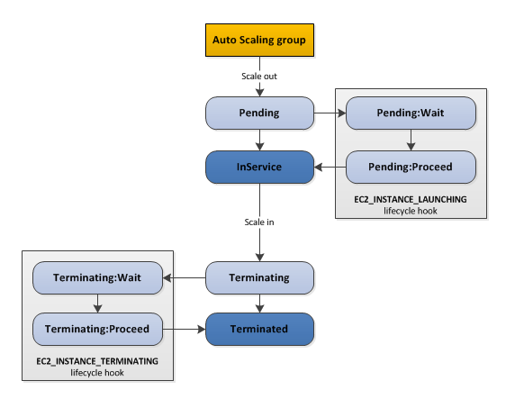
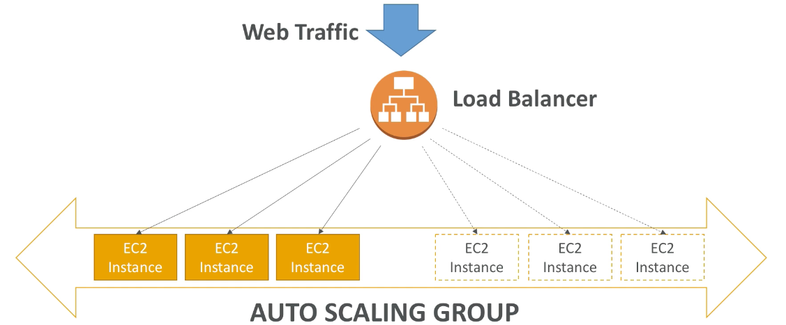

export const Highlight = ({ children, color }) => (
	
		{children}
	
)

export const Quote = ({ children, color }) => (
	
		{children}
	
)

## I. Introduction

1. Auto Scaling Groups (ASG) can manage resources with user traffic.
2. The goal of ASG is:
    1. Scale out (add instances)
    2. Scale in (remove instances)
    3. Ensure there's a min/max for both ends
    4. Automatically register instances to ELB

3. All ASGs have a **launch config** (old) or a **launch template** (new)
    1. A launch configuration
        1. AMI + Instant Type
        2. EC2 user data
        3. EBS volumes
        4. Security Groups
        5. SSH Key Pair

    2. Min/Max size, initial capacity
    3. Network + Subnet information
    4. Load balancer information
    5. Scaling policies

4. <Highlight>It is possible to scale ASG based on CloudWatch alarms.</Highlight>
5. It is now possible to define **better** auto scaling rules that are directly managed by EC2
    1. Target average CPU usage
    2. Number of request on ELB per instance
    3. Average network in/out

6. We can also scale based on custom metric e.g. number of connected users
    1. Send custom metric from app on EC2 to CloudWatch (`PutMetric` API)
    2. Create CloudWatch alarm to react to low/high values
    3. Use the alarm as scaling policy for ASG

7. <Highlight>ASG will automatically create a new instance when an existing instance is down or unhealthy (+ terminate the unhealthy instance).</Highlight>

## II. Scaling Policies

1. <Highlight>Target-tracking scaling</Highlight>
    1. Most simple and easy set up e.g. I want average ASG CPU to stay around 50%
    2. Increase or decrease the current capacity of the group based on a target value for a specific metric.
    3. This is similar to the way that your thermostat maintains the temperature of your home.
    4. If you are scaling based on a utilization metric that increases or decreases proportionally to the number of instances in an Auto Scaling group, then it is recommended that you use target tracking scaling policies. Otherwise, it is better to use step scaling policies instead.
2. <Highlight>Step scaling</Highlight>
    1. When a CloudWatch alarm is triggered (CPU > 70%) → add 2 units
    2. Increase or decrease the current capacity of the group **based on a set** of scaling adjustments, known as step adjustments, that vary based on the size of the alarm breach.

3. <Highlight>Simple scaling</Highlight>
    1. Increase or decrease the current capacity of the group based on a **single** scaling adjustment.

4. <Highlight>Scheduled scaling</Highlight>
    1. Anticipate a scaling event based on historical data e.g. add 2 units on Fridays

5. Scaling cool-downs
    1. The cool-down period helps ensure that the ASG doesn't launch or terminate before the previous scaling activity takes place.
    2. In addition to default cooldowns, we can create cooldowns that apply to a specific simple scaling policy. This would override the default cooldown period.
    3. If the default cooldown period of 300s is too long, you can reduce costs by applying a scaling-specific period of 180 seconds to the scale-in policy.
    4. <Highlight>If your app is scaling up and down multiple times each hour, modify the ASG cool-down timers and CloudWatch alarm periods that trigger the scaling.</Highlight>

## III. Health checks

1. <Highlight>If using an ELB, it is best to enable ELB health checks as otherwise EC2 status checks may show an instance as being healthy that the ELB has determined is unhealthy. In this case the instance will be removed from service by the ELB but will not be terminated by Auto Scaling Group.</Highlight>
2. <Highlight>ASG uses EC2 health checks by default. It can also use ELB health checks and custom health checks. ELB health checks are in addition to the EC2 status checks.</Highlight>
3. If any ASG health check returns an unhealthy status then the instance will be terminated.
4. When a ELB marks an instance as unhealthy, it reports it as `OutOfService`
5. A healthy instance enters the `InService` state.
6. If an instance is marked as unhealthy, it will be scheduled for replacement.
7. <Highlight>If connection draining is enabled, ASG waits for in-flight requests to complete or timeout before terminating instances.</Highlight>
8. The health check grace period allows a period of time for a new instance to warm up before performing a health check (300 seconds by default).
9. An instance is deemed unhealthy if there's a hardware impairment or it does not pass ELB health check. You can customize the health checks, pause and resume them.
10. When ELB notices that the instance is unhealthy, it will stop routing requests to it. However, prior to discovering that the instance is unhealthy, <Highlight>some requests to that instance will fail</Highlight>.
11. If any health check returns an unhealthy status the instance will be terminated. <Highlight>For the `impaired` status, the ASG will wait a few minutes to see if the instance recovers before taking action. If the `impaired` status persists → termination occurs.</Highlight>

|                                        EC2 health check                                       | ELB health check                                                                                           | ASG health check                                                                                                |
|:---------------------------------------------------------------------------------------------:|----------------------------------------------------------------------------------------------------------------|-----------------------------------------------------------------------------------------------------------------|
| 1. Automated built-in checks for hardware and software.                                       | 1. ELB checks health of registered instances using default ELB check or one configured by user e.g. ASG check. | 1. All instances start with healthy. An unhealthy status can come from EC2 default, ELB or custom health check. |
| 2. Cannot be deleted or disabled.                                                             | 2. You'd need a port, protocol (HTTP, HTTPS, TCP, SSL) and a ping path.                                        | 2. If the ASG has ELB attached, <Highlight>it would consider both EC2 default and ELB health checks.</Highlight>                   |
| 3. Performed every minute.                                                                    | 3. NLB can use either an active or passive health check.                                                       | 3. As soon as an instance is deemed unhealthy, ASG would launch a replacement.                                  |
| 4. System checks require AWS involvement whereas Instance checks can be resolved by the user. |                                                                                                                |                                                                                                                 |

## IV. ASG Tips

1. ASG default termination policy (balance instances across AZs)
    1. Find the AZ with most number of instances
    2. <Highlight>Delete the one with oldest launch config</Highlight>

2. ASG provides several lifecycle hooks to define custom actions

3. <Quote>Launch template vs Launch config</Quote>

1. Both allow defining AMI, instance type, SG and other usual EC2 parameters
2. Launch config is legacy and must be re-created every time
3. <Highlight>Launch template is newer and recommended. It allows versioning and provision on-demand + spot as well as T2 burst instances.</Highlight>

4. ASG and ELB work hand-in-hand

5. **Fleet management** —  Automatically replace unhealthy instances and maintains your fleet at a desired capacity.

6. **Dynamic scaling** — Automatically increase or decrease capacity based on load or other metrics e.g. add a new instance when the CPU spikes above 80%.

7. **Target tracking** — Set target for a metric you want to track and ASG will adjust the instance count automatically.

8. <Highlight>If you delete an ASG, all its running instances will be terminated.</Highlight>

9. You can configure SNS to receive notifications whenever ASG grows or shrinks.

10. Launch configuration is a template that an EC2 ASG uses to launch EC2 instances. It contains information including AMI, instance type, key pair and security groups.

11. When you create an EC2 scaling group, you MUST specify a launch configuration.

12. <Highlight>You can't modify a launch configuration after creating it.</Highlight>

13. <Highlight>ASG can span across AZs but not regions.</Highlight>

14. You can use AWS CodeDeploy or CloudFormation to orchestrate code changes to multiple instances in your ASG.

15. Data is NOT copied automatically to a newly created instance in ASG.

16. Lifecycle hooks let you take action before an instance goes in service or before it gets terminates e.g. <Highlight>you could use a terminate hook to write fleet log to S3 when an instance goes out of service.</Highlight>

18. You don't have to use ELB to use ASG! You can use EC2 health check to identify and replace unhealthy instances.

19. When an `impaired` instance fails a health check, Amazon EC2 Auto Scaling automatically terminates it and replaces it with a new one. If you’re using an Elastic Load Balancing load balancer, Amazon EC2 Auto Scaling gracefully detaches the impaired instance from the load balancer before provisioning a new one and attaching it to the load balancer. This is all done automatically, so you don’t need to respond manually when an instance needs replacing.

20. The turnaround time is within minutes. The majority of replacements happen within less than 5 minutes, and on average it is significantly less than 5 minutes. It depends on a variety of factors, including how long it takes to boot up the AMI of your instance.

22. If you are not using ELB, you can re-route requests using Route 53 or a reverse proxy.

23. <Highlight>You can configure ASG to mix and match EC2 instance types (Spot, RI)</Highlight>. You can also customize number of CPUs, RAM etc.

24. <Highlight>You can specify which subnets Auto Scaling will launch new instances into. ASG will always aim to keep your instances balanced across AZs.</Highlight>

26. <Highlight>You can attach already-running EC2 instances to your ASG but make sure you don't exceed the upper cap of the ASG.</Highlight>

27. <Highlight>Make sure to add ALL subnets to ASG while in VPC. ASG cannot do that automatically.</Highlight>

28. <Highlight>Instances showing `OutOfService` from ELB? Health check configuration not properly defined.</Highlight>

29. Prevent ASG from scaling temporarily?

1. Place the EC2 instance that is experiencing issues into the `Standby` state
2. Suspend the scaling processes responsible for launching new instances