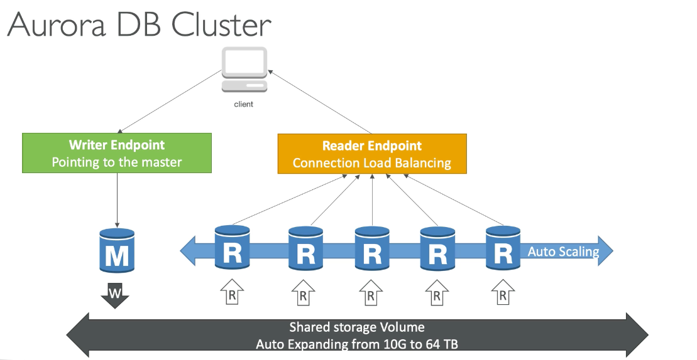
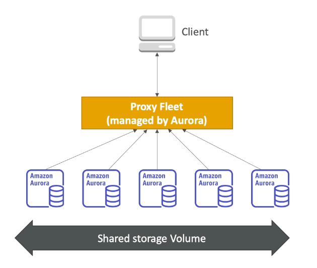
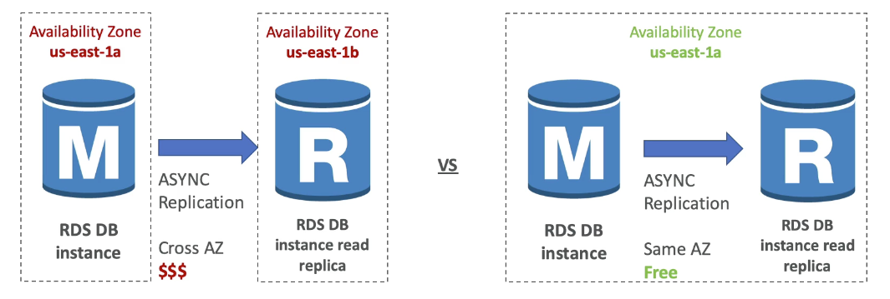

import Button from "@material-ui/core/Button";
import { withStyles } from "@material-ui/core/styles"; 

export const StyledButton = withStyles({
	root: {
		background: "linear-gradient(315deg, #fc9842 0%, #fe5f75 74%)",
		borderRadius: 7,
		border: 0,
		color: "inherit",
		height: 35,
		padding: "0 30px",
		boxShadow: "0 3px 5px 2px rgba(255, 105, 135, .3)",
	},
	label: {
		textTransform: "capitalize",
	},
})(Button)

export let Quote = ({ children, color }) => (
	
		{children}

)

## I. Introduction

1. Aurora serverless provides a simple, cost-effective option for infrequent, intermittent or unpredictable workloads
2. Cloud-optimized and compatible with MySQL and PostgreSQL
   - 5x better perf than MySQL
   - 3x better perf than PgSQL
   - +20% than RDS price
3. Starts with 10 GB, auto scales in increments of 10 GB (min) up to 64 TB
4. Compute resources can scale up to 32vCPUs and 244 GB of memory
5. <Quote>Auto backup is on by default</Quote>
6. <Quote>Auto patching is on by default</Quote>
7. <Quote>Fault-tolerant and self-healing</Quote>i.e. data blocks and disks are
   scanned and repaired automatically
8. Up to <Quote>15 replicas in Aurora</Quote>, 5 in MySQL and 1 in PostgreSQL
9. Can share Aurora snapshots with other AWS accounts
10. Not open source

## II. Aurora Cluster

1. An Aurora DB cluster consists of one or more db instances and a cluster volume that manages the data for those db instances.
2. An Aurora cluster volume is a virtual database storage volume that spans multiple AZs, each AZ having a copy of the cluster data.
3. DB clusters

   1. <Quote>Primary db instance</Quote>— Supports R/W, one primary instance per
      cluster
   2. <Quote>Aurora replica (up to 15)</Quote>
      1. Connects to the same storage volume as the primary db instance 
      2. Each Aurora
      db cluster can have up to 15 Aurora replicas in addition to the primary db
      instance. 
      3. Can offload read work from primary (master) 
      4. <Quote>
      	Automated failover for master in less than 30s
      </Quote>

4. Amazon Aurora automatically divides your database volume into 10GB segments spread across many disks. Each 10GB chunk of your database volume is replicated six ways, across three Availability Zones.
5. Two copies of your data is contained in each AZ
6. Min 3 AZ, so at least 6 copies of the data

   1. 4/6 copies needed for write
   2. 3/6 copies needed for reads
   3. self-healing with P2P replication

7. Aurora endpoints

   1. <Quote>Cluster endpoint</Quote>— connects to the current primary db
      instance for a db cluster, <Quote>only endpoint that can perform write operations</Quote>
   2. <Quote>Reader endpoint</Quote>
      1. Connects to one of available Aurora replicas for that DB cluster 2. Each
      Aurora db cluster has one reader endpoint 3. The reader endpoint provides load-balancing
      support for read-only connections to the db cluster 4. Can't use for writes

   3. <Quote>Instance endpoint</Quote>— connects to a particular instance in the
      cluster

## III. Aurora Security

1. Similar to RDS because uses the same engine
2. Encryption at rest using KMS
3. Automated backups, snapshots and replicas are also encrypted
4. Encryption in-flight using SSL/TLS
5. Option to authenticate using IAM
6. Cannot ssh into them

## IV. Aurora serverless

1. On-demand, autoscaling configuration for the MySQL-compatible and PostgreSQL-compatible editions of Amazon Aurora. An Aurora Serverless DB cluster automatically starts up, shuts down, and scales capacity up or down based on your application's needs.
2. <Quote>You can migrate regular Aurora to Aurora serverless</Quote>
3. <Quote>Good for infrequent, intermittent or unpredictable workloads.</Quote>
4. <Quote>No capacity planning needed.</Quote>
5. Does not support fast failover but does support automatic multi-AZ failover i.e. Aurora will automatically recreate the DB instance in a different AZ.
6. <Quote>You can set min and max Aurora Capacity Unit (ACU)</Quote>
7. <Quote>Pay-per-second, can be more cost effective.</Quote>
8. Only available for MySQL and Pgsql
9. Cannot access publicly, only through a VPC
10. Does not support
    1. Import/export from S3
    2. Aurora Read Replicas
    3. IAM database auth
    4. Multi-master clusters
    5. Restoring a snapshot from MySQL

## V. Aurora Global

1. <Quote>Aurora cross-region worldwide read replicas.</Quote>
   1. <Quote>Useful for disaster recovery</Quote>
   2. Simple to put in place

2. Aurora Global Database (recommended)

   1. 1 primary region (read/write)
   2. Up to 5 secondary (read-only) regions, replication lag < 1s
   3. Up to 15 read replicas per region
   4. Promoting to another region can be done in <1 minute
   5. You can assign promotion priority for each replica

3. <Quote>
   	Aurora Global is NOT active-active or multi-master. Use DynamoDB global
   	tables instead.
   </Quote>

## VI. Aurora for SA

1. Operations: Less, auto scaling storage
2. Security: AWS responsible for OS security, we are responsible for setting up KMS, security groups, IAM policies and authorizing users in DB
3. Reliability: Multi-AZ, HA
4. Performance: 5x better than MySQL, up to 15 read replicas
5. Cost: Pay per hour based on EC2 and storage usage. Possibly less than EC2.

## VII. Aurora Tips

1. Super cost effective throughput (compared to DynamoDB)
2. Aurora Global = Replication and DR
3. Aurora Serverless = No hardware provisioning
4. Recovers almost instantaneously from crash
5. No free tier
6. No replication lag
7. You can setup replication between Aurora and external MySQL db
8. Cannot encrypt an existing unencrypted instance
9. Amazon Aurora Parallel Query refers to the ability to push down and distribute the computational load of a single query across thousands of CPUs in Aurora’s storage layer
10. As well as providing scaling for reads, Aurora Replicas are also targets for multi-AZ. In this case the solutions architect can update the application to read from the Multi-AZ standby instance. (<Quote>For Aurora, Multi AZ ~ Read Replicas</Quote>)
11. If using a single Aurora (no multi-AZ, no read replicas), then in case of failure, Aurora will attempt to create a new DB Instance in the same Availability Zone as the original instance and is done on a best-effort basis.
<!-- 
<Button variant="outlined" color="inherit" href="/docs/notes_rds">
	Back To RDS
</Button> -->

<StyledButton href="/docs/notes_rds">Back to RDS</StyledButton>
