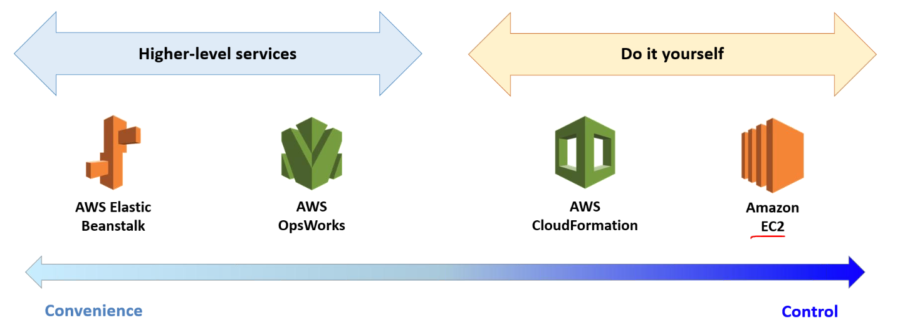

export const Quote = ({ children, color }) => (
	
		{children}
	
)

<!--  -->

## I. Introduction

1. **It's a PaaS that quickly deploy and manage "applications" (not infra, remember it)**
2. Supports Go, Java, Node, .NET, Python etc
3. Instantiating apps quickly can be done through
    1. Golden AMI: Install all dependencies/apps beforehand and create an AMI out of it
    2. Bootstrap using user data

4. **Elastic Beanstalk is a developer-centric way of deploying a typical app e.g. a 3-tier web-app. It uses all the common components like EC2, EBS, ELB, ASG etc.** 
    1. Free of cost and you only pay for underlying services.
    2. Deployment strategy is configurable but performed by Beanstalk.
    3. Developer is only responsible for app

5. Three architecture models
    1. Single instance (good for dev)
    2. LB + ASG (good for production)
    3. ASG only (good for non-web apps)

6. Beanstalk has three components
    1. Application — logical collection of components including env and versions
    2. Application version — labeled iteration of deployable code for a web app
    3. Env — a version that is deployed on to AWS resources

7. **You deploy app version to env and can promote envs. Also, roll back to previous version.**
8. **Elastic Beanstalk stores your application files and optionally, server log files in S3.**

 

## II. Beanstalk Tips

1. Supports Tomcat, Passenger and Puma containers.
2. Types of environment
    1. Load balancing — auto scaling
    2. Single instance

3. Beanstalk monitoring console displays your env status and application health at a glance.
4. Enhanced Health Reporting is a feature that you can enable on your env to allow Beanstalk to gather additional metrics.
5. EC2 instances in your Beanstalk env generate logs that can be used for debugging.
6. Make sure you have the right IAM role to create env
7. `eb init` can be used to initialize a Beanstalk environment

