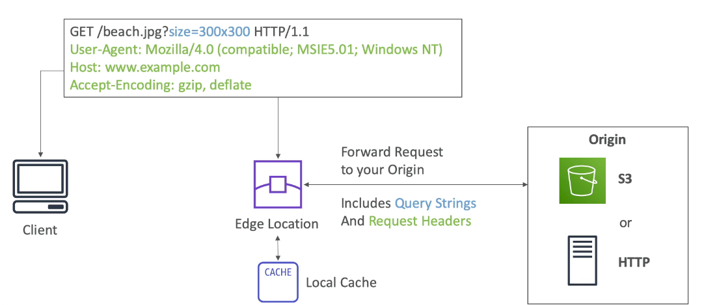
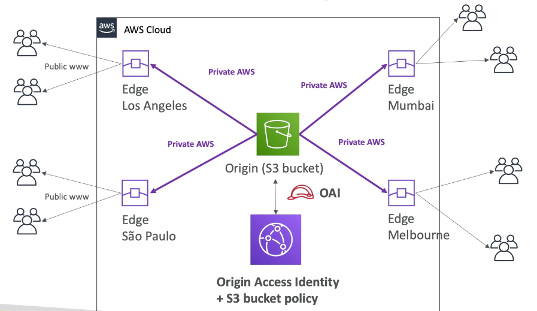
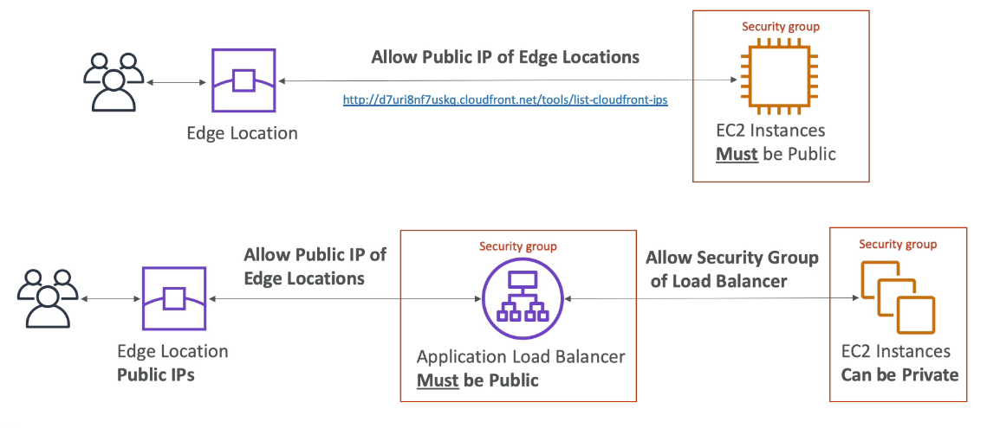
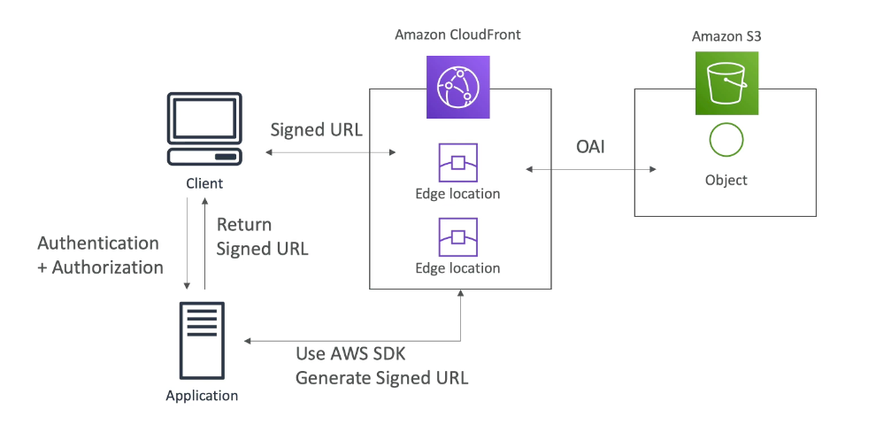

export const Quote = ({ children, color }) => (
	
		{children}
	
)

<!--  -->
## I. Introduction

1. AWS offered CDN that improves read performance because the content is cached at the edge lcoations.
2. Edge locations are far more prevalent than AZs and regions.
3. It also provides DDoS protection and WAF. Can expose external HTTPS and internal HTTPS backends.
4. Not good for highly dynamic content, use S3 CRR/GA instead.
5. General architecture

5. With S3

6. With EC2 (simple and ELB)

**7. CloudFront also allows geofencing where you can whitelist/blacklist countries.**

8. CloudFront vs S3

1. CloudFront
    1. Global edge netowrk
    2. Files are cached for a TTL
    3. Great for static content that must be available everywhere

2. S3 cross-region replication
    1. Must be setup for each region you want replication to happen
    2. Files are updated in near real time
    3. Read only
    4. Great for dynamic content that needs to be available at low latency in few regions

## II. Signed URLs

1. You can securely distribute content with target users without making it public.
2. We can attach a policy with
    1. URL expiration
    2. IP ranges to access data from
    3. Trusted signers

3. Signed URL = access to a single file
4. Signed cookie = access to multiple files

## III. Global Accelerator

1. AWS Global Accelerator and Amazon CloudFront are separate services that use the AWS global network and its edge locations around the world.
2. Global Accelerator improves performance for a wide range of applications over TCP or UDP by **proxying packets at the edge to applications** running in one or more AWS Regions. Global Accelerator is a good fit for non-HTTP use cases, such as gaming (UDP), IoT (MQTT), or Voice over IP, as well as for HTTP use cases that specifically require static IP addresses or deterministic, fast regional failover.
3. **It provides static IP addresses that act as a fixed entry point to your application endpoints in a single or multiple regions, such as your ALB, NLB or EC2 instances.**
4. With AWS Global Accelerator, you can add or remove endpoints in the AWS Regions, run blue/green deployment, and A/B test without needing to update the IP addresses in your client applications.
5. Used to reduce latency and server hops to make your users reach your content faster.
6. By default, Global Accelerator provides you with two static IP addresses that you associate with your accelerator.
7. Traffic traverses global network
8. Integrates with Shield for DDoS protection
9. Works with Elastic IP, EC2, and ELB.
10. Health checks comes by default
11. Important to know the difference between Unicast and Anycast IP.
    1. Unicast: Unique server, unique IP
    2. **Anycast: Any server, one IP**

12. Consistent performance
    1. Intelligent routing to lowest latency and fast regional failover
    2. No issue with client cache
    3. Internal AWS network

13. Security
    1. Only 2 external IP need to be whitelisted
    2. **DDoS protection, thanks to AWS Shield (basic) that comes by default**

## IV. CloudFront vs GA

**CloudFront**

1. Regular CDN to deliver static content.
2. Uses multiple sets of dynamically changing IPs
3. Pricing is mainly based on data transfer OUT (both internet and origin)
4. Only HTTP/HTTPS

**GA**

1. GA is a service that uses edge locations to look for optimal pathway for users to apps.
2. Provides a set of static IPs
3. Charges fixed hourly fee
4. Supports HTTP, TCP, UDP
5. Good for RT apps like VoIP

## V. Signed URLs

**CloudFront signed URL**

1. Can restrict access to both content in edge cache or origin (S3 bucket)
2. Can create a signed URL or signed cookie (multiple files)

**S3 Pre-signed URL**

1. Can create a pre-signed URL to share private content.
2. You need to specify security credentials, expiration and HTTP method while creating.

## VI. CloudFront Tips

1. <Quote>Only CloudFront/WAF can block traffic by country, security groups cannot.</Quote>
2. <Quote>You can use an OAI to restrict access to content in Amazon S3 but not on EC2 or ELB.</Quote>
3. Using Amazon CloudFront as the front-end provides the option to specify a custom message instead of the default message. To specify the specific file that you want to return and the errors for which the file should be returned, you update your CloudFront distribution to specify those values. 
4. CloudFront can work alongside Route53 geo-proximity based routing. In that case Route53 would send the user to the nearest edge location.
5. Amazon CloudFront supports content that can be sent using the HTTP or WebSocket protocols. This includes dynamic web pages and applications, such as HTML or PHP pages or WebSocket-based applications, and any popular static files that are a part of your web application, such as website images, audio, video, media files or software downloads. Amazon CloudFront also supports delivery of live or on-demand media streaming over HTTP.
6. <Quote>You can serve custom error pages for 4xx and 5xx codes. This is a simpler method than Route 53 active-passive failover.</Quote>
7. Default TTL at edge locations is 24 hours.
8. CloudFront is both HIPAA and PCI compliant.
9. Does not cache responses to POST, PUT, PATCH and DELETE
10. CloudFront has an optional private content feature. When this option is enabled, Amazon CloudFront will only deliver files when you say it is okay to do so by securely signing your requests.
11. Yes, you can configure Amazon CloudFront to add custom headers, or override the value of existing headers, to requests forwarded to your origin.
12. Amazon CloudFront supports delivery of dynamic content that is customized or personalized using HTTP cookies. To use this feature, you specify whether you want Amazon CloudFront to forward some or all of your cookies to your custom origin server. Amazon CloudFront then considers the forwarded cookie values when identifying a unique object in its cache. This way, your end users get both the benefit of content that is personalized just for them with a cookie and the performance benefits of Amazon CloudFront. You can also optionally choose to log the cookie values in Amazon CloudFront access logs.
13. <Quote>You can use query string parameters in the URL with CloudFront</Quote>
14. Supports gzip, just specify `Accept-Encoding: gzip` in the request header
15. Yes, Amazon CloudFront provides you with multiple options to deliver on-demand video content.
16. The maximum size of a single file that can be delivered through Amazon CloudFront is 20 GB. This limit applies to all Amazon CloudFront distributions.
17. <Quote>CloudFront provides two ways to log the requests that are delivered from your distributions: Standard logs (to S3) and Real-time logs (to Kinesis).</Quote>
18. <Quote>Can specify multiple origins to tackle failover.</Quote>
19. <Quote>Perfect Forward Secrecy</Quote> is a feature that provides additional safeguards against the eavesdropping of encrypted data, through the use of a unique random session key. This prevents the decoding of captured data, even if the secret long-term key is compromised. **CloudFront and ELB are the two AWS services that support Perfect Forward Secrecy.** 
20. To allow multiple domains to serve SSL traffic without the need to re-auth and re-provision your certificate every time you adds a new domain, you can upload all SSL certificates of the domains in the ALB using the console and bind multiple certificates to the same secure listener on your load balancer. ALB will automatically choose the optimal TLS certificate for each client using Server Name Indication (SNI).
21. You can also set up CloudFront with origin failover for scenarios that require high availability. An origin group may contain two origins: a primary and a secondary. If the primary origin is unavailable or returns specific HTTP response status codes that indicate a failure, CloudFront automatically switches to the secondary origin. To set up origin failover, you must have a distribution with at least two origins.
22. You can create a static website using Amazon S3 with a custom domain name. However, you cannot connect to an Amazon S3 static website using HTTPS (only HTTP) so this solution does not work. **Must use CloudFront + S3 for hosting static sites over HTTPS**.
23. When given a choice between CloudFront and GA for simple tasks, choose CloudFront as it's cheaper.
24. Look for the following keywords if you think GA is the answer.
    1. Traffic traverses AWS global network
    2. Static IP
    3. Auto failover
    4. Deterministic routing
    5. Real-time apps, VoIP
    6. A/B testing