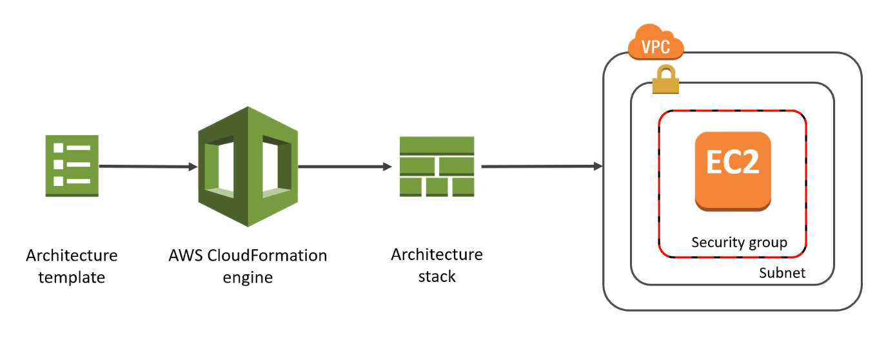

export const Quote = ({ children, color }) => (
	
		{children}
	
)

<!--  -->
## I. Introduction

1. Infrastructure as Code (IaC)
2. Declarative way of outlining your AWS infrastructure, for any resource (most are supported).
3. For instance, within a CloudFormation template, you can include
    1. Security group
    2. Two EC2s
    3. Two EIPs for two EC2s
    4. One S3 bucket
    5. One ELB

4. CloudFormation would then spin up all these resources for you, in the exact order.
5. Code can be version controlled.
6. Each resource within the stack is tagged so you can calculate costs.
7. As a way to save cost in dev, you can delete all resources at 5pm and bring them back up at 8am as you not working at night.
8. Automated generation of diagrams for your templates.
9. Declarative programming.
10. Process
    1. <Quote>Templates have to be uploaded in S3 and then referenced in CloudFormation</Quote>
    2. To update a template, you can't overwrite an existing one but create a new one
    3. Stacks are identified by a name
    4. Deleting a stack deletes every single artifact that was created

11. Manual deploy — edit templates using CloudFormation designer
12. Automated way — edit templates as a YAML file using AWS CLI
13. Building blocks
    1. <Quote>Resources (mandatory)</Quote>
    2. Parameters — dynamic inputs to template
    3. Mappings — static variables to template
    4. Outputs — References to what has been created

14. StackSets
    1. Pre-configured stacks that can be managed across multiple accounts and regions.
    2. Admin need to create it and share with trusted accounts.
    3. If you update a StackSet template, all associated instances are updated too (Symbol). 

## III. CloudFormation Tips

1. The `cloudformation:TemplateURL`, lets you specify where the CloudFormation template for a stack action, such as create or update, resides and enforce that it be used.
2. <Quote>You can use CloudFormation to orchestrate settings for OUs including VPC and subnets.</Quote>
3. Use a `DeletionPolicy` to preserve or backup a resource when its stack is deleted or updated
4. It's good practice to create layered architecture with a CloudFormation template for each layer.
5. AWS QuickStarts are standard templates to create full apps from scratch.
6. Works hand-in-hand with OpsWorks (Chef and Puppet).
7. You can nest stacks.
8. Integrated with CloudTrail.
9. Through AWS PrivateLink, you can use CloudFormation APIs inside of your VPC and route data between your VPC and CloudFormation entirely within the AWS network.
10. <Quote>If a resource cannot be created, CloudFormation rolls the stack back and automatically deletes any resources that were created.</Quote>
If a resource cannot be deleted , any remaining resources are retained until the stack can be successfully deleted.
11. <Quote>Stack update methods — Direct update and Creating/Executing change sets</Quote>
12. <Quote>Drift detection enables you to detect whether a stack's actual configuration differs, or has drifted, from it's expected configuration.</Quote>
13. To share information between stacks, export a stack's output values. Other stack in the same account can then import those values.
14. Stacksets allow you to roll out CloudFormation stacks over multiple accounts and regions easily. Often used alongside AWS Organizations to centrally deploy and manage services in different accounts.
15. You can assign logical names to AWS resources in a template. When a stack is created, AWS CloudFormation binds the logical name to the name of the corresponding actual AWS resource.
16. CloudFormation doesn’t allow this for all resources.
17. AWS CloudFormation provides a set of application bootstrapping scripts that enable you to install packages, files, and services on your EC2 instances simply by describing them in your CloudFormation template.
18. <Quote>CloudFormation allows you to define deletion policies for resources in the template. You can specify that snapshots be created for Amazon EBS volumes or Amazon RDS database instances before they are deleted.</Quote>

19. <Quote>You can also specify that a resource should be preserved and not deleted when the stack is deleted. This is useful for preserving Amazon S3 buckets when the stack is deleted.</Quote>
20. You can use CloudFormation to <Quote>modify and update the resources</Quote>
in your existing stacks in a controlled and predictable way.
21. <Quote>You WILL be charged for resources that were rolled back during a failed stack creation attempt.</Quote>
22. You can create up to 200 resources per stack.