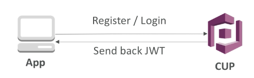
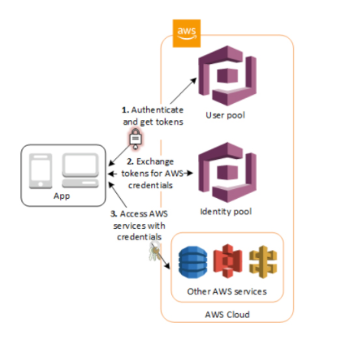
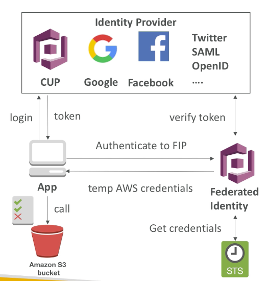
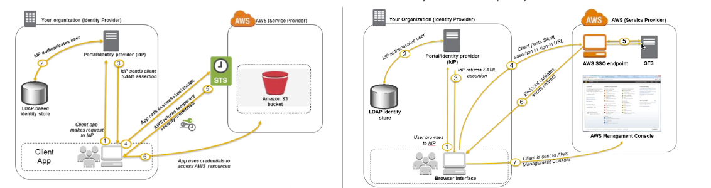
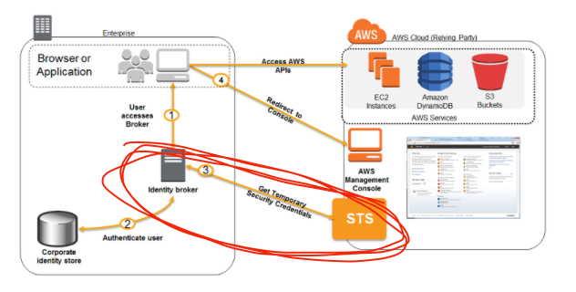
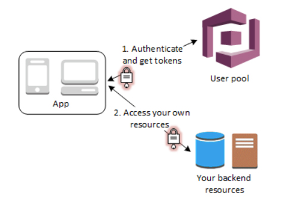
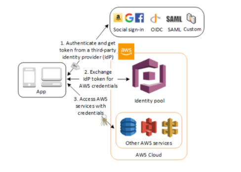

export const Quote = ({ children, color }) => (
	
		{children}
	
)

## I. Introduction

1. We want to give our users an identity so they can interact with our apps.
2. Cognito helps us by not creating millions of IAM users for our app.
3. **Cognito User Pool**
    1. <Quote>A user pool is like a directory of users</Quote>
    2. Sign-in functionality for app users
    3. Integrate with API Gateway
    4. Create a serverless db for your app users
        1. Simple login (username/email and password)
        2. Support for email verification and MFA
        3. Can enable federated identities (Facebook, Google etc). Sends back a JWT which can then be used for auth by API Gateway

4. **Cognito Identity Pool (Federated identity)**

    1. **Federate users into your AWS services**
    2. Supports anonymous guest users and following IdP:
    
        1. Cognito user pools
        2. SAML providers
        3. OIDC providers
        4. Social sign-in
        5. Developer authenticated identities 

3. Provide AWS credentials to users so they can directly access AWS resources
4. Integrate with user pools as an identity provider
5. Support unauthenticated identities by providing a unique identifier and AWS credential
6. Permission for authed and non-authed users are controlled through IAM roles
7. **No proxy, no API, straight access to AWS resources**
    1. Login to federated identity provider or remain anonymous
    2. Get temporary AWS credentials back from federated identity pool
    3. **These credentials come with pre-defined IAM policy stating their permissions**
    4. Example: Provide temp access to write to S3 using facebook login

5. Cognito Sync

    1. Synchronize data from device to Cognito
    2. Maybe deprecated and replaced by AppSync
    3. Store preferences, config, state of app
    4. Cross-device sync across platforms
    5. Offline capability (sync when back online)
    6. Requires federated identity pool
    7. Store data in datasets (up to 1MB)
    8. Up to 20 datasets to synchronize

## II. Identity federation

1. Federation lets users outside AWS to assume temporary role to access AWS resources. In other words, you don't need to create IAM users.
2. Federation can have many flavors
    1. SAML 2.0
    2. Custom identity broker
    3. Web identity federation with Cognito
    4. Web identity federation without Cognito
    5. SSO
    6. Non-SAML with Microsoft AD

3. Example with any SAML 2.0 compliant IdP

## III. SAML and SSO

1. Needs to set up trust between AWS IAM and SAML
2. SAML 2.0 enables web-based and cross-domain SSO
3. Use the STS API: `AssumeRoleWithSAML`
4. <Quote>Note: SAML is the old way of doing things, the new way is Amazon SSO</Quote>
5. The steps performed by the custom identity broker to sign users into the AWS management console are
    1. Verify that the user is authenticated by your local identity system (AD)
    2. Call AWS STS `AssumeRole` or `GetFederationToken` API operations to obtain temporary security credentials for the user
    3. <Quote>Call the AWS federation endpoint and supply the temporary security credentials to request a sign-in token</Quote>
    4. <Quote>Construct a URL for the console that includes the token</Quote>
    5. Give the URL to the user (coming from AD)
    ****

## V. Cognito Tips

1. **ALB supports authentication from OIDC compliant identity providers such as Google, Facebook and Amazon. It is implemented through an authentication action on a listener rule that integrates with Amazon Cognito to create user pools.**
2. **Single sign-on using federation allows users to login to the AWS console without assigning IAM credentials.** The AWS Security Token Service (STS) is a web service that enables you to request temporary, limited-privilege credentials for IAM users or for users that you authenticate (such as federated users from an on-premise directory).
3. **Want to provide SSO to on-prem users → Use STS and SAML.**
4. Cognito Sync is a key/value pair store linked to an Amazon identity.
5. You can use Cognito streams to push sync store data to Kinesis streams.
6. **When Cognito detects unusual sign-in activity (new location, device etc), it assigns it a risk score to that activity which you can use to enable MFA etc.**
7. When Cognito detects users have entered credentials that have been compromised elsewhere, it prompts a password change.
8. **You can create lambda function and then trigger it during user pool operations like sign-in, sign-up e.g. to present auth challenges to users during log-in**
9. Cognito calls lambda sync, and lambda must respond within 5s. Cognito would then retry the call for a maximum of 3 times.
10. You pay based on MAUs. The free tier includes 50,000 MAUs signing through user pools or social logins and 50 MAUs for SAML-based providers.

## Examples

