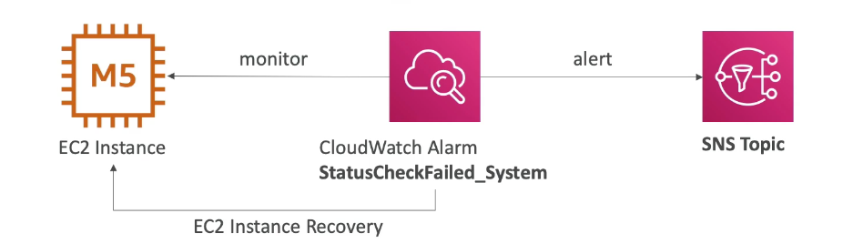

export const Quote = ({ children, color }) => (
	
		{children}
	
)

<!--  -->

## I. Introduction

1. <Quote>CloudWatch provides metrics for every service in AWS.</Quote>
2. CloudWatch Metrics are the fundamental concept in CloudWatch. 
    1. A metric represents a time-ordered set of data points that are published to CloudWatch.
    2. You cannot use a metric alone, it is used when setting up monitoring for any service in CloudWatch.
    3. Metric = CPU utilization, network latency etc
    4. Metrics belong to namespaces
    5. Metrics have timestamps
    6. Can create dashboard of metrics
    7. Dimension is an attribute of a metric (instance ID, env)

3. CloudWatch Events delivers a near real-time stream of system events that describe changes in Amazon Web Services (AWS) resources.
4. You use CloudWatch Logs to monitor applications and systems using log data. For example, CloudWatch Logs can track the number of errors that occur in your application logs and send you a notification whenever the rate of errors exceeds a threshold you specify.

## II. CloudWatch with EC2

1. EC2 instance have default every 5 minutes, can be bumped up to every 1 minute with **Detailed Monitoring** (costly).
2. Use **Detailed Monitoring** if you want to prompt scale your ASG. Note that detailed monitoring does not provide any additional insight, it just increases the frequency of already available metrics. If you want more granular metrics, use CloudWatch agent or scripts.
3. The free tier allows us to have 10 detailed monitoring metrics.
4. <Quote>EC2 memory usage is NOT pushed by default, use Agent!</Quote>
5. <Quote>CloudWatch logs can collect app logs to count all 200s, 404s, 500s etc.</Quote>
6. For instance recovery, EC2 provides two ways of status checks
    1. Instance status = check the EC2 VM
    2. System status = check the underlying hardware
    3. If either of the above fail, then the instance is down.
    4. You can configure CLoudWatch to recover the instance if the above happens.
    5. Recovery: Same private/public/elastic IP, metadata, placement group.

## III. Custom metrics

1. Possibility to define and send your own custom metrics.
2. Ability to use dimensions (attributes) to segment metrics.
    1. `instance.id`
    2. `environment.name`

3. Metric resolution
    1. Standard: 1 minute
    2. High-res: up to 1s (StorageResolution API parameter) — higher cost 

4. To send a metric to CloudWatch, you can use the PutMetricData API.
5. Use exponential backoff in case of errors.

## IV. Dashboards

1. Great way to setup dashboards for quick access to keys metrics.
2. <Quote>Dashboards are global — can include graphs from different regions.</Quote>
3. You can set timezone and refresh rates (10s - 15min)
4. Pricing
    1. 3 dashboards (each up to 50 metrics) for free
    2. $3/dashboard/month after that

## V. Logs

1. Applications can send logs to CloudWatch using the SDK.
2. CloudWatch can collect log from
    1. Elastic Beanstalk: collection of logs from application
    2. ECS: collection from containers
    3. Lambda: from function logs
    4. VPC flow logs (like Wireshark)
    5. API Gateway
    6. CloudTrail based on filter
    7. CLoudWatch log agents (e.g. on EC2 machines)
    8. Route53: DNS queries

3. CloudWatch logs can go to
    1. **S3 for archival**
    2. **Stream to ES for analytics**

4. Logs storage architecture
    1. Log groups: arbitrary name, usually representing the application
    2. Log group → Log stream: instances within application/log files/containers 

5. Can define log expiration policies (never expire, 30 days etc)
6. AWS CLI can tail the logs for real-time monitoring
7. Make sure IAM permission are correct before sending logs
8. <Quote>Logs can be encrypted using KMS</Quote>
9. CloudWatch logs can use filter expressions
    1. find a specific IP
    2. metric filters can be used to trigger alarm

10. <Quote>New features include "Insight" to interactively search logs and add it to dashboard.</Quote>

## VI. CloudWatch Agent

1. <Quote>By default, no logs from EC2 are going to CloudWatch. You need to install the agent.</Quote>
2. <Quote>Make sure your EC2 instance has the right IAM role i.e. it can write to CloudWatch.</Quote>
3. The agent can be set up on physical on-prem servers as well.
4. Out-of-the-box metrics only include a high level overview of CPU, disk and network.
5. **Standard CloudWatch Agent**
    1. older version
    2. can only send to CloudWatch logs

6. **Unified Agent for EC2**
    1. Newer version
    2. Centralized configuration using SSM parameter store
    3. Can collect additional system metrics
        1. CPU (active, guest, idle, user)
        2. Disk (IO, # reads, # writes)
        3. RAM (free, inactive, total, cached)
        4. Netstat (# of TCP and UDP connections, net packets, bytes)
        5. Processes (total, dead, bloqued, idle, running, sleep)
        6. Swap space (free, used, used %)

## VII. Alarms

1. Alarms are used to trigger notifications for any metric.
2. Alarms can go to auto scaling, EC2 actions, SNS notifications
3. Various options (sampling, %, max, min)
4. Alarm states
    1. `OK`
    2. `INSUFFICIENT_DATA`
    3. `ALARM`

5. Period
    1. Length of time in seconds to evaluate the metric
    2. High-res custom metrics: can choose either 10s or 30s

## VIII. Events

1. Schedule cron jobs
2. Event pattern: event rules to react to a service doing something
3. Triggers to SQS, SNS, Lambda, or kinesis
4. CloudWatch event creates a small JSON document to give information about the change

## IX. CloudWatch Tips

1. You can use the CloudWatch agent to collect both system metrics and log files from Amazon EC2 instances and on-premises servers. The agent supports both Windows Server and Linux, and enables you to select the metrics to be collected, including sub-resource metrics such as per-CPU core.
2. CloudWatch does not aggregate data across regions and so metrics are tightly bound to one region only.
3. A **namespace** is a container for CloudWatch metrics. There is no default namespace.
4. You can assign up to 10 dimensions to a metric.
5. You are charged per 1000 metrics per month.