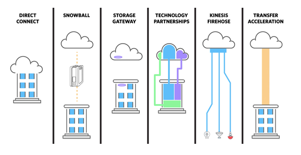

export const Highlight = ({ children, color }) => (
	
		{children}
	
)

export const Quote = ({ children, color }) => (
	
		{children}
	
)

## I. Introduction

1. AWS DataSync is an online data transfer service that simplifies, automates, and accelerates copying large amounts of data to and from AWS storage services <Quote>over the internet or AWS Direct Connect.</Quote>
2. <Quote>Can copy between NFS, SMB, S3, EFS and FSx for Windows.</Quote>
3. Allows you to <Quote>copy millions of files</Quote> without having to build custom solutions or licenses.
4. You can schedule copy jobs and pass filters to only include the desired files.
5. Replication tasks can be scheduled hourly, daily, weekly.
6. <Quote>Need to install DataSync agent (an EC2 instance running DataSync Agent AMI) on-premise to initiate the transfer.</Quote>7. Performs integrity checks to make sure the the data is copied correctly to the destination.
8. You can see the status of the data being copied using CloudWatch metrics.
9. Preserves directory structure when copying data.
10. <Quote>Can use either Direct Connect OR private VPC endpoint (PrivateLink) OR regular internet.</Quote>
11. When using VPC endpoint to transfer, data does not traverse public internet.
12. To use VPC endpoints with AWS DataSync, you create an AWS PrivateLink interface VPC endpoint for the DataSync service in your chosen VPC, and then choose this endpoint elastic network interface (ENI) when creating your DataSync agent. Your agent will connect to this ENI to activate, and subsequently all data transferred by the agent will remain within your configured VPC.
13. If a task is interrupted, the agent restarts and resumes from previous location.
14. AWS DataSync assumes an IAM role that you provide. The policy you attach to the role determines which actions the role can perform.
15. <Quote>A single DataSync agent is capable of fully-utilizing a 10 Gbps network link.</Quote>
16. All data transferred between the source and destination is encrypted via Transport Layer Security (TLS), which replaced Secure Sockets Layer (SSL). Data is never persisted in AWS DataSync itself.
17. It is PCI compliant and HIPAA eligible.
18. NOT suited for bandwidth-constrained customers (use snowball or snowcone).
19. You are only charged for the data you move.
20. <Quote>Can transfer directly to S3 Glacier Deep Archive. No need to go through S3 → Glacier.</Quote>

## II. DataSync vs Storage Gateway

DataSync is for transferring while Storage Gateway is for using both AWS and on-prem data stores simultaneously. You can use them together to minimize costs.

Use AWS DataSync to migrate existing data to Amazon S3, and then use the File Gateway configuration of [AWS Storage Gateway](https://aws.amazon.com/storagegateway/) to retain access to the migrated data and for ongoing updates from your on-premises file-based applications.

## III. DataSync vs Snowball

AWS DataSync is ideal for online data transfers. You can use DataSync to migrate active data to AWS, transfer data to the cloud for analysis and processing, archive data to free up on-premises storage capacity, or replicate data to AWS for business continuity.

[AWS Snowball Edge](https://aws.amazon.com/snowball-edge/) is suitable for offline data transfers, for customers who are bandwidth constrained, or transferring data from remote, disconnected, or austere environments.

## IV. DataSync vs S3 Transfer Acceleration

DataSync loses this round only if you already have your apps integrated with S3 API.