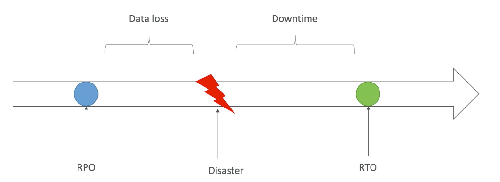
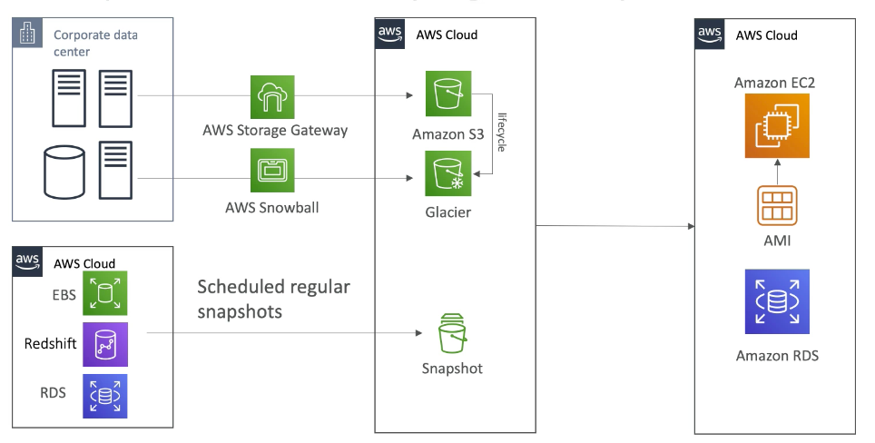
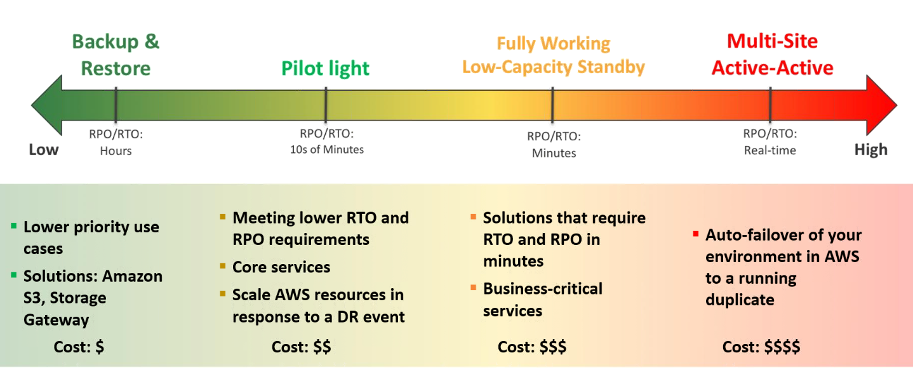
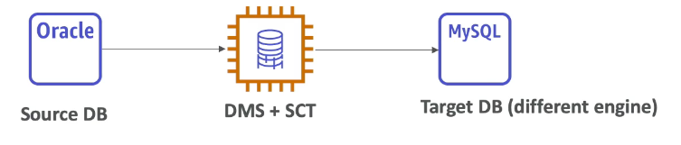

import Tabs from '@theme/Tabs';
import TabItem from '@theme/TabItem';

export const Quote = ({ children, color }) => (
	
		{children}
	
)

<!--  -->

## I. Introduction

1. Any event that has a negative impact on a company's business continuity or finances is a disaster.
2. Disaster Recovery (DR) is about preparing and recovering from it.
3. Kinds of DR
    1. On premise → traditional, very expensive
    2. On premise → AWS cloud hybrid recovery
    3. Full cloud → AWS region A to B

4. Recovery Point Objective (RPO) vs Recovery Time Objective (RTO)

## II. DR Strategies

1. Backup and restore
    1. High RPO and RTO → hours
    2. No managing infra
    3. Just restore from most recent point in time
    4. Keep snapshots of EBS volumes, RDS, S3 (or Glacier)

2. Pilot light
    1. RPO and RTO → 10s of minutes
    2. A small flame that’s always on can quickly ignite the entire furnace to heat up a house
    3. **Most critical core elements are running**
    4. When the time comes, you can rapidly provision a full-scale production app
    5. It is an Active/Passive failover configuration
    6. Restore happens through EBS snapshots and AMIs
    7. Lower RTO/RPO than backup because your app will always running
    8. Faster than backup because critical systems are already up

3. Full-working low-capacity (warm) standby
    1. RPO and RTO → minutes
    2. **Scaled-down version of a fully functional system is always running**
    3. Another example of Active/Passive failover configuration
    4. Servers can be left running on minimum and **smallest EC2s**
    5. Upon disaster, we can scale it to production load by increasing instances

4. Multi-site Active-Active
    1. Very low RTO (minutes or seconds)
    2. Most expensive
    3. Full production scale is running on one AWS region and on premise
    4. You can just change DNS and be good to go in case of failover

## III. DR Tips

1. Backup
    1. EBS snapshots, RDS automated backups
    2. Regular pushes to S3, S3 IA, Glacier (with lifecycle policy)
    3. From on-prem: Snowball or Storage Gateway

2. HA
    1. Use Route53 to migrate from one region to another
    2. RDS multi AZ, ElastiCache multi-AZ, EFS
    3. Site to site VPN as a recovery from Direct Connect

3. Replication
    1. RDS replication (cross-region), AWS Aurora + Global Database
    2. Database replication from on-prem to RDS
    3. Storage Gateway

4. Automation
    1. CloudFormation, Beanstalk to re-create full env
    2. Recover/Reboot EC2 with CloudWatch alarms

5. Chaos engineering 

## IV. Database Migration Service (DMS)

1. Quickly and securely migrate db to AWS, resilient, self-healing
2. The source db remains available 100% during migration
3. Supports both homogenous and heterogenous migrations
    1. Oracle to Oracle
    2. Oracle to Pgsql

4. Continuous data replication using CDC
5. You must create an EC2 instance to perform replication tasks
6. If your source and target databases are different, then you need to use Schema Conversion Tool (SCT)

## V. On-premise strategy with AWS

1. Ability to download AMI in .iso format. This can then loaded on popular VM softwares including VMWare, HyperV etc
2. You can also migrate existing applications to EC2 and create a DR strategy for on-prem VMs.
3. You can also export back from EC2 to on-prem VM.
4. AWS Application Discovery Service
    1. Gather info about your on-prem servers to plan a migration
    2. Server utilization and dependency mapping
    3. Track with AWS migration hub

5. AWS Server Migration Service (SMS) — Incremental replication of on-premise live servers to AWS

## VI. Data transfer scenarios

Scenario: Transferring 200TB of data to cloud over 100Mbps connection

1. Over the internet (Site-to-site VPN) — immediate to setup but will take 185 days!
2. Over direct connect (1Gbps) — long setup time (1 month), 18.5 days
3. Snowball — 1 week end-to-end transfer