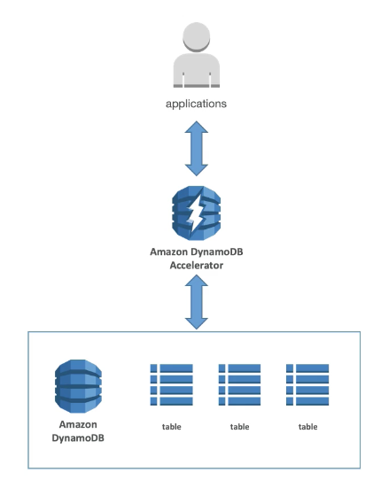
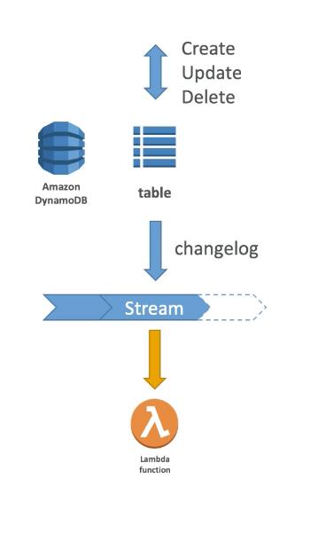
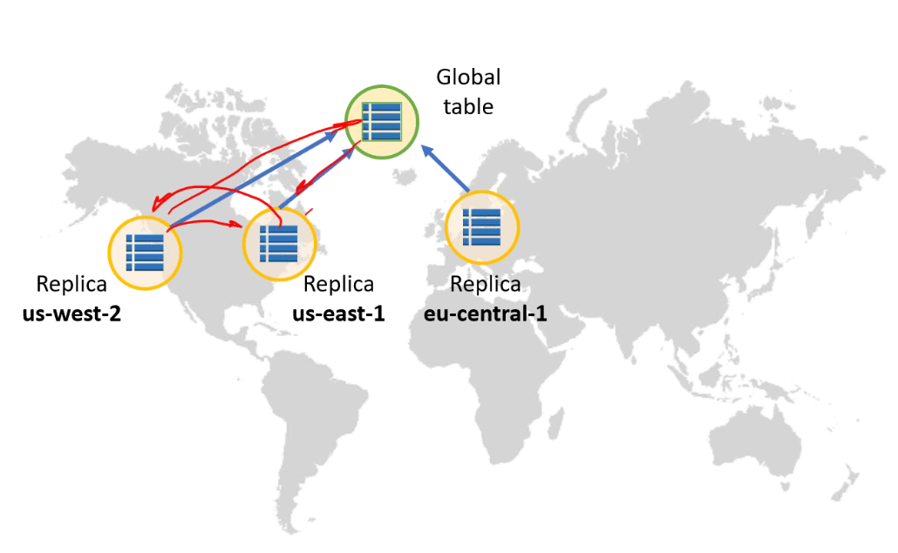
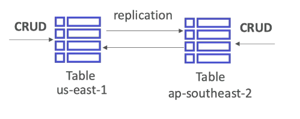
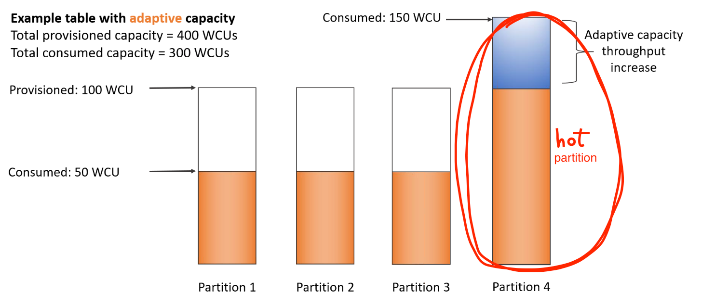

export const Quote = ({ children, color }) => (
	
		{children}
	
)

## I. Introduction

1. Fast and flexible NoSQL solution with ultra low latency
2. **Fully managed, supports both document and key-value models**
3. Stored on SSD
4. Eventual consistency (by default, >1s)
5. Can enable strongly consistent (never a dirty read, <1s)
6. **Default replication across three AZs**
7. **Millions of requests/s, trillions of rows, 100s of TBs of storage**
8. Enables event-driven programming with DynamoDB streams
9. Can only query on primary key, sort key or indices
10. DynamoDB has tables, each table can have infinite items (aka rows)
    1. Each item has attributes (can be null)
    2. Max size of an item is 400KB
    3. Data types supported include
        1. Scalar: String, Number, Binary, Boolean, null
        2. Document: List, Map
        3. Set: String set, Number set, Binary set

11. Provisioned throughput
    1. **Table must have provisioned read and write capacity units**
    2. Read Capacity Unit (RCU): $0.00013 per RCU
        1. 1 RCU = 1 strongly consistent read of 4 KB/s
        2. 1 RCU = 2 eventually consistent read of 4 KB/s 

    3. Write Capacity Unit (WCU): $0.00065 per WCU
        1. 1 WCU = 1 write of 1 KB/s 

    4. RCU and WCU are decoupled and can be scaled independetly.
    5. Option to set up auto-scaling to meet demand.
    6. Throughput can be exceeded using burst credit. If no burst credit available, you'll get a `ProvisionedThroughputException`
    7. As you surpass the write capacity, the requests will be throttled, and fail with an HTTP 400 code (Bad Request) and a `ProvisionedThroughputExceededException`

## II. Advanced features

1. DAX = DynamoDB accelerator
    1. Seamless cache for DynamoDB, no application re-write
    2. Fully-managed and highly available
    3. Writes go through DAX to DynamoDB
    4. Micro-second latency for cached reads and queries
    5. Solves the hotkey problem (too many reads)
    6. Each cache entry has TTL of 5 minutes by default
    7. Up to 10 nodes in a cluster
    8. Multi-AZ (min 3 nodes recommended for production use case)
    9. Secure (in-flight, at-rest)

1. Changes in DynamoDB (CRUD) can end up in a stream as a changelog.
2. This changelog can be fed to lambda, ES etc for analytics or other ops like welcome email.
3. Could implement cross-region replication using streams.
4. **Must enable them manually!**
5. 24 hour data retention by default.

3. New features
    1. Transactions: All or nothing type ops (like in RDBMS)
    2. On-demand: No capacity planning needed for WCU/RCU — scales automatically
    3. 2.5x more expensive than provisioned capacity
    4. Helpful when you expect spikes

4. Security
    1. VPC endpoint to access without internet
    2. Access fully controlled by IAM
    3. Encryption at rest using KMS

5. Backup
    1. Point-in-time like RDS
    2. No performance impact

6. **Global tables**
    1. <Quote>Multi-region, multi-master, active-active</Quote>
    2. <Quote>Fully replicated, high performance</Quote>
    3. Must enable DynamoDB streams
    4. Useful for low-latency, **DR purposes** 

7. Support for DMS (migration from Mongo, Oracle, SQL Server etc)
8. Can launch local version for development

## III. DynamoDB for SA

1. Operations: Serverless so no ops
2. Security: Full security through IAM policies, KMS, SSL
3. Reliability: Multi AZ backups
4. Performance: Single-digit millisecond performance, DAX for caching reads, performance doesn't degrade if app scales
5. Cost: Pay per provisioned capacity and storage usage (no guessing, can use auto scaling)

## IV. DynamoDB Tips

1. Unlimited capacity, infinite horizontal scaling
2. **No concept of read replicas in DynamoDB!**
3. Not bound by db-engine limit like RDBMS do
4. Super low latency (sub-ms)
5. ACID compliant
6. Heavily used in gaming, shopping cart etc
7. **Async replication** (use Aurora for sync)
8. DynamoDB is eventually consistent by default but you can enforce strong consistency
9. Supports GET/PUT by a user-defined PK
10. To prevent "hot" partitions, you can create partition keys (PK) with high-cardinality attributes, which have a large number of distinct values for each item
11. The PK can be either a single-attribute partition key or a composite partition sort-key
12. Supports **Adaptive Capacity** where your "hot" partitions are **juiced up without being throttled** to keep the throughput momentum going. 

1. Supports both web and mobile platforms
2. Optimize frequently made queries
3. Min throughput = 1 RCU, 1 WCU
4. Max throughput = unlimited
5. With point-in-time recovery, you can store data up to any point in last 35 days
6. DynamoDB best practices
    1. Keep item sizes small
    2. If you are storing serial data in DynamoDB that will require actions based on data/time use separate tables for days, weeks, months
    3. Store more frequently and less frequently accessed data in separate tables
    4. If possible compress larger attribute values
    5. Store objects larger than 400KB in S3 and use pointers (S3 Object ID) in DynamoDB

7. Billing
    1. RCU and WCU beyond free limit
    2. Disk usage beyond first 25 GB/month
    3. Global Tables
    4. DAX

## RDS vs DynamoDB

|     Item     | RDS                                                                                                                                                                                                                                                                                                                                                              | DynamoDB                                                                                                                                                                                                                           |
|:------------:|------------------------------------------------------------------------------------------------------------------------------------------------------------------------------------------------------------------------------------------------------------------------------------------------------------------------------------------------------------------|------------------------------------------------------------------------------------------------------------------------------------------------------------------------------------------------------------------------------------|
| Type         | Managed RDBMS                                                                                                                                                                                                                                                                                                                                                    | Fully-managed NoSQL (no setup, admin work needed)                                                                                                                                                                                  |
| Storage      | 64 TB for Aurora, 16 TB otherwise                                                                                                                                                                                                                                                                                                                                | Virtually unlimited                                                                                                                                                                                                                |
| Performance  | General purpose storage is an SSD-backed storage option that delivers a  consistent baseline of 3 IOPS per provisioned GB with the ability to  burst up to 3000 IOPS.  Provisioned IOPS storage is an SSD-backed storage option designed to  deliver a consistent IOPS rate that you specify when creating a database  instance, up to 40,000 IOPS per database. | Sub-ms R/W performance, can handle more than 10 trillion requests per  day with peaks greater than 20 million requests per second. Petabytes of  storage. IT IS A BEAST!  DAX is cache for DynamoDB that can improve reads by 10x. |
| Availability | Multi-AZ deployments synchronously replicates your data to a standby instance in a different AZ.  RDS will automatically switch over to standby in time of failure.                                                                                                                                                                                              | Default replication across three AZs                                                                                                                                                                                               |
| Scalability  | 5 replicas in regular RDS and up to 15 in Aurora, manual scaling                                                                                                                                                                                                                                                                                                 | Unlimited capacity, AUTOMATIC infinite horizontal scaling                                                                                                                                                                          |
| Uses         | Traditional, ERP, CRM etc                                                                                                                                                                                                                                                                                                                                        | Internet-scale apps like gaming, mobile etc                                                                                                                                                                                        |