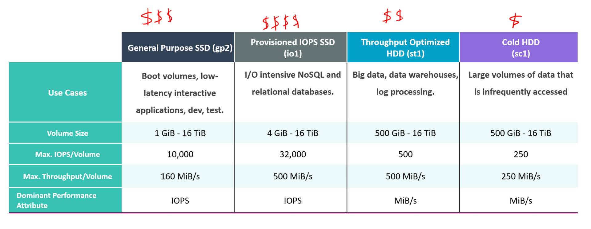
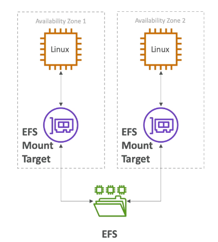

export const Highlight = ({ children, color }) => (
	
		{children}
	
)

export const Quote = ({ children, color }) => (
	
		{children}
	
)

## I. Introduction

1. Elastic Block Storage (EBS) is a network drive that you can attach to your instances while they run. It allows your instance to persist data.
2. Well suited for use as the primary storage for file systems, databases, or for any application that requires fine granular updates and access to raw, unformatted, block level storage.
3. You can mount multiple volumes on the same EC2 instance and vice versa (multi-attach).
4. Termination protection is turned off by default and must be enabled manually.
5. <Highlight>It's locked to an AZ.</Highlight>6. In the same AZ, you can detach from one EC2 and attach to another. To move a volume, you need to snapshot it.
7. Have a provisioned capacity (GB, IOPS).
8. <Highlight>Only GP2 and IO1 can be chosen while launching an instance.</Highlight>
## II. Types of EBS

1. <Highlight>GP2 — General Purpose SSD</Highlight>   
    
    1. General purpose SSD volume that balances price (cheap) and performance
    2. Recommended for most workloads
    3. System boot volumes
    4. <Highlight>Virtual desktops, low latency interactive apps</Highlight>    5. Development and test environments
    6. <Highlight>Size: 1GB - 16TB</Highlight>    
    7. <Highlight>3 IOPS per GB, maxes out at 16,000</Highlight>

2. <Highlight>IO1 and IO2 — Provisioned IOPS SSD</Highlight>    

    1. High perf SSD for low latency and critical apps/db (IOPS > 16,000)
    2. <Highlight>Size: 4 GB - 16TB</Highlight>    
    3. <Highlight>10 IOPS per GB</Highlight>    
    4. <Highlight>Good for large scale db where low latency might be required</Highlight>    
    5. Min: 100, Max: 64000 (nitro instances) OR 32000 (regular instances)

3. <Highlight>ST1 — Throughput optimized HDD</Highlight>    

    1. <Highlight>Low cost HDD for frequent (sequential) reads</Highlight>    
    2. <Highlight>NOT good for random reads</Highlight>    
    3. <Highlight>Used in data warehousing, log processing, MapReduce, streaming workloads</Highlight>    
    4. <Highlight>Cannot be a boot volume</Highlight>    
    5. Size: 500GB - 16TB
    6. <Highlight>Max IOPS is 500</Highlight>

4. <Highlight>SC1 —  Cold HDD</Highlight>    

    1. <Highlight>Lowest cost for infrequent reads</Highlight>   
    2. <Highlight>Good for database and backups (store and forget)</Highlight>    
    3. <Highlight>Cannot be a boot volume</Highlight>    
    4. Size: 500GB - 16TB
    5. <Highlight>Max IOPS is 250</Highlight>    
    6. <Highlight>Max throughput of 250MB/s, can burst</Highlight>    
    7. Attaching both ST1 and SC1 is not supported at this time 

## III. EBS Snapshots

1. <Highlight>Incremental - only backup changed blocks.</Highlight>
2. Backups use IO so do it during downtime e.g. 2am-3am
3. <Highlight>Snapshots are stored in S3 but you can't directly see it, only available through EC2 API.</Highlight>
4. Each snapshot is given a unique identifier, and customers can create volumes based on any of their existing snapshots.
5. Not necessary to detach volume during snapshot but recommended.
6. Max 100,000 snapshots.
7. Can copy snapshots across AZ or region.
8. Can make AMI from snapshot
9. EBS volumes restored by snapshots need to be pre-warmed (using fio or dd commands).
10. Snapshots can be automated using Amazon Data Lifecycle Manager (DLM).
11. <Highlight>Snapshots occur async and do not interfere with the normal functioning of EBS.</Highlight>

## IV. EBS Migration

1. EBS volumes are locked to a specific AZ.
2. To migrate it to a different AZ (or region):
    1. Snapshot the volume
    2. Copy the volume to a different region
    3. Create a volume from the snapshot in the AZ of your choice

## V. EBS Encryption

1. Creating an encrypted EBS enables
    1. <Highlight>Data at rest encryption for the EBS</Highlight>
    2. <Highlight>All the data in flight moving between the instance and volume is encrypted</Highlight>
    3. <Highlight>All snapshots are encrypted</Highlight>

2. Encryption and decryption is handled by KMS (w/ AES 256). 
3. It has a minimal impact on latency.
4. Snapshots of encrypted volumes are encrypted.
5. <Highlight>You can have encrypted an unencrypted EBS volumes attached at the same time.</Highlight>
6. <Highlight>All EBS volume types support encryption and all instance families now support encryption too.</Highlight>
7. Supports encryption of boot volumes as well (GP2, IO1, IO2).

## VI. Instance Store

1. Some instances do not come with root EBS volumes but an "Instance Store".
2. Instance stores are <Highlight>ephemeral</Highlight> storages and physically attached to machine, unlike EBS which is a network drive.
3. When using an Instance store-backed root volume, any data on the instance store volumes persists as long as the instance is running, but this data is deleted when the instance is terminated (<Highlight>instance store-backed instances do not support the `Stop` action</Highlight>) or if it fails (such as if an underlying drive has issues).
4. The pros are
    1. Very high IOPS (>100,000)
    2. Good for buffer/cache/scratch data
    3. <Highlight>Data survives reboot</Highlight>
    4. Disk size is up to 7.5TB
    5. Block storage (just like EBS)

5. The cons are
    1. The data is lost on stop or terminate
    2. Cannot be resized
    3. Backups are manual

## VII. EBS RAID

1. EBS is somewhat already redundant (replicated within AZ) but RAID can be helpful if you want to
    1. Increase IOPS to 100,000
    2. Mirror EBS volumes

2. RAID is possible as long as your OS supports it (Mac, Windows). Some RAID options are
    1. RAID 0
    2. RAID 1
    3. RAID 5 (not recommended)
    4. RAID 6 (not recommended)

3. <Highlight>RAID 0 (Series)</Highlight>
    1. Combining two or more volumes and getting the total disk space and IO
    2. If one disk fails, all data is gone
    3. Useful when high IOPS is needed but not fault-tolerance OR when a database has it already built-in
    4. This allows us to have a very big disk with lot of IOPS
    5. For instance, two 500 GB EBS instances with 4,000 PIOPS would combine to become a 1,000 GB RAID 0 array with 8,000 PIOPS and 1000 MB/s throughput

4. <Highlight>RAID 1 (Parallel)</Highlight>
    1. Data is written to all underlying EBS volumes (mirror)
    2. This increases fault tolerance
    3. Low network throughput because of multiple writes
    4. For instance, two 500 GB EBS instances with 4,000 PIOPS would combine to become a 500 GB RAID 1 array with 4,000 PIOPS and 500 MB/s throughput

## VIII. EFS

1. Elastic File System (EFS) is a managed network storage.
2. <Highlight>It can applied to multiple EC2 instances across AZs.</Highlight>
3. Highly available, scalable and expensive (3x of GP2) but pay per use
4. It uses standard NFSv4.1 protocol.
5. Cannot be mounted on Windows instances.
6. Used in web apps, CMS etc.
7. <Highlight>Encryption at rest using KMS and in-flight with HTTPS</Highlight>. No effect on throughput.
8. POSIX file system that has a standard file API.
9. File system scales automatically, pay per use so no capacity planning.
10. You can control who can administer your file system using IAM. You can control access to files and directories with <Highlight>POSIX-compliant user and group-level permissions</Highlight>. POSIX permissions allows you to restrict access from hosts by user and group. EFS Security Groups act as a firewall, and the rules you add define the traffic flow.
11. Scale
    1. Can support 1000s of concurrent NFS clients, 10GB/s throughput.
    2. Can automatically grow to petabyte-scale file system.

12. Performance mode (set at EFS creation time)
    1. <Highlight>General purpose (default): For latency-sensitive use cases</Highlight>
    2. <Highlight>Max IO: Higher latency and throughput, highly parallel (big data, media processing)</Highlight>

13. Storage Tiers
    1. <Highlight>Standard:</Highlight> For frequently accessed files
    2. <Highlight>Infrequent Access (EFS-IA):</Highlight> Cheap to store but pay-per-retrieval

    ## IX. EBS vs EFS

1. EBS volumes

    1. can be attached to only one instance at a time
    2. are locked at AZ level
    3. 16TB for one volume
    4. provide lowest latency to parent EC2
    5. common types include GP2, IO1
    6. pay structure is up front
    7. used for boot volumes
    8. Offer durable snapshots for backups
    9. To migrate an EBS volume across AZ
        1. Take a snapshot
        2. Restore the snapshot to another AZ

    10. <Highlight>Root EBS volumes of instances get terminated by default</Highlight>if the EC2 instance gets terminated (you can disable it though).

2. EFS volumes

1. can be mounted to 1000s of instances across AZs
2. <Highlight>only available for Linux instances</Highlight>3. costlier than EBS, EFS-IA is cheaper though
4. billed only for usage
5. unlimited size
6. not used for boot volumes
7. EFS-EFS replication through DataSync
8. can be integrated with on-prem

## X. EFS Tips

1. EFS provides shared access to data using a traditional file sharing permissions model and hierarchy directory structure via NFS protocol. S3 is more about object storage that is massively scalable, durable and low-cost.
2. EFS can share data across 1000s of machines.
3. Compatible with all AMIs.
4. You can securely sync data between NFS-EFS or EFS-EFS through AWS DataSync over DirectConnect or AWS VPN (= VPG + Customer Gateway).
5. You can save costs by moving data to EFS IA using a lifecycle policy. If you further disable IA, no new files will be moved but all existing files will stay there.
6. Files smaller than 128KB are not eligible for EFS IA.
7. Supports multi-AZ.
8. <Highlight>You can create backups using AWS Backup.</Highlight>9. Provisioned Throughput enables EFS customers to provision their system's throughput independent of the data they need. In this mode, you are billed separately for throughput and storage.
10. You can grow or shrink the throughput whenever you want.
11. You control which EC2 instances can access VPC using VPC security group rules.
12. EFS Access Points provide a IAM-enabled API of accessing your file system.
13. You can concurrently access EFS from on-prem datacenters as well as EC2 instances in the cloud.
14. The file names do not need to be globally unique.
15. EFS can be integrated with ECS and EKS.
16. <Highlight>Does NOT work for windows</Highlight>
## XI. EBS Tips

1. EBS Standard has been renamed to EBS Magnetic Volumes (to avoid confusion with GP2).
2. <Highlight>If EBS is attached to an EC2 instance and if it's stopped, you still have to pay for EBS.</Highlight>
3. ST1 and SC1 process IOs in chunks of 1 MBs. They won't perform well on random small IO situations e.g. database.
4. You can stripe multiple volumes together to achieve up to 80k IOPS or 2.3GB/s when attached to a larger EC2 instance. However, performance for ST1 and SC1 scales linearly with volume size so there may not be as much of a benefit to stripe these volumes together.
5. You will be billed for provisioned IOPS even in a detached state. It is recommended to create a snapshot when a volume is not in use to reduce costs.
6. You can detach an EBS volume from an instance explicitly or by terminating the instance. However, if the instance is running, you must first "unmount" the volume.
7. <Highlight>If the EBS volume is the root device of an instance, you must stop the instance before detaching the volume.</Highlight>
8. You only need the most recent snapshot to create the full volume because snapshots are incremental.
9. You cannot use a block device mapping to specify a snapshot, EFS volume or S3 bucket.
10. An EC2 status check on an EBS volume is showing as `insufficient-data` → The checks may still be in progress on the volume.
11. <Highlight>The volume does not need a certain amount of data on it to be checked properly.</Highlight>
12. Want to attach EBS volume to EC2 instance inside CloudFormation → <Highlight>specify both EC2 and EBS logical IDs.</Highlight>
13. Tips for improving performance
    1. Use EBS-optimized instances
    2. Understand your workload
    3. Use a modern linux kernel
    4. Track performance using CloudWatch
    5. Use RAID 0 to maximize utilization of instance resources