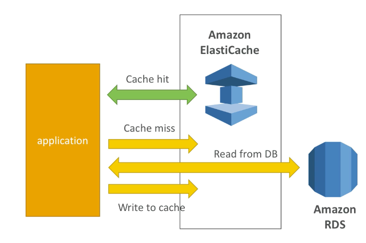
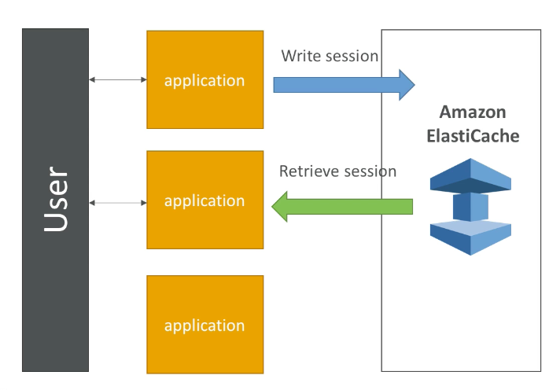
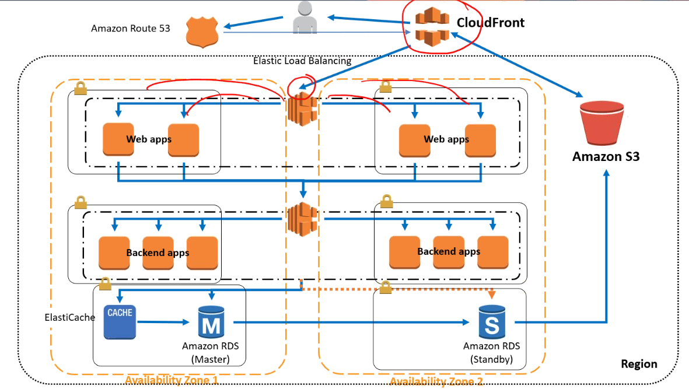

export const Quote = ({ children, color }) => (
	
		{children}
	
)

<!--  -->

## I. Introduction

1. Web service to deploy, operate and scale in-memory cache in the cloud.
2. Improves perf of web-based apps by reducing reads from disks.
3. **Supports two caching engines**
    1. **redis (advanced use case)**
    2. **memcached (basic use case)**

4. Should be used along side read replicas to improve perf of an app.
5. Read scaling using read replicas.
6. Multi-AZ with failover capability.
7. AWS takes care of OS, patching, optimizations and such.

## II. Use cases

1. Lazy loading

2. Shopping cart user session

## III. Redis vs MemcacheD

1. **Redis**
    1. **Multi-AZ with auto failover**
    2. Read replicas to scale reads and have HA
    3. Data durability using AOF persistence
    4. Backup and restore features
    5. Used more like traditional db
    6. Can be used for message queue as well

2. **Memcached**
    1. Multi-node for partitioning (sharding)
    2. Non persistent
    3. No backup
    4. Multi-threaded architecture
    5. Used solely for memcached

## IV. Security

1. All caches in ElastiCache
    1. Support SSL
    2. **No IAM auth**
    3. IAM policies on ElastiCache are only used for AWS API-level security

2. **Redis auth**
    1. **You can set a "password/token" when you create a cluster**
    2. This is extra level of security for your cache (on top of security groups)
    3. Forces user to enter credentials
    4. Use HTTPS to enable in-transit encryption while the data is being replicated.

3. Memcached — supports SASL-based auth

## V. Patterns

1. Lazy loading: all the read data is cached (can be stale)
2. Write through: adds/updates data in the cache when written to a db (no stale data)
3. Session store: store temporary session data in cache (using TTL features)

## VI. ElastiCache for SA

1. Operations: same as RDS
2. Security: AWS responsible for OS security, we are responsible for user auth and encryption
3. Reliability: Clustering, multi-AZ
4. Performance: Sub-millisecond performance, in-memory, read-replicas for sharding
5. Cost: Pay per hour based on EC2 and storage usage
6. Below is a fully-functional 3-tier architecture with different caches 

