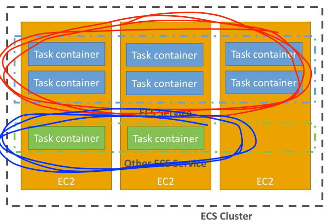
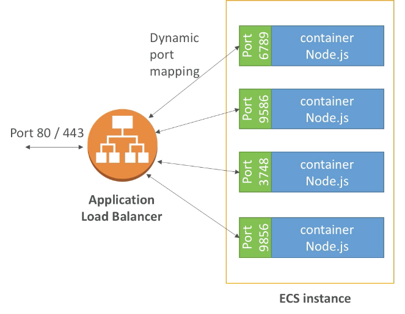
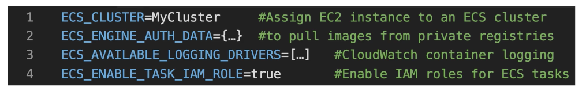
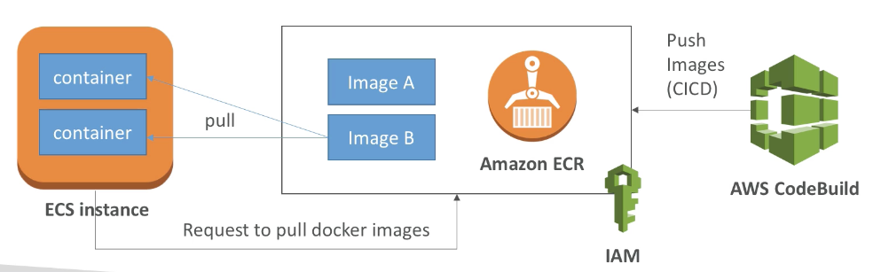
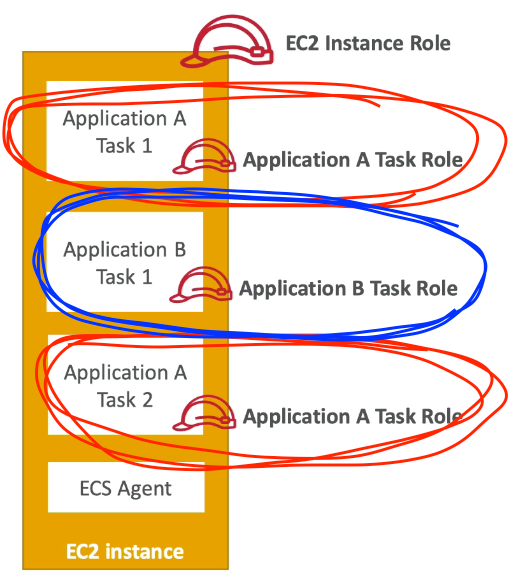

export const Quote = ({ children, color }) => (
	
		{children}
	
)

## I. Introduction

1. It is a container orchestration service, helps run docker containers on EC2 machines.
2. ECS inlcudes
    1. ECS core: running ECS on user-provisioned EC2 instances
    2. Fargate: running ECS tasks on AWS-provisioned compute (serverless)
    3. EKS: running on ECS on AWS-provisioned k8s
    4. ECR: container registry
3. IAM security and roles are at the <Quote>ECS task level.</Quote>
4. Direct integration with ALBs, auto scaling capability.
5. To start, you create a ECS cluster (set of EC2 instances), then define ECS service and finally the ECS tasks (individual containers).

<Quote>Tasks allow you to define a set of containers that you would like to be placed together (or part of the same placement decision), their properties, and how they may be linked.</Quote>

Tasks include all the information that Amazon ECS needs to make the placement decision.

To launch a single container, your task Definition should only include one container definition.

When you run tasks using ECS, you place them in a cluster i.e. a logical grouping of resources. 

Clusters are region-bound. 

When using Fargate, ECS manages your cluster resources. When using EC2, you manage the group of containers.

Before you delete a cluster, you must delete the services and de-register the container instances inside that cluster.

ECS Task (IAM) Role — to make sure each task has right roles to perform the needed actions. 

<Quote>You first need to create an IAM role for your task</Quote>, using the 'Amazon EC2 Container Service Task Role’ service role and attaching a policy with the required permissions. 

When you create a new task definition or a task definition revision you can then specify a role by selecting it form the ’Task Role’ drop-down or using the `taskRoleArn` field in the JSON format.

**1 Task Defn = 1 IAM Role**

<Quote>You can only apply one IAM role to a Task Definition so you must create a separate Task Definition. </Quote>

A Task Definition is required to run Docker containers in Amazon ECS and you can specify the IAM role (Task Role) that the task should use for permissions.

6. ALB integration
    1. <Quote>Direct port-mapping possible</Quote>
    2. Run multiple instances of the same app on the same EC2 

7. ECS setup — config file 

8. ECR — fully integrated with IAM and ECS 

## II. Fargate

1. In general, we have to create our own EC2 instances to launch ECS. If need to scale, manually add more EC2s so we are managing infra on our own.
2. <Quote>Fargate does all the above — serverless, no more EC2!</Quote>
3. Fargate requires you to specify CPU and memory at task level. Task storage is ephemeral.
4. <Quote>With Fargate, you pay for the vCPU and memory resources that your containerized app requests. The resources are calculated right from the time the container image is pulled till the ECS task terminates.</Quote>
5. <Quote>Sends log to CloudWatch.</Quote>

## III. EKS

1. ECS = AWS way, EKS = k8s way for managing containers.
2. Great way to migrate to AWS if running k8s already elsewhere.

## IV. ECS Tips

1. Must choose the launch type at the time of creation e.g. EC2
2. <Quote>The ECS container agent is included in the Amazon ECS-optimized AMI</Quote>
and can also be installed on any EC2 instance that supports the ECS specification.
3. <Quote>You need to verify that the installed agent is running and that the IAM instance profile has the necessary permissions applied.</Quote>
4. There is no additional charge for Amazon ECS. You pay for AWS resources (e.g. EC2 instances or EBS volumes) you create to store and run your application.
5. You can scale your application up and down by changing the number of containers you want the service to run.
6. You can perform batch jobs by running Amazon ECS "Run task" to run one or more tasks once.
7. ECS provides Blox, a collection of open source projects for container management and orchestration.
8. ECS is PCI and HIPAA approved. Monthly uptime of 99.99%.
9. Amazon ECS schedules containers for execution on customer-controlled Amazon EC2 instances or with AWS Fargate and builds on the same isolation controls and compliance that are available for EC2 customers. <Quote>Your compute instances are located in a Virtual Private Cloud (VPC) with an IP range that you specify.</Quote>,You decide which instances are exposed to the Internet and which remain private.
    1. Your EC2 instances use an IAM role to access the ECS service. As an Amazon EC2 customer, you have root access to the operating system of your container instances.
    2. Your ECS tasks use an IAM role to access services and resources.
    3. Security Groups and networks ACLs allow you to control inbound and outbound network access to and from your instances.

10. <Quote>Troubleshooting steps for containers include</Quote>

    1. Verify that the Docker daemon is running on the container instance
    2. Verify that the Docker Container daemon is running on the container instance
    3. Verify that the container agent is running on the container instance
    4. **Verify that the IAM instance profile has the necessary permissions**

11. <Quote>Deployment strategies</Quote>

    1. **Rolling update**— replace current running version with latest.

    2. **Blue/Green**— Verify the new deployment before sending production traffic to it