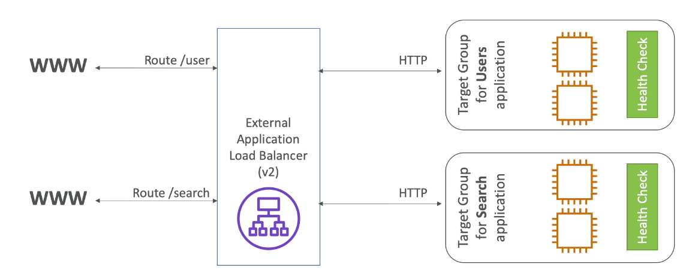
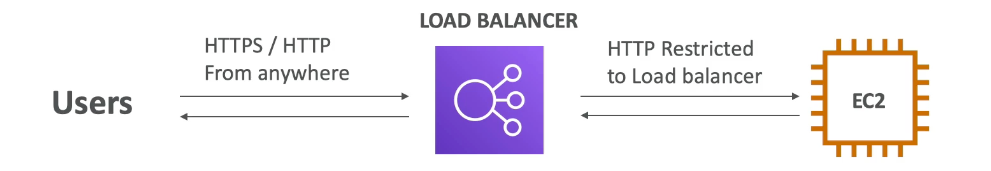
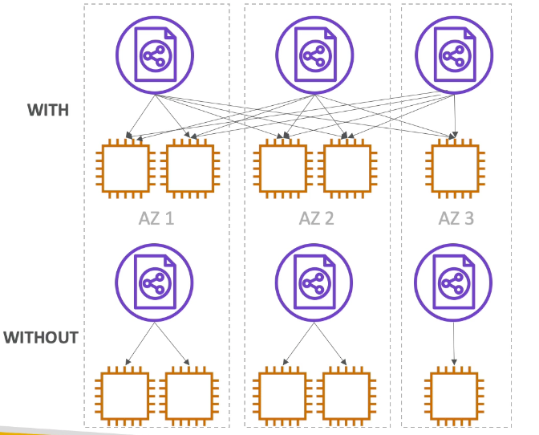
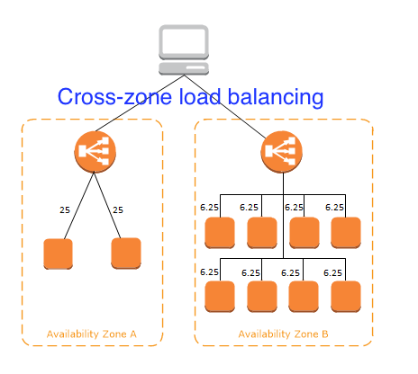
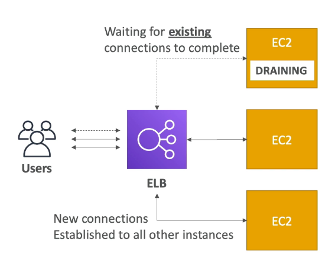

export const Highlight = ({ children, color }) => (
	
		{children}
	
)

export const Quote = ({ children, color }) => (
	
		{children}
	
)

## I. Introduction

1. Distributes incoming application or network traffic across multiple "targets" including EC2, Lambdas, ECS etc.
2. When you create an ELB, you must specify one public subnet from at least two AZs (one public subnet per AZ).
3. Enable deletion protection to prevent your load balancer from being deleted accidentally.
4. <Highlight>Deleting ELB won't delete the instances registered to it.</Highlight>
5. You can perform load balancing on ports 1-65535
6. Inherent ability to detect unhealthy instances

## II. High Availability

1. High Availability (HA) means running your application in at least two data centers (== AZ). The goal of HA is to survive a data center loss.
2. Load balancers (LB) are servers that forward internet traffic to multiple servers (EC2 instances) downstream.
3. Uses of LB
    1. Spread load across multiple downstream instances
    2. Expose a single point of access (DNS) to your application
    3. Seamlessly handle failures of downstream instances
    4. Do regular health checks to your instance
    5. Provide TLS to your apps
    6. Enforce stickiness with cookies
    7. HA across zones
    8. Separate public and private traffic

4. The health check is done through port and route (`/health` is a common one)
    1. The instance will be pinged every 5s (can be configured)
    2. If the response is not `200`, that instance would be deemed unhealthy

## III. Types of ELB

1. <Highlight>Classic LB (v1, 2009)</Highlight>
    1. Old generation, supports TCP (layer 4) and HTTP/HTTPS (layer 7)
    2. For use with EC2 classic only
    3. Health checks are TCP or HTTP based
    4. Fixed hostname `XXX.region.elb.amazonaws.com`
    5. Can be used for internet-facing as well as internal apps
    6. Supports IPv6
    7. <Highlight>Does not support SNI</Highlight>
    8. Does not support path-based or HTTP header-based routing

2. <Highlight>Application LB (v2, 2016)</Highlight>
    1. Supports layer 7 -  HTTP, HTTPS
    2. The default routing algorithm is round robin
    3. Supports path based routing (wildcard supported)
        1. [myapp.com](http://myapp.com) goes to instance A
        2. [api.myapp.com](http://api.myapp.com) goes to instance B
        3. [mobile.myapp.com](http://mobile.myapp.com) goes to instance C

    4. Fixed hostname (`XXX.region.elb.amazonaws.com`)
    5. The application servers don't see IP of client directly — use `X-Forwarded-For` header
    6. Load balancing to multiple apps on the same machine (containers)
    7. Supports HTTP/2 , websockets and redirects
    8. Routing based on different paths e.g. `/user` and `/posts` 
    9. Routing based on hostname in URL and query strings
    10. Routing based on HTTP headers and methods
    11. Cross-zone load balancing is ALWAYS enabled
    12. The targets can be lambdas as well
    13. <Highlight>Need detailed HTTP logs → Enable access logs</Highlight>
    14. You are charged for each hour (full or partial) that an ALB is running and the number of Load Balancer Capacity Units (LCU) used per hour.
    15. You are not charged for cross-region data transfer while load balancing
    16. Great for microservices and containers (targets in general)
    17. (Setup video = #78)

3. <Highlight>Network LB (new v2, 2017)</Highlight>
    1. Supports layer 4 -  TCP, UDP, TLS
    2. <Highlight>Faster than ALB</Highlight> because it operates on layer 4 and not 7
    3. Can handle millions of requests per second
    4. Best suited for low-latency and high throughput workloads
    5. Less latency ~100ms (vs 400ms for ALB)
    6. <Highlight>Has one static IP per AZ and supports elastic IP</Highlight>
    7. At least one subnet must be specified, preferably two
    8. Cross-zone load balancing is DISABLED by default
    9. Supports connections from clients over inter-region VPC peering, AWS-managed VPN and third party VPN solutions
    10. <Highlight>You cannot enable/disable AZ after creating the NLB</Highlight>
    11. Preserves client IP so it can be seen by the backend
    12. Automatically provides a static IP per AZ that can be used by the applications as their frontend. Also enables one Elastic IP.

4. It's recommended to use newer versions.
5. Any user can talk to ELB but only ELB can talk to EC2. The EC2 instance's security group should be configured such that it can only talk to the ELB.
6. ELBs can scale but not instantaneously, contact AWS for a warmup
7. ELB access logs will log all requests (CloudWatch)

## IV. Stickiness

1. Stickiness means a client will ALWAYS be redirected to the same underlying target.
2. Works with classic and application ELBs.
3. It's implemented through a cookie to make sure the user doesn't lose their session.

## V. Cross-zone load balancing

1. Each ELB distributes evenly across all registered instances in all AZs.
2. Otherwise, the ELB will only distribute only its own AZ.
3. Disabled for classic ELB, no charges if enabled.
4. <Quote>Always enabled for application ELB, no charges.</Quote>
5. <Quote>Disabled for network ELB, you pay for enabling.</Quote>
6. In general, you pay anytime data travels through AZs.

## VI. SSL/TLS

1. TLS = new version of SSL
2. Public TLS certs are signed by orgs like GoDaddy, Google etc
3. You can manage your certs in ACM
4. Server Name Identification (SNI) is the method to support various certs for various sites on your EC2 instance.
    1. It's a newer protocol that requires the client to indicate the hostname of target server in the initial handshake.
    2.  <Highlight>Only works for ALB and NLB, not classic ELB. </Highlight>

## VII. Connection Draining

1. Time to complete "in-flight" requests while the instance is unhealthy or de-registering.
2. Classic ELB = "Connection draining", App/Network ELB = "De-registration delay"
3. The default "delay" is 300s but can be set from 1-3600s.
4. Can also be disabled by setting delay to 0.
5. Set to low value if your requests are short.

## VIII. ELB Tips

1. <Highlight>CANNOT balance across regions, use Route 53 for that.</Highlight>
2. ELBs are intended to load balance across EC2 instances in a ‘single’ region. Whereas DNS load-balancing (Route 53) is intended to help balance traffic ‘across’ regions.
3. If your NLB is responsive, integration with Route 53 will remove the unavailable load balancer IP address from service and direct traffic to an alternate NLB in another region.
4. Load balancer states — `Provisioning`, `Active`, `Failed`
5. By default, ELB timeout value is 60s. If a target does not send data at least every 60s while the request is in flight, ELB can close the frontend connection. For backend, you can use the  `keep-alive` option.
6. Listener rules determine how the load balancer routes the requests to the targets in one or more target groups.
7. Slow-start mode gives targets time to warm up before the load balancer sends them a full share of requests.
8. You cannot use instance ID based targets for on-premises servers and you cannot mix instance ID and IP address target types in a single target group.
9. <Highlight>Cannot use SSL with NLB (Layer 4 vs Layer 7)</Highlight>
10. <Highlight>You can passthrough encrypted traffic with an NLB and terminate the SSL on the EC2 instances.</Highlight>
11. ALB supports authentication from OIDC compliant identity providers such as Google, Facebook and Amazon. It is implemented through an authentication action on a listener rule that integrates with Amazon Cognito to create user pools.
12. When you enable an Availability Zone for your load balancer, Elastic Load Balancing creates a load balancer node in the Availability Zone. If you register targets in an Availability Zone but do not enable the Availability Zone, these registered targets do not receive traffic. Your load balancer is most effective when you ensure that each enabled Availability Zone has at least one registered target.
13. Health check statuses
    1. <Quote>Initial</Quote>: ELB is in the process of registering the target or performing initial health checks
    2. <Quote>Healthy</Quote>: Target is healthy
    3. <Quote>Unhealthy</Quote>: Target did not respond or failed the health check
    4. <Quote>Unused</Quote>: Target is not registered with a target group OR the target group is not used in a listener rule OR target is in an AZ that's not enabled for ELB.
    5. <Quote>Draining</Quote>: Target is deregistering

14. Classic three tier architecture with ELB, ASG and security groups