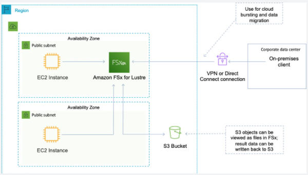

export const Highlight = ({ children, color }) => (
	
		{children}
	
)

export const Quote = ({ children, color }) => (
	
		{children}
	
)

## I. FSx for Windows

1. EFS is a shared POSIX compliant system for Linux. FSx is a fully managed Windows file system share drive.
2. Supports SMB protocol and Windows NTFS. Also AD and LDAP, ACLs.
3. Storage of up to 64 TB per file system.
4. Built on top of SSD, scale up to 10s of GB/s, <Quote>millions of IOPS</Quote>, 100s of PBs of data.
5. <Quote>Can be accessed from your on-prem infrastructure.</Quote>
6. <Quote>Can be configured to be multi-AZ.</Quote>
7. <Quote>Data is backed up daily to S3.</Quote>
8. <Quote>To migrate your existing file data into FSx, use Windows Robust File Copy (RoboCopy) to copy your files directly to FSx.</Quote>

## II. FSx for Lustre

1. Lustre = Linux + Cluster 
2. It is a type of parallel distributed file system for large scale computing.
3. Used in ML and HPC, quant finance, EDA
4. Scales up to 100s of GB/s, <Quote>millions of IOPS</Quote>, <1ms latency
5. Can be mounted on-prem servers using DirectConnect.
6. You can use FSx as your "hot" storage and S3 for "cold" storage.
7. Seamless integration with S3
    1. <Quote>Can read S3 as a file system (through FSx)</Quote>
    2. Can write the output of the computations back to S3 (through FSx)

## III. FSx Tips

1. Auto replication within the AZ it resides in.
2. Offers single AZ and multi-AZ deployment options for your Windows file-based workloads.
3. Uses the Volume Shadow Copy Service (VSS) to automatically take highly durable, file-system consistent daily backups to S3.
4. Default backup retention period is 7 days.
5. Supports identity based auth over SMB for Microsoft AD.
6. <Quote>Automatically encrypts data at-rest using KMS and in-transit using SMB kerberos session keys.</Quote>
7. PCI and HIPAA compliant.
8. Billed hourly based on configured storage capacity and throughput capacity.
9. Billed hourly for your backup storage (GB-month).