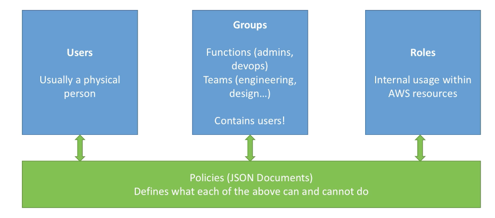
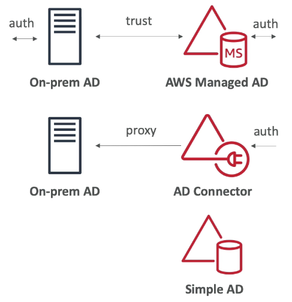
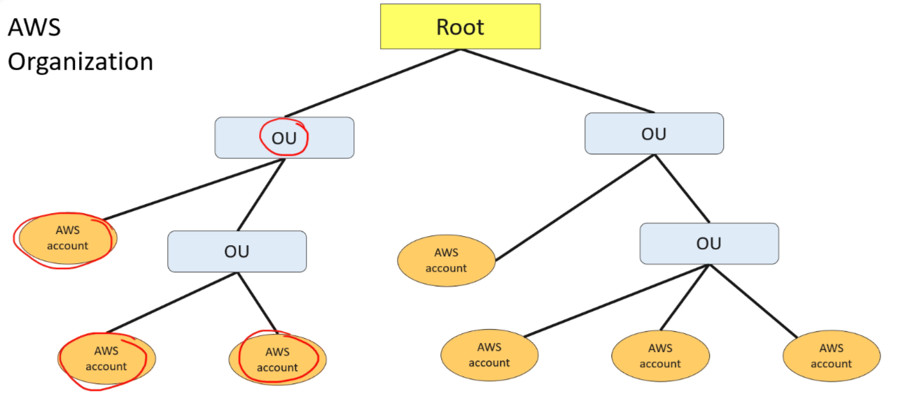
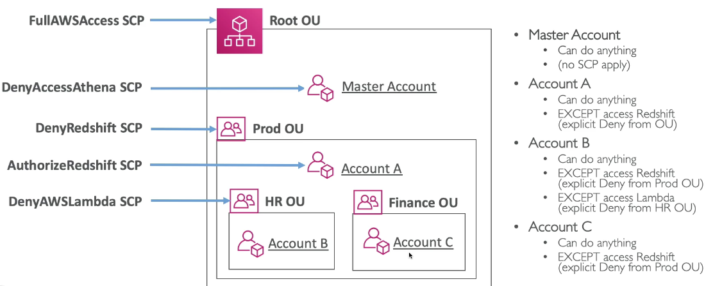
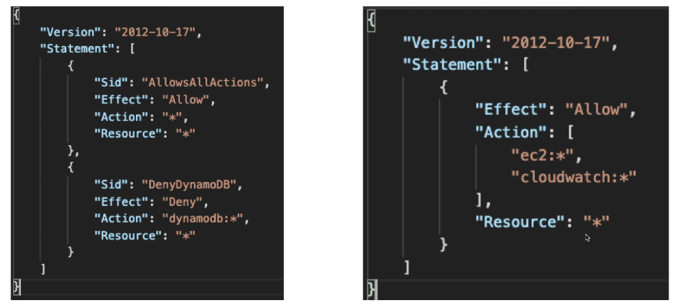
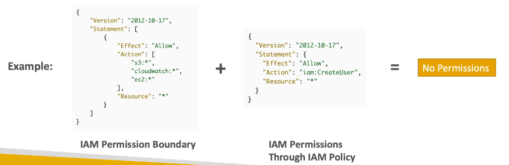
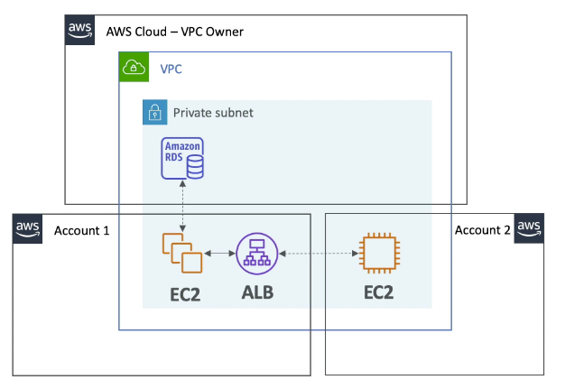
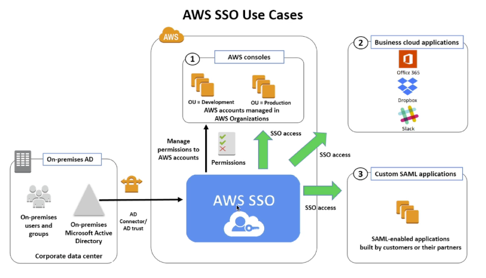
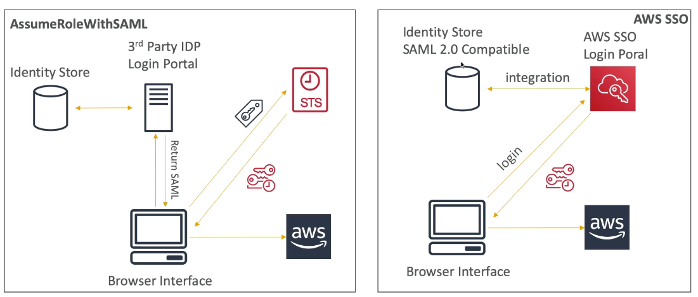

import Tabs from "@theme/Tabs"
import TabItem from "@theme/TabItem"

export const Highlight = ({ children, color }) => (
	<span
		style={{
			backgroundColor: color,
			borderRadius: "2px",
			color: "#fff",
			padding: "0.2rem",
		}}
	>
		{children}
	</span>
)

export const Colorize = ({ children, color }) => (
	<span
		style={{
			color: "#FF9900",
		}}
	>
		{children}
	</span>
)

<!-- <Highlight color="#25c2a0">Docusaurus green</Highlight> and <Highlight color="#1877F2">Facebook blue</Highlight> are my favorite colors. -->

## I. Introduction

1. IAM is the center of AWS.
2. Root account should never be used or shared.
3. <Highlight color="#FF9900">
   	{" "}
   	"Users" and "Groups" are for people, "Roles" are for machines.
   </Highlight>
4. "Permissions" are governed by "Policies" which are in JSON format.
5. An IAM group is a collection of IAM users. Groups let you specify permissions for multiple users, which can make it easier to manage the permissions for those users.

   1. Groups are collections of users and have policies attached to them
   2. <Highlight color="#FF9900">
      	A group is not an identity and cannot be identified as a principal in an
      	IAM policy
      </Highlight>
   3. Use groups to assign permissions to users
   4. IAM groups cannot be used to group EC2 instances
   5. **Groups cannot belong to other groups aka no nesting!**
   6. <Highlight color="#FF9900">CANNOT add role to a group</Highlight>
   7. <Highlight color="#FF9900">
      	Only users and services can assume a role to take on permissions (NOT
      	groups)
      </Highlight>

6. IAM comes with managed policies.
7. <Highlight color="#FF9900">
   	It's best to give users least amount of permissions they need to perform
   	their job.
   </Highlight>
8. IAM Federation - Big enterprises have their own repo of users that can be integrated with IAM. This way, one can login into AWS using their company credentials (SAML).
9. <Highlight color="#FF9900">One IAM user per physical person.</Highlight>
10. <Highlight color="#FF9900">One IAM role per application.</Highlight>
11. **IAM roles cannot make direct requests to AWS services**; <Highlight color="#FF9900">they are meant to be assumed</Highlight> by authorized entities, such as IAM users, applications, or AWS services such as EC2. Use IAM roles to delegate access within or between AWS accounts.
12. IAM credentials should never be shared.
13. Never use root account except for initial setup.
14. Always create an IAM user when setting up AWS!



<Tabs
	defaultValue="When to Create IAM user"
	values={[
		{ label: "When to Create IAM user", value: "When to Create IAM user" },
		{ label: "When to Create IAM group", value: "When to Create IAM group" },
	]}
>
	<TabItem value="When to Create IAM user">
		<li>You created an AWS account and you're the only person who works in your account.</li>
        <li>Other people in your group need to work in your AWS account, and your group is using no other identity mechanism.</li>
        <li>You want to use the command-line interface to work with AWS.</li>
	</TabItem>
	<TabItem value="When to Create IAM group">
    	<li>You created an application that runs on an Amazon EC2 instance and that application makes requests to AWS.</li>
        <li>You're creating an app that runs on a mobile phone and that makes requests to AWS.</li>
        <li>Users in your company are authenticated in your corporate network and want to be able to use AWS without having no sign in again(federate into AWS).</li>
    </TabItem>


</Tabs>


## II. STS

1. Allows to grant limited and temporary access to AWS resources.
2. **Token is valid up to one hour (must be refreshed).**
3. IAM users can request temporary security credentials for their own use by calling the AWS STS `GetSessionToken` API. The default expiration for these temporary credentials is 12 hours; the minimum is 15 minutes, and the maximum is 36 hours.
4. How can I use temporary security credentials to call AWS service APIs?

   1. Use the access key ID and secret access key that are provided with the temporary security credentials
   2. Use the session token that is provided with the temporary security credentials. Include the session token in the `x-amz-security-token` header.

5. APIs

   1. `AssumeRole`: within your own account for enhanced security or cross-account
   2. `AssumeRoleWithSAML`: return credentials for users logged with SAML
   3. `AssumeRoleWithWebIdentity`: return credentials for users logged in with identity provider, **AWS recommends using Cognito instead of this**.
   4. `GetSessionToken`: for MFA from a user's root account

6. Using STS to assume a role
   1. Define an IAM role within your account or cross-account
   2. Define which principals can access this IAM role
   3. Use AWS STS to retrieve credentials and impersonate the IAM role you have access to
   4. Temporary credentials valid for 15-60 minutes.

## III. AWS Active Directory

1. A brief background of Microsoft AD

   1. Found on any Windows server with AD domain services.
   2. Database of objects: User, Accounts, Computers, Printers, File shares etc
   3. Centralized security management, create account, assign permissions
   4. Object are organized in trees. A group of trees is called forest.

2. AWS managed Microsoft AD

   1. Create your own AD in AWS, manage users locally
   2. Supports MFA
   3. Establish trust connection with your on-prem AD

3. AD connector

   1. Directory gateway (proxy) to redirect to on-prem AD
   2. Users are managed on the on-prem AD

4. Simple AD
   1. AD-compatible managed directory on AWS
   2. Cannot be joined with on-prem AD



## IV. AWS Organizations

1. Global service to manage multiple AWS accounts.
2. The main account is master account and you can't change it. Other accounts are members.
3. <Highlight color="#FF9900">
   	Member accounts can only be part of one organization aka no nesting!
   </Highlight>
4. Consolidated billing across all accounts - single payment method.
5. Pricing benefits from aggregated usage (volume discount for EC2 and S3).
6. API available to automate account creation.
7. Multi-account strategy
   1. Create accounts per dev, per cost center, per env for better isolation
   2. Multi account vs Multi VPCs
   3. Use tagging for billing purposes
   4. Enable CloudTrail on all accounts and send logs to a central S3 bucket
   5. Establish cross-account roles for admin purposes

## V. Organizational Units (OU)

1. You can create OUs however you want.
2. Leave master account in root OU (good practice).
   

3. Service Control Policies (SCP)
   1. Whitelist or blacklist IAM actions
   2. Applied at the OU or account level
   3. Does not apply to master account
   4. SCP is applied to all users and roles of the account, including root
   5. SCP does not apply to service-linked roles
   6. **Must have an explicit allow (deny all by default)**
   7. Use cases
      1. Prod account cannot use EMR
      2. Enforce PCI compliance by explicitly disabling services




## VI. Advanced IAM

1. IAM conditions — `aws:SourceIP`(restrict client IP from which requests are made)

```json
{
	"Version": "2012-10-17",
	"Statement": [
		{
			"Effect": "Allow",
			"Principal": {
				"AWS": "arn:aws:iam::account-id:user/EXAMPLEIAMUSERNAME"
			},
			"Action": "sts:AssumeRole",
			"Condition": {
				"NotIpAddress": {
					"aws:SourceIp": ["103.15.250.0/24"]
				}
			}
		}
	]
}
```

2. `aws:RequestedRegion` (restrict region API calls are made to)

```json
{
	"Version": "2012-10-17",
	"Statement": [
		{
			"Sid": "DenyAllOutsideRequestedRegions",
			"Effect": "Deny",
			"NotAction": ["cloudfront:*", "iam:*", "route53:*", "support:*"],
			"Resource": "*",
			"Condition": {
				"StringNotEquals": {
					"aws:RequestedRegion": [
						"eu-central-1",
						"eu-west-1",
						"eu-west-2",
						"eu-west-3"
					]
				}
			}
		}
	]
}
```

3. Restrict based on tags

```json
{
	"Version": "2012-10-17",
	"Statement": [
		{
			"Sid": "StartStopIfTags",
			"Effect": "Allow",
			"Action": ["ec2:StartInstances", "ec2:StopInstances", "ec2:DescribeTags"],
			"Resource": "arn:aws:ec2:region:account-id:instance/*",
			"Condition": {
				"StringEquals": {
					"ec2:ResourceTag/Project": "DataAnalytics",
					"aws:PrincipalTag/Department": "Data"
				}
			}
		}
	]
}
```

4. Force MFA

```json
{
	"Version": "2012-10-17",
	"Statement": [
		{
			"Effect": "Allow",
			"Action": ["ec2:StopInstances", "ec2:TerminateInstances"],
			"Resource": ["*"],
			"Condition": { "Bool": { "aws:MultiFactorAuthPresent": "true" } }
		}
	]
}
```

5. IAM for S3
   1. ListBucket permission applies to `arn:aws:s3:::test`(bucket-level permission)

```json
{
	"Version": "2012-10-17",
	"Statement": [
		{
			"Effect": "Allow",
			"Action": ["s3:ListBucket"],
			"Resource": ["arn:aws:s3:::test"]
		},
		{
			"Effect": "Allow",
			"Action": ["s3:PutObject", "s3:GetObject", "s3:DeleteObject"],
			"Resource": ["arn:aws:s3:::test/*"]
		}
	]
}
```

2. But `GetObject`, `PutObject` and `DeleteObject` applies to anything within bucket so to include all, we add `arn:aws:s3:::test/*` (object-level permission)

## VII. IAM Roles vs Resource Based Policies

1. When you assume a role, you give up original permissions of your principal and take the new ones given by the role.
2. <Highlight color="#FF9900">
   	When using resource-based policy, you don't have to give up permission of
   	your principal.
   </Highlight>

## VIII. IAM Permission Boundaries

1. The permissions boundary for an IAM entity (user or role) sets the maximum permissions that the entity can have. This can change the effective permissions for that user or role. The effective permissions for an entity are the permissions that are granted by all the policies that affect the user or role.
2. Within an account, the permissions for an entity can be affected by identity-based policies, resource-based policies, permissions boundaries, Organizations SCPs, or session policies.
3. <Highlight color="#FF9900">
   	IAM permission boundaries are supported for users and roles (not groups).
   </Highlight>
4. Advanced features to use a managed policy to set the maximum permissions an IAM entity can get.



```json
{
	"Version": "2012-10-17",
	"Statement": [
		{
			"Effect": "Deny",
			"Action": "sqs:_",
			"Resource": "*"
		},
		{
			"Action": ["sqs:DeleteQueue"],
			"Effect": "Allow",
			"Resource": "*"
		}
	]
}
```
1. **Can you create a SQS queue?**
No because there's an explicit deny.

2. **Can you delete a SQS queue?**
<Highlight color="#FF9900">No because there's an explicit deny on top which precedes the allow.</Highlight>

3. **Can you create an EC2 instance?**
<Highlight color="#FF9900">There's no explicit deny or allow. Since everything in AWS is deny by default so no.</Highlight>

## X. AWS Resource Access Manager (RAM)

1. Share AWS resources with other AWS accounts.
2. <Highlight color="#FF9900">Share with ANY account or those within your organization.</Highlight>
3. Avoid resource duplication.
4. VPC subnets (most common)
    1. allow to have all the resources launched in the same subnet
    2. must be from the same AWS organizations
    3. cannot share security groups and default VPC
    4. participants can manage their own resources in there
5. In the following examples	
	1. Account1 owns EC2 and ELB which cannot be modified by 	Account2 or owner
	2. But network is shared so they can talk to each other 	using private IP



## XI. AWS SSO

1. Centrally managed SSO to access multiple accounts and third-party business applications.
2. Integrated with OU and supports SAML 2.0 and AD.
3. Centralized permission and CloudTrail audits



4.  `AssumeRoleWithSAML` vs SSO




## XII. Identity Federation

1. With identity federation, external identities are granted secure access to resources in your AWS account without having to create IAM users. These external identities can come from your corporate identity provider (such as Microsoft Active Directory or from the AWS Directory Service) or from a web identity provider (such as Amazon Cognito, Login with Amazon, Facebook, Google, or any OpenID Connect-compatible provider).
2. Federated users (aka external identities) are users you manage outside of AWS in your corporate directory, but to whom you grant access to your AWS account using temporary security credentials. <Highlight color="#FF9900">They differ from IAM users, which are created and maintained in your AWS account.</Highlight>
3. When you request temporary security credentials for your federated user using an `AssumeRole` API, you can optionally include an access policy with the request. <Highlight color="#FF9900">The federated user’s privileges are the intersection of permissions granted by the access policy passed with the request and the access policy attached to the IAM role that was assumed.</Highlight>
4. Once the identity federation console session times out, the user is presented with a message stating that the console session has timed out and that they need to request a new session.
5. Prefer Cognito over `AssumeRoleWithWebIdentity` API.

## XIII. IAM Tips

1. <Highlight color="#FF9900">IAM is a free service.</Highlight>
2. To sign in to the AWS Management Console as an IAM user, you must provide your account ID or account alias in addition to your user name and password.
3. To sign in programmatically (CLI and API), you must provide access key ID and secret access key.
4. If a company is using Microsoft Active Directory which implements Security Assertion Markup Language (SAML), you can set up a SAML-Based Federation for API Access to your AWS cloud. In this way, you can easily connect to AWS using the login credentials of your on-premises network.
5. Access keys → API calls
6. Key pair → logging in EC2
7. <Highlight color="#FF9900">You can assign a role to an EC2 instance that is already running. Only one role per EC2.</Highlight>
8. You must grant an IAM user two distinct permissions to successfully launch EC2 instances with roles:
    1. Permission to launch EC2 instances.
    2. Permission to associate an IAM role with EC2 instances.

9. <Highlight color="#FF9900">You can create a managed policy and assign it to the group of users and the role on the Amazon EC2 instance.</Highlight>
10. <Highlight color="#FF9900">Can users SSH to EC2 instances using their AWS username and password? No, you need the key pair!</Highlight>
11. We can utilize AWS Config to check for compliance on the password policy by configuring the Config rule to check the `IAM_PASSWORD_POLICY` on an account.
12. IAM is eventually consistent.
13. APIs can be enabled to use MFA protection.
14. <Highlight color="#FF9900">Users, roles, federated users and applications are all "principals". Your root account is your "first principal".</Highlight>
15. <Highlight color="#FF9900">By default, a brand new IAM user has NO permissions. You must grant access keys and attach necessary permissions to enable them to take any action.</Highlight>
16. AWS Service Role is a role that a service assumes to perform actions in your account on your behalf.
17. You can manage and rotate programmatically a user's access keys and X.509 certificates via the IAM APIs, AWS CLI, or IAM console.
18. <Highlight color="#FF9900">AWS recommend that you use the AWS SDKs to make programmatic API calls to IAM. However, you can also use the IAM Query API to make direct calls to the IAM web service. An access key ID and secret access key must be used for authentication when using the Query API.</Highlight>
19. Currently, IAM users can use their SSH keys only with AWS CodeCommit to access their repositories.
20. You assume an IAM role by calling the AWS Security Token Service (STS) AssumeRole APIs (in other words, `AssumeRole`, `AssumeRoleWithWebIdentity`, and `AssumeRoleWithSAML`). These APIs return a set of temporary security credentials that applications can then use to sign requests to AWS service APIs.
21. <Highlight color="#FF9900">There is no limit to the number of IAM roles you can assume, but you can only act as one IAM role when making requests to AWS services.</Highlight>
22. You can log IAM actions, STS actions, and AWS Management Console sign-ins by activating AWS CloudTrail.
23. If you got your certificate from a third-party CA, import the certificate into **AWS Certificate Manager** OR upload it to the **IAM Certificate Store**.