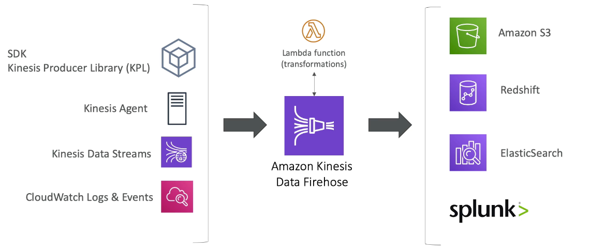

export const Quote = ({ children, color }) => (
	
		{children}
	
)

<!--  -->

## I. Introduction

1. **It is a managed alternative to Kafka, fully serverless.**
2. Great for application logs, metrics, IoT, real-time big data, click streams.
3. Great for streaming processing frameworks (Spark, NiFi etc).
4. Data is automatically replicated to three AZs.
5. Security
    1. In-flight
    2. At-rest
    3. Client-side (harder)
    4. VPC endpoints for private access

6. Types
    1. **Kinesis Streams**: low latency streaming ingest at scale
    2. **Kinesis Analytics**: perform real-time analytics on streams using SQL
    3. **Kinesis Firehose:** load data to S3, RDS, Redshift, ES, Splunk (NOT S3 Select or Redshift Spectrum)

## II. Streams

1. Streams are divided in ordered shards / partitions.
2. **Data retention is one day by default, can be extended up to 7.**
3. Ability to reprocess/replay data.
4. Multiple apps can consume same stream.
5. Once data is in stream, it cannot be deleted (immutable).
6. One stream is made of many different shards (stream = logical group of shards).
7. A shard is the base throughput unit of Kinesis data stream. It is an append-only log and a unit of streaming capability. 
8. **A shard contains an ordered sequence of records ordered by arrival time.**
9. 1MB/s or 1000msgs/s write per shard (incoming).
10. 2MB/s at read per shard (outgoing).
11. **In a case where multiple consumer applications have total reads exceeding the per-shard limits, you need to increase the number of shards in the Kinesis data stream.**
12. **You cannot increase the number of read transactions per shard. Read throttling is enabled by default for Kinesis data streams. If you’re still experiencing performance issues you must increase the number of shards.**
13. Billing is per shard provisioned.
14. A record is the unit of data stored in a Kinesis stream. 
15. Record = Sequence # + Partition Key + Data Blob
16. A partition key is usually a meaningful identifier such as userID or timestamp. It is used to segregate and route data records to different shards of a stream.
17. A sequence number is a unique identifier for each record. Sequence number is assigned by Amazon Kinesis when a data producer calls `PutRecord` or `PutRecords` operation to add data to an Amazon Kinesis data stream.
18. Batching available or per message calls.
19. You can monitor shard-level metrics in Kinesis Data Streams using CloudWatch and KCL.
20. <Quote>Number of shards can evolve over time (split or merge).</Quote>

## III. Producers

1. Producers can write to Kinesis using `PutRecord` API through CLI or SDK.
2. You need to send message key and data.
3. Message key → Same shard
4. Message sent gets a "sequence key"
5. Shard balancing is done be key and should be chosen wisely.
6. You might get `ProvisionedThroughputExceeded` if go over the limit, use retry or exponential backoff to reduce rate.
    1. Happens when you exceed the limit MB/s or TPS per shard
    2. Make sure you don't have a hot shard
    3. <Quote>Solution: Increase shard and/or ensure a good partition key (high cardinality)</Quote>

7. Consumers
    1. Can use CLI/SDK or client libraries aka KCL (Node, python etc)
    2. KCL uses DynamoDB to checkpoint offsets and track other workers to share among shards

## IV. Firehose

1. Fully managed, no administration, automatic scaling and serverless
2. Load data into Redshift, S3, ES, Splunk
3. Near real-time — 60s latency minimum for non-full batches or 32MB of data at a time
4. Supports many data formats, conversions, transformations and compression
5. Can convert incoming data into another format before storing e.g. JSON → ORC
6. Only pay for the data going through firehose

## V. Kinesis Data Streams vs Firehose

1. Kinesis Data Stream
    1. Write custom code for producer and consumer
    2. Real-time (~200ms)
    3. Must manage scaling (shard splitting and merging)
    4. Data storage for 1-7 days, replay capability, multi-consumers

2. Firehose
    1. Fully managed, send to S3/ES/Splunk/Redshift 
    2. Serverless data transformation with lambda
    3. Near real-time (60s)
    4. Automated scaling
    5. No data storage

## VI. Kinesis Analytics

1. Perform real-time analytics on Kinesis Streams using SQL.
2. Pay for actual consumption rate
3. Can create streams out of query results
4. Kinesis Data Analytics
    1. Auto scaling
    2. Managed
    3. Real-time

## VII. Kinesis vs SQS FIFO

Assuming 100 trucks, 5 shards and 1 FIFO queue

1. Kinesis Data Streams
    1. Avg 20 trucks per shard
    2. Trucks will have their data ordered within each shard
    3. Max consumers in parallel = 5
    4. Can receive up to 5MB/s of data
    5. Can handle large real-time data compared to SQS FIFO
    6. <Quote>Guaranteed ordering using partition key</Quote>

2. SQS FIFO
    1. Only one FIFO queue
    2. 100 GroupIDs
    3. 100 consumers (one per GroupID)
    4. 300msgs/s or 3000 (when using batches)

## VIII. SQS vs SNS vs Kinesis

**Kinesis use cases**

1. Routing related records to the same record processor (as in streaming MapReduce).
2. Ordering of records.
3. Ability for multiple applications to consume the same stream concurrently.
4. Ability to consume records in the same order a few hours later.

**SQS use cases**

1. Messaging semantics (such as message-level ack/fail) and visibility timeout.
2. Individual message delay.
3. Dynamically increasing concurrency/throughput at read time.
4. Leveraging Amazon SQS’ ability to scale transparently e.g. you buffer requests and the load changes as a result of occasional load spikes.

## IX. Kinesis Tips

1. **You can increase per-shard limit for reads if facing hot shard using `UpdateShardCount` API.**
2. Kinesis Data Streams can automatically encrypt sensitive data as a producer enters it into a stream. It uses KMS master keys for encryption.
3. You are charged for each shard at an hourly rate.
4. You can create Directed Acyclic Graphs (DAGs) of Amazon Kinesis Applications and data streams.
5. <Quote>Each shard can support up to five read transactions per second.</Quote>
6. If the shard iterator expires immediately before you can use it, this might indicate that the DynamoDB table used by Kinesis does not have enough capacity to store the lease data. This situation is more likely to happen if you have a large number of shards. To solve this problem, increase the write capacity assigned to the shard table.
7. You can privately access Kinesis Data Streams APIs from your Amazon Virtual Private Cloud (VPC) by creating VPC Endpoints. With VPC Endpoints, the routing between the VPC and Kinesis Data Streams is handled by the AWS network without the need for an Internet gateway, NAT gateway, or VPN connection.
8. You can encrypt using SSE or write encrypted data directly to stream.