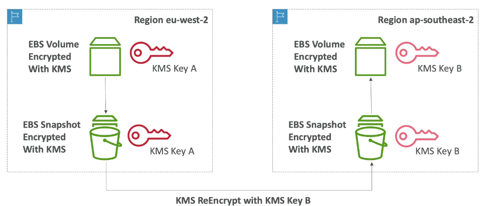

export const Quote = ({ children, color }) => (
	
		{children}
	
)

<!--  -->

## I. Encryption

1. Encryption is required to safeguard against hackers.
2. In-flight encryption protects against MITM attack.
3. SSE: data is encrypted after being received by the server.
    1. It is decrypted before being sent to the user
    2. The encryption is managed through KMS

4. Client encryption
    1. Data is encrypted by the client and never by the server
    2. Data will be decrypted by the receiving client
    3. The server should not be able to decrypt
    4. Could leverage envelope encryption

## II. KMS Overview

1. **Anytime you hear encryption for an AWS service, it's most likely KMS**
2. Easy way to control access to your data, AWS manages keys for us
3. **Fully integrated with IAM for auth**
4. **Seamlessly integrated into EBS, S3, RDS, Redshift etc**
5. Can also use CLI or SDK
6. **Customer Master Key (CMK)**
    1. **Symmetric (AES-256)**
        1. First KMS offering, single key for both encryption and decryption
        2. AWS services use this
        3. Necessary for envelope encryption
        4. You never get access to key unencrypted (must use KMS API)

    2. **Asymmetric (RSA & ECC key pairs)**
        1. Public (encrypt) and private (decrypt)
        2. Public key is downloadable
        3. Used when symmetric keys is unavailable i.e. cannot call KMS API

7. Able to fully manage keys and policies
    1. Create
    2. Rotation
    3. Enable/Disable 
    4. Audit (with CloudTrail)

8. Three types of CMK
    1. AWS managed default CMK (free)
    2. User-created: $1/month         
    3. User-imported (must be 256-bit symmetric key): $1/month
    4. pay for API call to KMS ($0.03/10000 calls)

9. The real value of KMS is that the user never sees the keys and can only call the APIs. Thus the keys always stay with AWS.
10. Never store secrets in plaintext. Encrypted secrets can be stored in code/env variables.
11. KMS can only help in encrypting up to 4KB of data per call.
12. If data > 4KB, use envelope encryption
13. To give access to KMS to someone
    1. **Make sure the key policy allows the user**
    2. **Make sure the IAM policy allows the API calls**

14. **KMS keys are region bound!** 

## III. KMS Policies

1. Control access to KMS keys, similar to S3 bucket policies
2. You cannot control access without them
3. Default KMS key policy
    1. Created if you don't provide a specific KMS key policy
    2. Complete access to the key to the root user (= entire AWS account)

4. Custom KMS key policy
    1. Define users, roles that can access the KMS key
    2. Define who can administer the key
    3. Useful for cross-account access of your KMS key

5. Copying snapshots across accounts
    1. Create snapshot, encrypted with your own CMK
    2. Attach a policy allowing the target account to read
    3. Share encrypted snapshot
    4. (In target) create a copy of snapshot and encrypt using a KMS key in your account
    5. Create a volume from the snapshot

## IV. CloudHSM

1. Hardware appliance for keys
2. KMS → AWS manages the software for encryption
3. CloudHSM → AWS provisions encryption hardware
4. You manage your own encryption keys
5. HSM device is tamper resistant, FIPS 140-2 Level 3 compliance
6. HSM clusters are spread across multi-AZ (must setup yourself)
7. Supports both symmetric and asymmetric keys
8. No free tier available
9. Must use the CloudHSM client software
10. Supported by Redshift
11. Good option to use along side SSE-C encryption
12. **If the HSM is zeroized and you did not have a copy of keys stored somewhere else, they are lost permanently. AWS cannot recover it.**