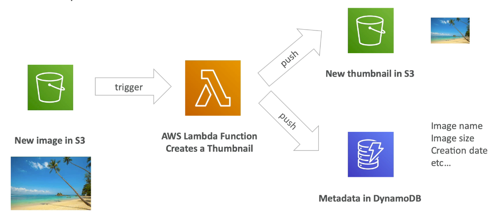
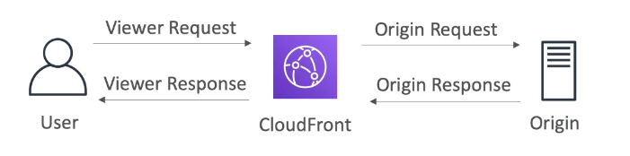
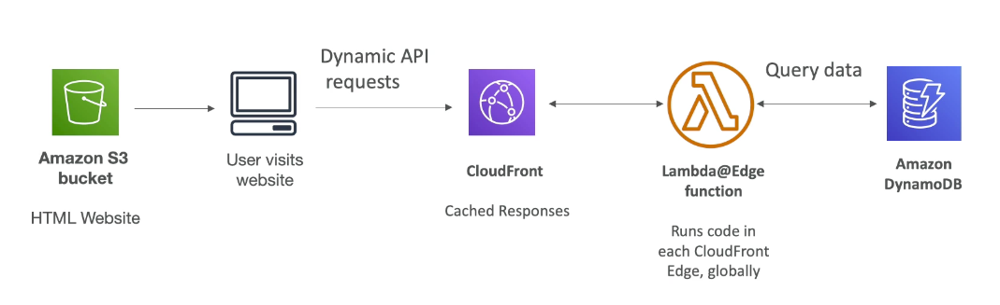
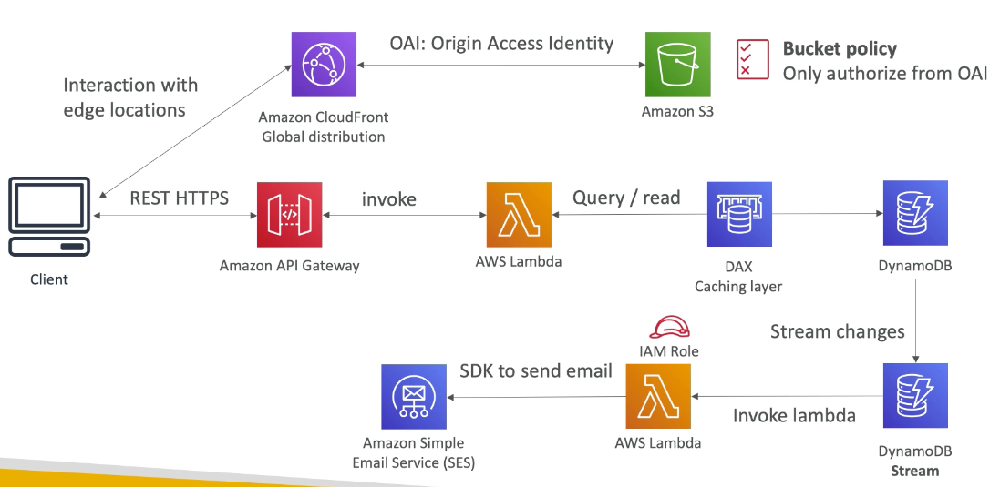
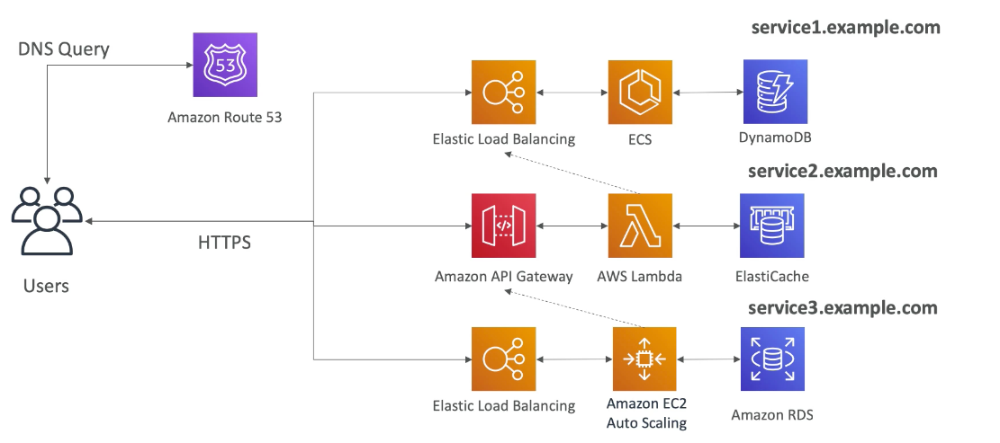
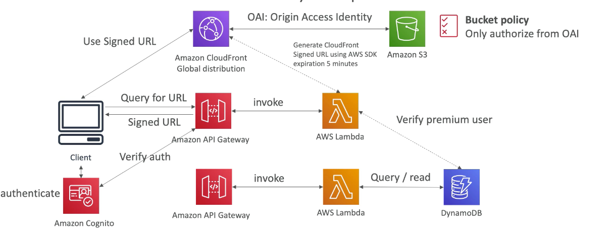
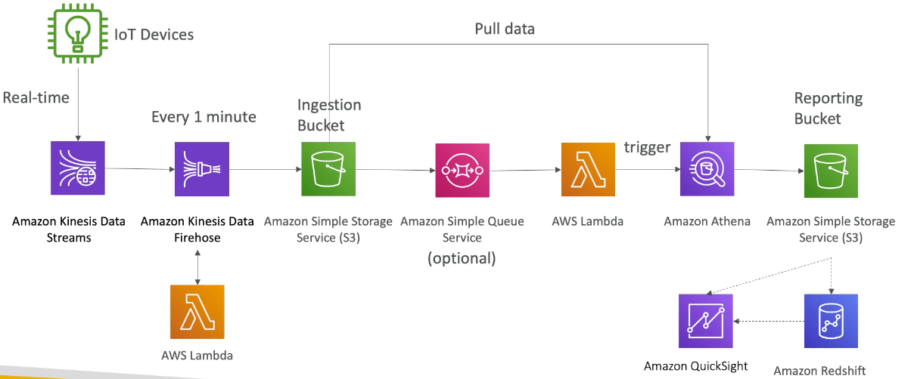

export const Quote = ({ children, color }) => (
	
		{children}
	
)

## Pillars of serverless

1. Lambda
2. DynamoDB
3. Cognito
4. API Gateway
5. SAM

## I. Introduction

1. Virtual functions — no servers to manage.
2. Limited by time — short executions (15 mins max).
3. Run on-demand, scaling is automated.
4. Easy pricing
    1. Pay per request and compute time
    2. Free tier includes 1 million lambda requests and 400,000 GBs of compute time.

5. Integrated with the whole AWS suite of services and popular languages (except Docker).
6. Easy monitoring with CloudWatch.
7. <Quote>Each Lambda function receives 500MB of non-persistent disk space in its own `/tmp` directory.</Quote>
8. <Quote>Easy to get more resources per function (up to 3GB RAM).</Quote>
9. AWS Lambda allows you to use normal language and operating system features, such as creating additional threads and processes.
10. <Quote>You can automate your serverless application’s release process using AWS CodePipeline and AWS CodeDeploy.</Quote>
11. <Quote>You can use AWS Step Functions to coordinate a series of AWS Lambda functions in a specific order.</Quote>
12. <Quote>You can enable your Lambda function for tracing with AWS X-Ray. This will provide you with insights such as Lambda service overhead, function init time, and function execution time.</Quote>
13. Execution
    1. Memory allocation: 128 MB - 3 GB (in increments of 64 MBs)
    2. <Quote>Maximum execution time: 900s (15 mins)</Quote>
    3. Env variables (up to 4 KB)
    4. Disk capacity in the "function container" (/tmp): 512 MB
    5. Concurrency execution: 1000 (can be increased)

14. Deployment
    1. Lambda function deployment size (compressed zip): 50 MB
    2. Size of uncompressed deployment (code + deps): 250 MB
    3. Can use `/tmp` to load other files at startup

15. Pay per calls
    1. First one million requests are free
    2. $0.20 per 1 million requests thereafter

16. Pay per duration
    1. 400K GB-seconds of compute time per month if free
    2. After that, $1 for 600K GB-s

## II. Lambda@Edge

1. Deploy lambda function alongside your CloudFront CDN
2. Use cases
    1. Website security and privacy
    2. Dynamic web application at edge
    3. Globally distributed viewers
    4. SEO
    5. Intelligent routing
    6. Bot mitigation at edge
    7. Real-time image transformation
    8. A/B testing
    9. User auth
    10. User prioritization
    11. User tracking and analytics

3. <Quote>Customize CDN content by editing Viewer and Origin requests and responses (event source for lambda)</Quote>

## III. Use cases

**a. Blog**

**b. Microservices**

1. You are free to design each microservice the way you want.
2. Sync pattern: API Gateway, Load balancers
3. Async pattern: SQS, Kinesis, SNS, Lambda triggers
4. Challenges
    1. Repeated overhead for creating new service
    2. Issues with optimizing server density/utilization
    3. Complexity of running multiple versions at once
    4. Proliferation of client-side code requirements to integrate with many separate services

**c. Distributing paid content**

**d. Big data ingestion pipeline**

## V. Lambda Tips

1. To encrypt env variables, the Lambda console makes it easier for you by providing encryption helpers that leverage KMS to store the sensitive information as cipher text.
2. <Quote>Environment variables are always encrypted at rest through KMS. When your Lambda function is invoked, those values are decrypted and made available to the Lambda code.</Quote>
3. <Quote>Lambda supports both sync and async invocations.</Quote>
4. <Quote>Event source mapping maps an event source to a lambda function for auto invocation.</Quote>
5. <Quote>Event source mapping is available for Kinesis, DynamoDB and SQS.</Quote>
6. To ensure the function always achieves a certain level of concurrency, you can configure the function with <Quote>reserved concurrency</Quote> 1000 concurrent executions are free.
7. To enable your function to scale without fluctuations in latency, use <Quote>provisioned concurrency.</Quote>Provisioned Concurrency is ideal for building latency-sensitive applications, such as web or mobile backends, synchronously invoked APIs, and interactive microservices.
8. By default, lambda runs code in a VPC.
9. Versions and aliases are secondary resources that you can create to manage function deployment and invocation.
10. <Quote>A layer is a zip archive that contains libraries, custom runtime or other dependencies.</Quote>
11. <Quote>You can monitor total request invocations, iterator size and latency by default using CloudWatch.</Quote>
12. Lambda function automatically scales based on the number of events it processes. If your Lambda function accesses a VPC, you must make sure that your VPC has sufficient ENI capacity to support the scale requirements of your Lambda function. It is also recommended that you specify at least one subnet in each Availability Zone in your Lambda function configuration.
13. <Quote>EC2 needs to invoke lambda in an async way? Use SNS!</Quote>
14. <Quote>Lambda stores code in S3 and encrypts at rest.</Quote>
15. On exceeding the throttle limit, AWS Lambda functions being invoked synchronously will return a throttling error (`429` error code).
16. <Quote>On failure, Lambda functions being invoked synchronously will respond with an exception. Lambda functions being invoked asynchronously are retried at least 3 times.</Quote>
17. AWS Lambda offers a single version of the operating system and managed language runtime to all users of the service.
18. AWS Lambda is integrated with AWS CloudTrail. AWS CloudTrail can record and deliver log files to your Amazon S3 bucket describing the API usage of your account.
19. To create a lambda, you first package your code and dependencies in a deployment package. Then, you upload the deployment package to create your lambda function.
20. After your lambda is in production, lambda automatically monitors function on your behalf, reporting metrics through CloudWatch.
21. <Quote>To enable your lambda to access resources inside your VPC, you must provide:</Quote>

    1. <Quote>VPC subnet ID</Quote>
    2. <Quote>VPC security group ID</Quote>

22. If you're using the AWS Lambda compute platform, you must choose one of the following deployment configuration types to specify how traffic is shifted from the original AWS Lambda function version to the new AWS Lambda function version:
    1. <Quote>Canary</Quote>: Traffic is shifted in two increments. You can choose from predefined canary options that specify the percentage of traffic shifted to your updated Lambda function version in the first increment and the interval, in minutes, before the remaining traffic is shifted in the second increment.
    2. <Quote>Linear</Quote>: Traffic is shifted in equal increments with an equal number of minutes between each increment. You can choose from predefined linear options that specify the percentage of traffic shifted in each increment and the number of minutes between each increment.
    3. <Quote>All-at-once</Quote>: All traffic is shifted from the original Lambda function to the updated Lambda function version at once.