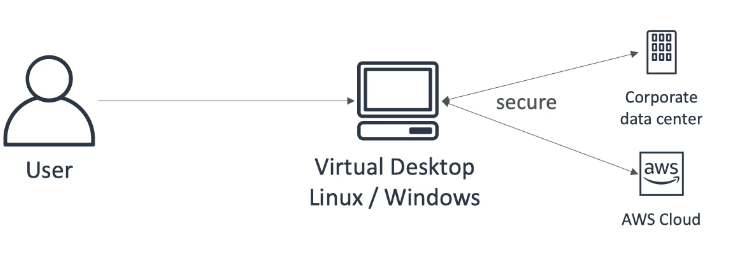

import Tabs from '@theme/Tabs';
import TabItem from '@theme/TabItem';

export const Quote = ({ children, color }) => (
	
		{children}
	
)

<!--  -->
## I. CICD

## II. Elastic Map Reduce (EMR)

1. Create managed hadoop clusters to manage and analyze large amounts of data.
2. The clusters can be made of 100 of EC2s.
3. Supports Spark, Hbase, Presto, Flink
4. Auto scaling with spot instances
5. **Can retrieve output in S3**

## III. AWS Glue

1. Fully managed ETL
2. Serverless, pay as you go, fully managed, provisions Spark
3. Crawls data sources and identifies data formats (schema inference)
4. Automated code generation
5. **Sources: Aurora, RDS, Redshift, S3**
6. **Sink: S3, Redshift**
7. **Glue data catalog: metadata of source tables**
8. **CANNOT run custom python scripts!**

## IV. OpsWorks

1. Managed Chef and Puppet by AWS
2. Perform server configs automatically and repeat actions
3. Alternative to SSM

## V. ElasticTranscoder

1. Convert media files stored in S3 into various formats for variety of platforms.
2. Features: bit rate optimization, thumbnail, watermarks, captions, DRM, encryption
3. Fully managed, pay per use, serverless, scales automatically
4. Components
    1. Jobs: what does the transcoding
    2. Pipeline: queue that manages the transcoding job
    3. Presets: template for converting media from one format to another
    4. Notifications: SNS

## VI. AWS Workspaces

1. **Managed secure cloud desktop**
2. Supports AD
3. On demand, pay per use
4. Great to eliminate on-prem VDI
5. Access to AWS and corporate data resources 

## VII. AWS AppSync

1. **Store and sync data across mobile and web apps using GraphQL**
2. Kinda like Prisma
3. Client code can be generated automatically
4. Integrations with Lambda, DynamoDB
5. Real-time subscriptions
6. Offline data sync (replaces Cognito sync)
7. Fine-grained security

## VIII. SAM

1. SAM = Serverless Application Model
2. Extension of CloudFormation
3. Framework for developing and deploying serverless apps
4. **All the config is in YAML — Lambda, DynamoDB, API Gateway, Cognito**
5. **SAM can help run lambda, API Gateway and Dynamo locally**
6. **SAM can use CodeDeploy to deploy lambda functions**

## IX. AWS Batch

1. **Enables you to run batch computing workloads on the AWS Cloud.**
2. Deep learning, genomics analysis, financial risk models, Monte Carlo simulations, animation rendering, media transcoding, image processing, and engineering simulations are all excellent examples of batch computing applications.
3. It is a regional service that simplifies running batch jobs across multiple AZs within a region.
4. Manages compute env and job queues, allowing you to easily run thousands of jobs of any scale using EC2 and EC2 Spot.
5. AWS Batch uses Amazon ECS to execute containerized jobs and therefore requires the ECS Agent to be installed on compute resources within your AWS Batch Compute Environments. The ECS Agent is pre-installed in Managed Compute Environments.
6. Batch chooses where to run the jobs and monitors the app, launching/removing additional AWS capacity as needed.
7. **Prefer it over CloudFormation if you have to launch a HPC-specific resource set.**
8. The unit of work is a job (bash script, docker image) that you submit to Batch. Jobs can be referenced by name or Job ID and can be daisy-chained.
9. You can use the AWS Batch event stream for CloudWatch events to receive near real-time notifications regarding the current state of jobs that have been submitted to your job queues.
10. **At least once delivery**
11. CloudTrail captures all API calls for Batch as "events".
12. There is no additional charge for AWS Batch. You only pay for the AWS Resources (e.g. EC2 Instances) you create to store and run your batch jobs.
13. You can use job definition to specify how a job is run. The definition can contain
    1. IAM role to provide access to AWS resources
    2. memory and CPU requirements

## X. Trusted Advisor

1. No need to install anything, high-level AWS account assessment
2. **Analyze your AWS accounts and provides recommendations on five pillars**
    1. Cost optimization
    2. Performance
    3. Security
    4. Fault-tolerance
    5. Service-limits

3. Core checks and recommendations are available for all customers but **full features only for enterprise customers**.
4. **Warns if you're reaching your service limits!**
5. Ability to set weekly email notifications.

## XI. Detective vs GuardDuty vs Inspector vs Macie

<Tabs
  defaultValue="Detective"
  values={[
    {label: 'Detective', value: 'Detective'},
    {label: 'GuardDuty', value: 'GuardDuty'},
    {label: 'Inspector', value: 'Inspector'},
    {label: 'Macie', value: 'Macie'}
  ]}>

<TabItem value="Detective">

1. Security and investigation

2. Automatically collects log data from AWS resources and uses AI/ML to enable faster searching and security investigations.

3. Can be integrated with GuardDuty and Macie, VPC flow logs, CloudTrail etc.

4. Multi-account service

5. Regional service

</TabItem>
  <TabItem value="GuardDuty">

1. Threat detection

2. Analyzes billions of events from VPC flow logs, CloudTrail and DNS logs

3. Broader protection of AWS accounts and workloads

4. Regional service

5. Pricing based on number of files analyzed

</TabItem>
<TabItem value="Inspector">

1. EC2 security assessment

2. Automated service that does security testing of network accessibility of your EC2 instance and the apps running on it

3. Uses IAM service-linked roles

4. Needs inspector agent to be installed

5. Pricing based on number of instances included and security package selected

6. Kinda like Fortify for EC2

</TabItem>
  <TabItem value="Macie">

1. Uncover troublesome data

2. Uses AI/ML to discover potential PII and IP data in your account

3. Data source includes S3 objects, CloudTrail logs, bucket logs

4. Does not support all file formats

</TabItem>
</Tabs>