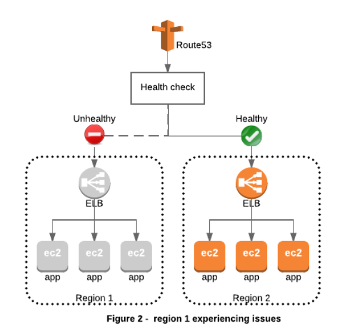

export const Quote = ({ children, color }) => (
	
		{children}
	
)

<!--  -->

## I. Introduction

1. It is a DNS service by AWS. DNS converts human-friendly domain names into IPs.
2. IPv4 has over 4 billion addresses that are quickly running out. Most ISPs are unwilling to switch to IPv6.
3. Top Level Domain (TLD) are assigned by Internet Assigned Numbers Authority (IANA).
4. Domain Registrars (GoDaddy etc) is the authority that can assign domain names under on or more TLDs. These domain names are registered with InterNIC, a service by ICANN that enforces uniqueness.
5. Each domain name becomes registered in a central db called WhoIS
6. "A" record stands for address, it is used to convert domain name to an IP address
7. TTL is the time for which the IP address of a domain name is stored on either the user's computer or resolving server.
8. The lower the TTL, the faster DNS changes would reflect
9. CNAME record is used to map multiple domain names to a single one e.g. [m.myapp.com](http://m.myapp.com) and [mobile.myapp.com](http://mobile.myapp.com)
10. Alias records — same as CNAME except CNAME cannot be used for naked addresses i.e. a domain name without www
11. ELBs do not have pre-defined IPv4 addresses, you resolve them using a DNS name
12. Given choice between Alias record or CNAME, use Alias.

## II. Records

1. **A**: hostname to IPv4

2. **AAAA**: hostname to IPv6

3. **CNAME**: hostname to hostname

4. [app.mydomain.com](http://app.mydomain.com) → [app.yourdomain.com](http://app.yourdomain.com)
5. It should only be used when there are not other records on that name
6. AWS resources have long URLs but we want short and sweet myapp.com
7. Only work for NON-ROOT domain e.g. [hello.myapp.com](http://hello.myapp.com) but not myapp.com
8. You have to pay for it
9. Cannot be used with apex (naked) domains (app.com)

10. **Alias**: hostname to AWS resource

11. [myapp.com](http://myapp.com) to [myapp.s3.amazonaws.com](http://myapp.amazonaws.com)
12. Prefer it over CNAME when using internal AWS resources
13. Works for both root (zone-apex) and non-root domain
14. Free of cost and native health check
15. <Quote>Resources include ELB, API Gateway, S3, VPC endpoints and Beanstalk</Quote>

16. You CANNOT point an Alias record directly at an on-premises web server

## III. Features

1. Route53 can use

   1. public domain names you own
   2. private domain names that can be resolved only within your VPC

2. Some advanced features include

   1. Load balancing (through DNS - also called client load balancing)
   2. <Quote>Health checks</Quote>

   3. Routing policy (simple, failover etc)

3. You pay \$0.50 per month per hosted zone.

## IV. TTL

1. TTL is a way of caching DNS results to avoid overwhelming the DNS server.
2. Browsers have to wait for their TTL to expire to redo the query.
   1. High TTL (24 hours)
   2. Low TTL (60s)
3. TTL is mandatory for each DNS record.

## V. Health checks

1. Have X (default = 3) health checks failed? → Unhealthy
2. Have X (default = 3) health checks passed? → Healthy
3. Default health check interval: 30s (can be set to 10s at a higher cost)
4. About 15 health checkers will check the endpoint health — one request/2s on average
5. Can have HTTP/HTTPS/TCP health checks

## VI. Route53 as a registrar

1. A domain name registrar is an organization that manages the reservation of internet domain names e.g. namecheap and godaddy
2. <Quote>Route53 can also act as a registrar.</Quote>

3. Domain registrar ≠ DNS but each registrar comes with some DNS features e.g. adding A and CNAME records.
4. It is possible to use Route53 even though you bought domain name elsewhere.

   1. <Quote>Create a "hosted zone" on Route53</Quote>

   2. <Quote>Update NS records on third-party website to use Route53 name servers</Quote>

   3. Check video #88

## VII. Failovers

1. <Quote>You can use Route 53 health checking to configure active-active and active-passive failover configurations.</Quote>You configure active-active failover using any routing policy (or combination of routing policies) other than failover, and you configure active-passive failover using the failover routing policy.

2. <Quote>Active-active failover</Quote>

3. Use this failover configuration when you want all of your resources to be available the majority of the time.
4. <Quote>When responding to queries, Route 53 includes ALL resources.</Quote>

5. When a resource becomes unavailable, Route 53 can detect that it's unhealthy and stop including it when responding to queries.
6. In active-active failover, all the records that have the same name, the same type (such as A or AAAA), and the same routing policy (such as weighted or latency) are active unless Route 53 considers them unhealthy.
7. No concept of primary/secondary

8. <Quote>Active-passive failover</Quote>

9. Use an active-passive failover configuration when you want a <Quote>primary</Quote>resource or group of resources to be available the majority of the time and you want a <Quote>secondary</Quote>resource or group of resources to be on standby in case all the primary resources become unavailable.
10. <Quote>When responding to queries, Route 53 includes only the healthy primary resources.</Quote>

11. If ALL the primary resources are unhealthy, Route 53 begins to include only the healthy secondary resources in response to DNS queries.

## VIII. Route53 Tips

1. If you already have a domain name from another registrar, you can use `CreateHostedZone` API to create a hosted zone that can store DNS records for your domain.
2. Your hosted zone will be initially populated with a basic set of DNS records, including four virtual name servers that will answer queries for your domain.
3. <Quote>Route 53 uses AWS' infrastructure backbone to provide HA.</Quote>

4. You can create multiple hosted zones for the same domain name.
5. Supports wildcard entries
6. Amazon Route 53 does not support DNSSEC for DNS at this time. But Amazon Route 53 allows DNSSEC on domain registration.
7. You can map your zone apex (<Quote>app.com</Quote>vs www.app.com) to S3, CloudFront, Beanstalk, API Gateway and VPC.
8. Private DNS is a Route 53 feature that lets you have authoritative DNS within your VPCs without exposing your DNS records (including the name of the resource and its IP address(es) to the Internet.
9. You can configure DNS Failover for Elastic Load Balancers (ELBs). To enable DNS Failover for an ELB endpoint, create an Alias record pointing to the ELB and set the `EvaluateTargetHealth` parameter to `true`. Route 53 creates and manages the health checks for your ELB automatically.
10. <Quote>You can use DNS Failover to maintain a backup site (for example, a static site running on an Amazon S3 website bucket) and fail over to this site in the event that your primary site becomes unreachable.</Quote>([Link](https://aws.amazon.com/premiumsupport/knowledge-center/route-53-dns-health-checks/))

11. <Quote>Route 53 can only fail over to an endpoint that is healthy. If there are no healthy endpoints remaining in a resource record set, Route 53 will behave as if all health checks are passing.</Quote>

12. CloudWatch metrics for Route 53 health checks are available free of charge.
13. Amazon Route 53 is both an Authoritative DNS service and Recursive DNS service. Authoritative DNS contains the final answer to a DNS query, generally an IP address. Clients (such as mobile devices, applications running in the cloud, or servers in your datacenter) don’t actually talk directly to authoritative DNS services, except in very rare cases. Instead, clients talk to recursive DNS services (also known as DNS resolvers) which find the correct authoritative answer for any DNS query. Route 53 Resolver is a recursive DNS service.
14. A DNS endpoint includes one or more elastic network interfaces (ENI) that attach to your Amazon Virtual Private Cloud (VPC). Each ENI is assigned an IP address from the subnet space of the VPC where it is located. This IP address can then serve as a forwarding target for on-premises DNS servers to forward queries.

## IX Routings

1. **Simple**
    - Only one record for multiple IPs
    - If you specify multiple IPs, Route53 would return them in random order
    - No health checks
2. **Weighted**
    - Splits traffic based on rule
    - Used with active-active systems
    - e.g. 80% to us-east-1 and 20% to eu-west-1
    - Helpful in situations when you want a small % of traffic going to new app version
    - Can be associated with health checks
3. **Latency-based**
    - Selects the route with lowest network latency for the end user
4. **Failover**
    - Selects based on health of the server
    - Used for disaster recovery
    - Used with active-passive policy
    - e.g. primary EC2 in us-east-1 and secondary S3 in eu-west-1
5. **Geolocation**
    - Routing based on location of the end user
6. **Geoproximity**
    - Routing based on geographical location of users as well as resources
    - Optionally choose to drive more/less traffic (aka throttle) to a given resource by a value, known as **bias**
    - A **bias** expands or shrinks the size of the geographic region from which traffic is routed to a resource
7. **Multi-value Answer** 
    - Same as simple routing with health checks
    - Up to 8 healthy records are returned for each multi-value query
    - It's not a substitute for ELB