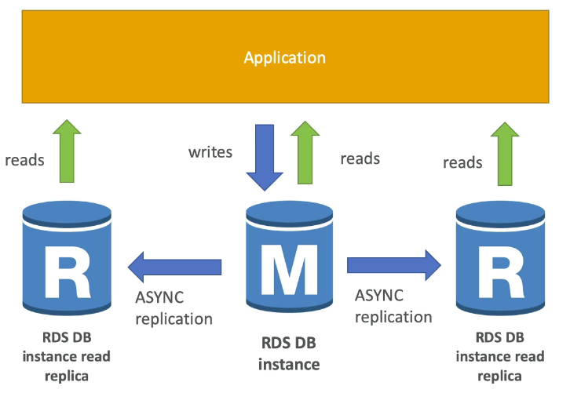

import Button from "@material-ui/core/Button"
import { withStyles } from "@material-ui/core/styles";

export const StyledButton = withStyles({
	root: {
		background: "linear-gradient(315deg, #fc9842 0%, #fe5f75 74%)",
		borderRadius: 7,
		border: 0,
		color: "inherit",
		height: 35,
		padding: "0 30px",
		boxShadow: "0 3px 5px 2px rgba(255, 105, 135, .3)",
	},
	label: {
		textTransform: "capitalize",
	},
})(Button)

1. They allow you to have read-only copy of your production database for read-heavy apps (eg Wikipedia)
2. This is achieved using **async** replication from the primary RDS instance to the read replica
3. Used for scaling, not for disaster recovery
4. **Must have automatic backups turned on in order to deploy a read replica**
5. You can have up to **5 read replica copies** of any database
6. You can have read replicas of read replicas (except Pgsql, Oracle and SQL Server)
7. **Each read replica will have its own DNS endpoint**
8. **They can be cross-AZ and cross-region**
9. If the master and Read Replica are in different regions, you encrypt using the encryption key for that region.
10. They can be promoted to master (breaks replication)
11. Not available for SQL Server instances
12. **If you want the read replica to be HA itself, create a read replica as a multi-AZ DB instance.**
13. You can track how far behind a replica is from master using CloudWatch's "Replica Lag" feature
14. A read replica will stay active even if the master is deleted
15. No extra charge for replication within same AZ
16. Pgsql requires physical replication. MySQL and MariaDB do logical replication.
17. They are *eventually* consistent
18. You can ElastiCache in conjunction with read replicas

<StyledButton href="/docs/notes_rds">Back to RDS</StyledButton>
