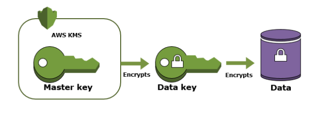
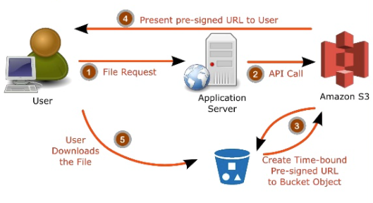
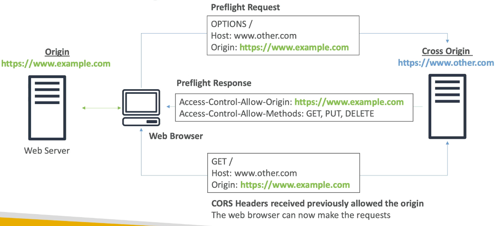
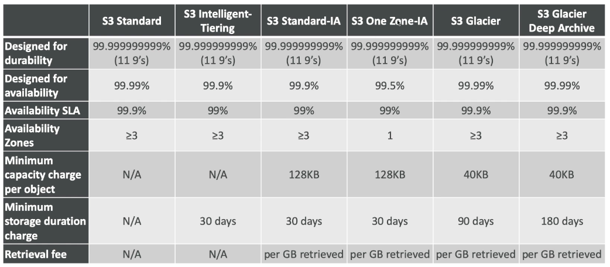
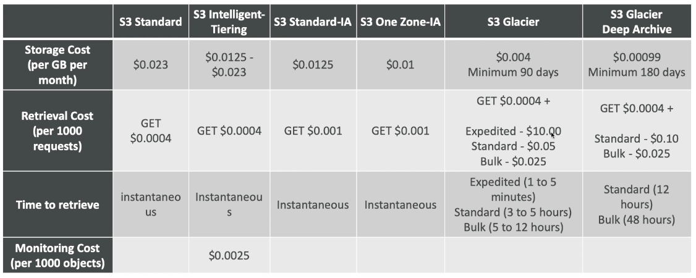
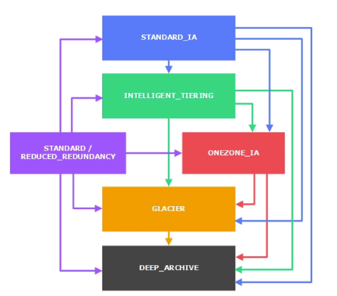
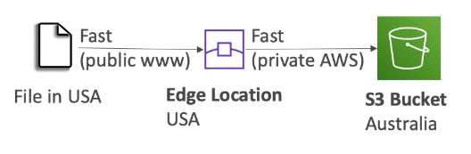
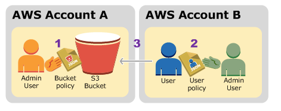

export const Highlight = ({ children, color }) => (
	<span
		style={{
			backgroundColor: "#FF9900",
			borderRadius: "5px",
			color: "#fff",
			padding: "0.1rem",
		}}
	>
		{children}
	</span>
)

export const Quote = ({ children, color }) => (
	<span
		style={{
			backgroundColor: "#5a5a5a",
			borderRadius: "7px",
			color: "#FF9900",
			padding: "0.3rem",
		}}
	>
		{children}
	</span>
)


## I. Introduction

1. Amazon S3 allows people to store objects (files) in buckets (directories).
2. Charged for data stored per month e.g. GB-month
3. Buckets must have a globally unique name.
4. Buckets are defined at the region level.
5. S3 is a global service.
6. Naming convention
    1. No uppercase
    2. No underscore
    3. 3-63 characters long
    4. Not an IP
    5. Must start with lower case letter or number

7. Objects
    1. They are files and have a key
    2. <Quote>You can directly upload with pre-signed URLs if the web server is stressed</Quote>    
    3. <Quote>The largest object that can be uploaded in a single PUT is 5GB</Quote>    
    4. The key is the full path (`s3://my-bucket/folder/test.txt`) 
    5. Key = Prefix + Object name
        1. Prefix = folder
        2. Object name = test.txt

    6. Object values are the contents of the file (max size 5TB)
    7. <Quote>If uploading more than 5GB, use multi-part upload</Quote>    8. Metadata (list of text key / value pairs - system or user metadata)
    9. Tags (Unicode key/value pair - up to 10) - useful for security/lifecycle
    10. Version ID (if versioning is enabled)
    11. If you add files and then enable versioning, the existing files will have "null" version

## II. Encryption

A customer master key (CMK) is a logical representation of a master key. The CMK includes metadata, such as the key ID, creation date, description, and key state. The CMK also contains the key material used to encrypt and decrypt data. You can use a CMK to encrypt and decrypt up to 4 KB (4096 bytes) of data. Typically, you use CMKs to generate, encrypt, and decrypt the data keys that you use outside of AWS KMS to encrypt your data. This strategy is known as envelope encryption.




1. Four methods to encrypt objects in S3
    1. SSE-S3
        1. Encrypts S3 objects using keys handled and managed by S3
        2. The above key is encrypted itself using a master key that is regularly rotated
        3. SSE = Server-side encryption
        4. AES-256 encryption type
        5. Must set header: `"x-amz-server-side-encryption": "AES256"`

    2. SSE-KMS
        1. Leverages the KMS service to encrypt
        2. Separate permission for CMK and data key
        3. Complete key-rotation control
        4. <Quote>Envelope encryption</Quote>        5. KMS advantage includes user control and audit trail
        6. Must set header: `"x-amz-server-side-encryption": "aws:kms"`

    3. SSE-C
        1. For managing your own keys i.e. AWS does not provide keys
        2. Must use HTTPS
        3. Encryption key must be provided every time (for every HTTP request)

    4. Client-side encryption
        1. Can be used using AWS S3 Encryption client
        2. Must encrypt themselves before sending
        3. Must decrypt themselves when retrieving

2. Encryption in transit
    1. S3 exposes both HTTP and HTTPS endpoints
    2. Most clients will use HTTPS

3. You may enable default encryption for a bucket.

## III. Security

1. User based
    1. IAM policies — which API calls should be allowed for a specific user from IAM console
    2. Prefer IAM over bucket policies

2. Resource based
    1. Bucket policies — bucket-wide rules from the S3 console
    2. Object ACL (uncommon)
    3. Bucket ACL (uncommon)

3. An IAM user can access an S3 object iff
    1. the user's IAM permission allows it OR the resource policy allows it
    2. AND there's no explicit deny

4. S3 bucket policy
    1. JSON-based policies 
    2. Resources: buckets and objects
    3. Actions: Set API to allow or deny
    4. Effect: Allow or deny
    5. Principal: Account or user

5. These policies are used for
    1. Granting public access to the bucket
    2. Force objects to be encrypted at upload
    3. Grant access to another account

6. Block public access were designed to prevent accidental data leaks and can be done through
    1. new ACL
    2. any ACL
    3. new public bucket or access point policy
    4. any public bucket or access point policy

7. If you know that your bucket will NEVER be public, leave the above settings on.
8. S3 supports VPC endpoints.
9. Logging and audit
    1. S3 audit logs can be stored in another S3 bucket
    2. API calls can be logged through CloudTrail

10. MFA can be required in versioned buckets to delete objects.
11. Pre-signed URLs — short term sharing
    1. Allow only premium users to download a video from bucket.
    2. Allow an ever changing list of users to download filed by generating URLs dynamically.
    3. Temporarily allow a user to upload something to your bucket e.g. profile picture.
    4. Can bypasses the web server avoiding any performance bottlenecks. 





    ```bash
    # Generating presigned URLs
    $ aws configure set default.s3.signature_version s3v4
    $ aws s3 presign s3://mybucket/coffee.jpg --expires-in 300 --region us-east-1
    ```

## IV. S3 websites

1. S3 can host static websites and have them accessible on www.
2. The static URL will be `<bucket_name>.s3-website-<AWS_region>.amazonaws.com`
3. Make sure to make your bucket public before hosting.
4. CORS
    1. If a client does a cross-origin request on our S3 bucket, we need to enable the correct CORS header.
    2. You can allow for a specific origin or all origins (*)
    3. It has to defined on the "other" bucket, not the main one



## V. Consistency

1. READ after WRITE for PUTS.
    1. PUT → GET (ok)
    2. GET → PUT → GET (404)
2. Eventual consistent for DELETES and PUTS
    1. PUT 1 → PUT 2 → GET (might still see PUT 1 data)
    2. DELETE → GET (might still see the resource)
3. There's no way to enforce "strong" consistency
## VI. Advanced S3
1. MFA Delete: MFA forces user to generate a code on a device before doing important operations on S3.
2. A delete marker is a placeholder (marker) for a versioned object that was named in a simple DELETE request. Because the object was in a versioning-enabled bucket, the object was not deleted. <Quote>The delete marker, however, makes Amazon S3 behave as if it had been deleted.</Quote>   
3. To use MFA Delete, <Quote>enable versioning on the S3 bucket</Quote>. You will need it for
    1. permanently delete an object version
    2. suspend versioning on the object
4. You won't need MFA for
    1. enable versioning
    2. listing deleted versions
5. Only the bucket owner (root account) can enable/disable MFA delete. Currently, it can only be enabled through CLI.
6. S3 object lock
    1. Adopt a WORM (Write Once Read Many) model
    2. Block an object version deletion for a specified amount of time
7. Glacier vault lock
    1. Adopt a WORM model
    2. Lock the policy for future edits
    3. Helpful for compliance and data retention
8. Earlier, S3 would reject any incoming request if it didn't contain the encryption headers. Now, you can enable default encryption while creating a bucket to prevent that. Note that bucket policies are evaluated prior to encryption.
9. S3 can be used as a key-value store where key is the file path and value is the object.
10. <Quote>You can enable logging by creating a logging bucket to store access logs for your main bucket. Never make your main bucket the logging bucket.</Quote>    
11. <Quote>You can enable S3 event notifications for events like (create, delete, put etc) and assign them to targets like SQS, SNS and Lambda.</Quote>        
    1. The events are delivered in seconds (`less 60s`)
    2. If you want to ensure that an event notification is sent for every successful write, you can enable versioning on your bucket.

## VII. S3 replication

1. <Quote>Must enable versioning in source and destination, buckets can be in different accounts.</Quote>    
2. Copying is async and must give proper S3 permissions.
3. Cross Region Replication (CRR) — compliance, lower latency, replication across accounts, NOT enabled by default
4. Same Region Replication (SRR) — log aggregation, live replication.
5. After activating, only the new objects are replicated (not retroactive).
6. Any delete operation is not replicated.
7. Replication is not commutative.
8. Can be enabled at bucket level, shared-prefix level or object level.
9. Replication Time Control is an SLA to ensure 99.99% of replications will happen under 15 minutes.

## VIII. Storage classes

1. Standard — General Purpose
    1. High availability (99.99999999999%) eleven 9s of objects across AZ
    2. 99.99% availability over a given year
    3. Sustain two concurrent AZ failures (so 3 AZs by default?)
    4. Use cases — content distribution, gaming etc
2. Standard — Infrequent Access (IA)
    1. Suited for less frequently accessed data
    2. Eleven 9s durability across AZs
    3. 99.9% availability over a given year
    4. Cheaper than General Purpose
    5. Can sustain two concurrent facility failures
    6. Can't pick your AZ, S3 will assign based on availability
    7. Use cases — disaster recovery, backups
3. One zone — IA
    1. Same as IA but single AZ
    2. 99.5% availability
    3. Low latency and high throughput
    4. Supports HTTPS and encryption at rest
    5. Use cases — storing data that can be recreated e.g. thumbnails
    6. 20% cheaper than regular IA
4. Intelligent Tiering
    1. Same low latency and high throughput of S3 standard
    2. Small monthly monitoring and auto-tiering fee
    3. Two tiers — Frequent Access and Infrequent Access (not to be confused with S3 IA)
    4. Automatically moves objects between two access tiers based on usage patterns
    5. Can be further paired with One Zone IA or Glacier
    6. No retrieval cost, no minimum duration
    7. Durability: Eleven 9s, Availability: 99.9%
    8. Resilient against events that impact an entire AZ
5. Glacier
    1. Low cost object storage meant for archiving/backup 
    2. Data is retained for long term (10+ years, min 90 days)
    3. Alternate to on-prem magnetic tape storage
    4. <Quote>Data is resilient in the event of one entire Availability Zone destruction</Quote>        
    5. <Quote>Durability: Eleven 9s, Availability: 99.99%</Quote>      
    6. Cost = $0.004/GB/month + retrieval cost
    7. Each item in glacier is called "archive" (up to 40TB)
    8. Archives are stored in "vaults"
    9. A Vault Lock policy is a vault access policy that you can lock. Using a Vault Lock policy can help you enforce regulatory and compliance requirements. Amazon S3 Glacier provides a set of API operations for you to manage the Vault Lock policies.
    10. As an example of a Vault Lock policy, suppose that you are required to retain archives for one year before you can delete them.
    11. Three retrieval options (1min-12hours)
        1. Expedited: 1-5 minutes
        2. Standard: 3-5 hours
        3. Bulk: 5-12 hours
    12. <Quote>Provisioned capacity ensures that your retrieval capacity for expedited retrievals is available when you need it. You should purchase provisioned retrieval capacity if your workload requires highly reliable and predictable access to a subset of your data in minutes.</Quote>   
    13. When looking for retrieval, you <Quote>MUST initiate a "retrieval request"</Quote> and based on the urgency, you will have access to a copy of the archived object (through console or API). <Quote>You can use SNS to get a notification when the archived copy is ready.</Quote>
    14. You can also use server-side filtering to save on CPU and bandwidth. Simple SQL is allowed to filter by rows and columns.
6. Glacier Deep Archive
    1. Cheaper than regular glacier
    2. Minimum storage duration is 180 days
    3. Supports tape gateway
    4. Two retrieval options
        1. Standard (12 hours)
        2. Bulk (48 hours)
7. Reduced Redundancy Storage (deprecated)





    

## IX. Lifecycle rules
1. Transition actions: Define when objects are moved to another storage class
    1. Move objects to IA 60 days after creation
    2. Move to glacier for archiving after 6 months
2. Expiration actions: configure objects to expire (delete) after some time
    1. Access log files can be set to delete after 365 days
    2. Can be used to delete old versions of a file
    3. Can be used to delete incomplete uploads
3. Rules can also be created for a certain prefix e.g. `s3://mybucket/mp3` or tags
## X. Performance
1. S3 automatically scales to high request rates with low 100-200 ms latency
2. Your application can achieve at least 3,500 PUT/COPY/POST/DELETE and 5,500 GET/HEAD requests per second per prefix in a bucket.
3. There are no limit to prefixes in your bucket.
4. Performance can be impacted by KMS limits
    1. When you upload, S3 calls the `GenerateDataKey` KMS API
    2. When you download, it calls the `Decrypt` API
    3. This gets counted towards KMS quota which cannot be increased
5. <Quote>Multipart upload is recommended for files > 100MB and mandatory for files > 5GB. It can help parallelize uploads.</Quote>    
6. S3 Transfer Acceleration is a feature to boost upload speeds. Increase transfer speed by uploading the file to an edge location first which will forward the data to the bucket in the target region. Compatible with multipart upload. Rarely a better choice than Snowball or DataSync (over DirectConnect).

7. Byte-range fetches
    1. Parallelize GETs by requesting specific byte ranges
    2. Better resilience in case of failures
    3. Helps you achieve higher aggregate throughput but does not support retrieving multiple ranges of data per `GET` request.
## XI. S3 for SA
1. Operations: not needed
2. Security: IAM, bucket policies, ACL, encryption
3. Reliability: Eleven 9s durability, 99.99% availability, Multi AZ, CRR
4. Performance: Scales to thousands of read/write per second, transfer acceleration, multi-part upload for big files
5. Cost: pay per storage usage, network costs, requests number
## XII. S3 Tips
1. For S3 standard, S3 IA and Glacier, your objects are automatically stored across multiple devices spanning a minimum of three AZs, each separated by miles across an AWS region.
2. Objects in S3 One Zone-IA are only stored in one AZ in your selected region.
3. No data transfer charges within the same region.
4. Four mechanisms for controlling access — IAM policies, bucket policies, ACLs and Query string authentication (pre-signed URL).
5. S3 uses a combination of MD5 + CRC to detect data corruption.
6. Normal S3 rates apply for each version of the object. You can use lifecycle policy to cut down on costs e.g. move all older versions of a file to glacier after 30 days and further delete everything from glacier after 180 days.
7. Access Points are the new way of sharing data. You can create multiple access points for apps, users and groups rather than managing a long and complex policy document.
8. S3 Access Points have their own IAM access point policy. You write access point policy the same way you'd write a bucket policy.
9. <Quote>With S3 Select, you can use simple SQL to filter the contents of S3 objects</Quote>and retrieve just the subset of data that you need. Amazon S3 Select works on objects stored in CSV, JSON, or Apache Parquet format. It also works with objects that are compressed with GZIP or BZIP2 (for CSV and JSON objects only), and server-side encrypted objects.
10. S3 inventory is not a feature and an alternate to the List API. You can configure it to provide a file output of all your files and their metadata.
11. <Quote>You can use S3 Batch Operations to automate S3 tasks e.g. rename tags, update ACL</Quote>   12. Amazon S3 Object Lock is a new Amazon S3 feature that blocks object version deletion during a customer-defined retention period so that you can enforce retention policies as an added layer of data protection or for regulatory compliance.
13. You should use S3 Object Lock if you have regulatory requirements that must be WORM protected.
14. <Quote>Only standard S3 has no minimum storage period.</Quote>   15. Although CloudTrail can track most bucket-level and object-level operation logs (requester, bucket name, request time, error code etc), you can also use <Quote>Server Access Logging</Quote>if want even more granular details like `referrer` and `turn-around` time.
16. With S3 event notifications, you can select which events are enabled for the notification e.g. `DeleteObject`. The events can then be sent to an SNS topic, an SQS queue or a Lambda function.
17. If nothing is known, go with Intelligent Tiering or One-zone IA
18. S3 Standard → S3 IA → S3 Glacier is a very common pattern
19. Cannot jump directly to Glacier, the target MUST be S3 first
20. NEVER create a server (EC2, Lightsail, Nginx) to host static sites!
21. Amazon S3’s support for parallel requests means you can scale your S3 performance by the factor of your compute cluster, without making any customizations to your application.
22. If you triggered an S3 API call and got HTTP 200 result code and MD5 checksum, then it is considered as a successful upload. The S3 API will return an error code in case the upload is unsuccessful.
23. Storage Class Analysis can continuously monitor your bucket and track how your objects are accessed over time. This tool generates detailed reports on the percentage of data retrieved and by age groups.
24. <Quote>Amazon S3 does not currently support Object Locking. If two PUT requests are simultaneously made to the same key, the request with the latest timestamp wins. If this is an issue, you will need to build an object-locking mechanism into your application.</Quote>   25. <Quote>IAM policy > Bucket ACL (remember it!)</Quote>   26. To grant access bu subfolders (`/bucket/bob`, `/bucket/jane`):
    1. Create an IAM group and attach the IAM policy, add IAM users to the group.
    2. Create an IAM policy that applies folder-level permissions
27. Follow these steps to configure cross-account permissions to copy objects from a source bucket in Account A to a destination bucket in Account B:
    1. Attach a bucket policy to the source bucket in Account A
    2. Attach an IAM policy to a user or role in Account B
    3. Use the IAM user or role in Account B to perform the cross-account copy

28. Here are the prerequisites for routing traffic to a website that is hosted in an S3 Bucket
    1. An S3 bucket that is configured to host a static website. <Quote>The bucket must have the same name as your domain or subdomain.</Quote>For example, if you want to use the subdomain `portal.tutorialsdojo.com`, the name of the bucket must be `portal.tutorialsdojo.com`.
    2. A registered domain name. You can use Route 53 as your domain registrar, or you can use a different registrar.
    3. Route 53 as the DNS service for the domain. If you register your domain name by using Route 53, we automatically configure Route 53 as the DNS service for the domain.
 

|        Storage Need        | Solution                                                                                                                                                                                                                                                                                                                                                                                                                                                                                                                                             | AWS Services                 |
|:--------------------------:|------------------------------------------------------------------------------------------------------------------------------------------------------------------------------------------------------------------------------------------------------------------------------------------------------------------------------------------------------------------------------------------------------------------------------------------------------------------------------------------------------------------------------------------------------|------------------------------|
| Temporary Storage          | Consider using local instance store volumes for needs such as scratch disks, buffers, queues, and caches.                                                                                                                                                                                                                                                                                                                                                                                                                                            | Amazon Local Instances Store |
| Multi-instance Storage     | Amazon EBS volumes can only be attached to one EC2 instance at a time. If you need multiple EC2 instances accessing volume data at the same time, consider using Amazon EFS as a file system                                                                                                                                                                                                                                                                                                                                                         | Amazon EFS                   |
| Highly durable storage     | If you need very highly durable storage, use S3 or Amazon EFS. Amazon S3 Standard storage is designed for 99,99999 percent(11 nines) annual durability per Object. You can even decide to take a snapshop of the EBS volumes. Such a snapshot then gets saved in Amazon S3, thus providing you the durability of Amazon S3. For more, information on EBS durability, see the Durabillity and Availabillity section. EFS is designed for high durability and high availability, with data stored in multiple Availability Zones within an AWS Region  | Amazon S3 Amazon EFS         |
| Static data or web content | If you data doesn't change that often, Amazon S3 might represent a more cost-effective and scalable solution for storing this fixed information. Also, web content served out of Amazon EBS requires a web server running on Amazon EC2; in contrast, you can deliver web content directly out of Amazon S3 or from multiple EC2 instances using Amazon EFS.                                                                                                                                                                                         | Amazon S3 Amazon EFS         |