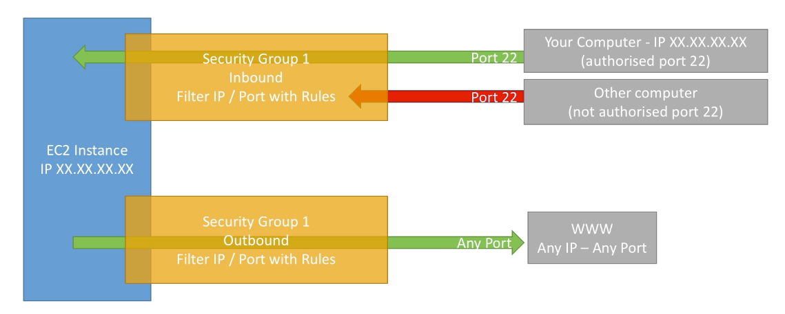

1. Security Group is the fundamental unit of network security on AWS.
2. They control how traffic is allowed in/out of our EC2 machines.
3. They act as firewall and regulate access to ports, authorized IP ranges, control of inbound/outbound network.
4. SG:EC2 = Many:Many
5. SG is locked down to a region/VPC combination.
6. It's good to maintain one SG for SSH.
7. **By default, all inbound traffic is blocked and all outbound traffic is allowed.**
8. AWS allows pen-testing of SOME services without prior-approval.
9. **You can specify allow rules, but not deny rules.**
10. You can specify separate rules for inbound and outbound traffic.
11. Security groups are stateful — if you send a request from your instance, the response traffic for that request is allowed to flow in regardless of inbound security group rules. Responses to allowed inbound traffic are allowed to flow out, regardless of outbound rules.
12. **When you create a new security group, it has no inbound rules.** Therefore, no inbound traffic originating from another host to your instance is allowed until you add inbound rules to the security group. **However, the EC2 launch wizard would pre-populate SSH rule to be added in the UI.**
13. **By default, a security group includes an outbound rule that allows all outbound traffic.**
14. Security groups are associated with network interfaces. After you launch an instance, you can change the security groups that are associated with the instance, which changes the security groups associated with the primary network interface (eth0).
15. **A security group can only be used in the VPC that you specify when you create the security group.**

