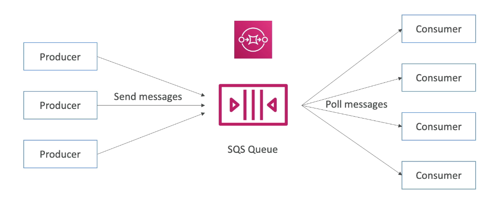
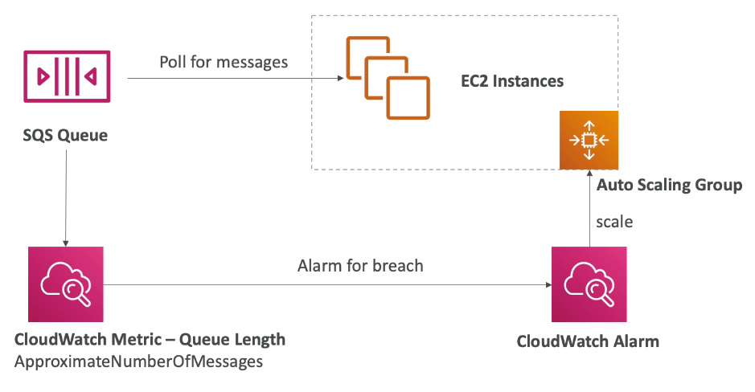
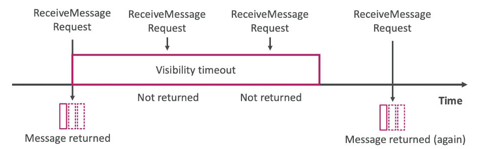

export const Quote = ({ children, color }) => (
	
		{children}
	
)

<!--  -->
## I. Introduction

1. Oldest AWS service, used to decouple applications.
2. **Unlimited throughput and number of messages in the queue.**
3. **Scales automatically, millions and millions of messages.**
4. Default retention of messages is 4 days (max 14 days)
5. Low latency (<10ms on publish and receive)
6. Limitation of 256KB per message sent including XML, JSON and unformatted text.
7. Can have duplicate messages (at least once delivery).
8. Best effort message ordering
9. Producers
    1. Send message using SDK
    2. Gets persisted in SQS

10. Consumers
    1. **Apps running on EC2, Lambda etc**
    2. Polls SQS for messages
    3. Receive up to 10 messages at a time
    4. Process the messages (write to RDS)
    5. Delete the message

11. SQS plays nicely with ASG
    1. ASG can add/remove EC2 based on queue length
    2. The info is provided by a CloudWatch metric

12. Security
    1. In-flight encryption with HTTPS API
    2. At-rest using KMS
    3. Client-side available as well

13. IAM policies to regulate access to SQS API.
14. SQS Access Policies (similar to S3 bucket policies) that are useful for cross-account SQS queues.

## II. Message Visibility Timeout

1. Once a message is polled by a consumer, it becomes "invisible" to other consumers.
2. By default, the "message visibility timeout" is 30s which means the message has 30s to get processed (and deleted).
3. If the message is not processed within 30s, it will be "visible" again.

4. If the consumer has seen the message and knows it will take more than 30s to process, it can change the timeout using `ChangeMessageVisibility` API. This new timeout should be reasonable (not too long, not too short).

5. If the consumer fails to process the message within 30s (can be configured), it will be put back in the queue. If the failure happens again, the message will be keep coming back to the queue. After the `MaximumReceives` threshold, the message goes to a Dead Letter Queue (DLQ).

1. Make sure to process messages in DLQ before they expire.
2. Good to set a retention period of 14 days.

6. Delay Queue

1. Delay a message so the users don't see it immediately (up to 15 minutes)
2. Default is 0s (message is available right away)
3. Can set a default at a queue level
4. Can override the default using the `DelaySeconds` parameter

## III. SQS FIFO

1. Limited throughput 300msgs/s and 3000msgs/s (with batching)
2. Exactly once send capability
3. Messages are processed in order by the consumer
4. Queue name has to end with `.fifo`. 
5. You can use `GroupID` (similar to partition key in Kinesis) to send messages to different consumers.
6. SQS FIFO CANNOT sustain thousands of messages per second.

## IV. Amazon MQ ("Migration")

1. SQS, SNS and Kinesis are cloud-native. If you are already using MQ protocol locally, you would not want to rewrite everything to fit into SQS. This is where Amazon MQ comes into play.
2. Amazon MQ = Managed Apache ActiveMQ
3. Doesn't scale as much as SQS/SNS 
4. Runs on a dedicated machine, can run in HA with failover
5. Has both queue and topic features

## V. SQS Tips

1. Poll the queue after a delayed duration (for 30s over keep-alive connection) to avoid polling too frequently. This is because you are charged per request.
2. Always remember that the messages in the SQS queue will continue to exist even after the EC2 instance has processed it, until you delete that message. **You have to ensure that you delete the message after processing to prevent the message from being received and processed again once the visibility timeout expires. SQS does not automatically delete messages on its own.**
3. <Quote>Long polling helps reduce the cost of using SQS by eliminating the number of empty responses</Quote> (when there are no messages available for a `ReceiveMessage` request) and false empty responses (when messages are available but aren't included in a response).
4. In almost all cases, Amazon SQS long polling is preferable to short polling. Long-polling requests let your queue consumers receive messages as soon as they arrive in your queue while reducing the number of empty `ReceiveMessageResponse` instances returned.
5. Monitor SQS queues using CloudWatch. 
6. Log SQS API calls with CloudTrail.
7. You can delete all messages in an Amazon SQS message queue using the `PurgeQueue` action.
8. **You CANNOT convert an existing standard queue to FIFO.**
9. **When setting up DLQ for FIFO, the DLQ itself must be FIFO as well.**
10. Queues can be encrypted using SSE (using KMS). SSE encrypts the body of a message but not the metadata.
11. **Messages are NOT encrypted by default.**
12. A single Amazon SQS message queue can contain an unlimited number of messages. However, there is a 120,000 limit for the number of inflight messages for a standard queue and 20,000 for a FIFO queue. Messages are inflight after they have been received from the queue by a consuming component, but have not yet been deleted from the queue.