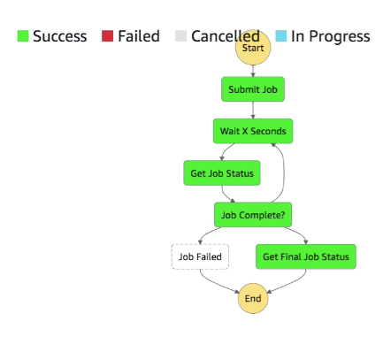
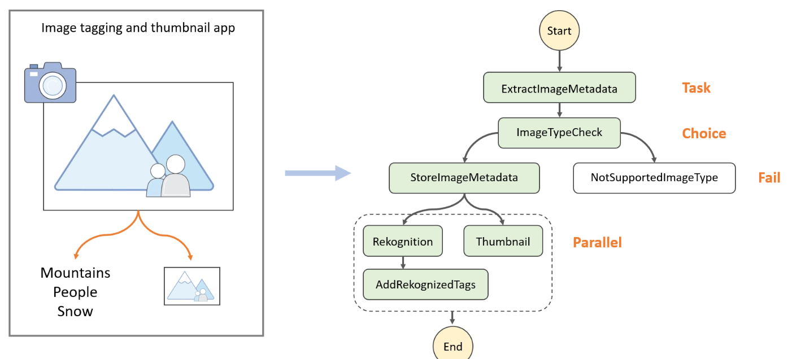

export const Quote = ({ children, color }) => (
	
		{children}
	
)

<!--  -->
## I. AWS SWF

1. Amazon Simple Workflow Service (SWF) is a web service that makes it easy to coordinate work across distributed application components.
2. Max runtime of 1 year
3. You write a "Decider Program" to separate "Activity step" and "Decision step"
4. Built-in "Human intervention step" 
5. Older and deprecated → use Step Functions instead
6. Can be a replacement for SQS FIFO
7. **Used to decouple EC2 services**

## II. Step Functions

1. Build serverless visual workflow to **orchestrate your lambdas**
2. Represent flow as JSON state machine
3. Features: sequence, parallel, conditions, timeout etc
4. Can also integrate with EC2, ECS, on-prem servers
5. Max execution time of 1 year
6. **Kinda like Airflow, new offering over SWF**

