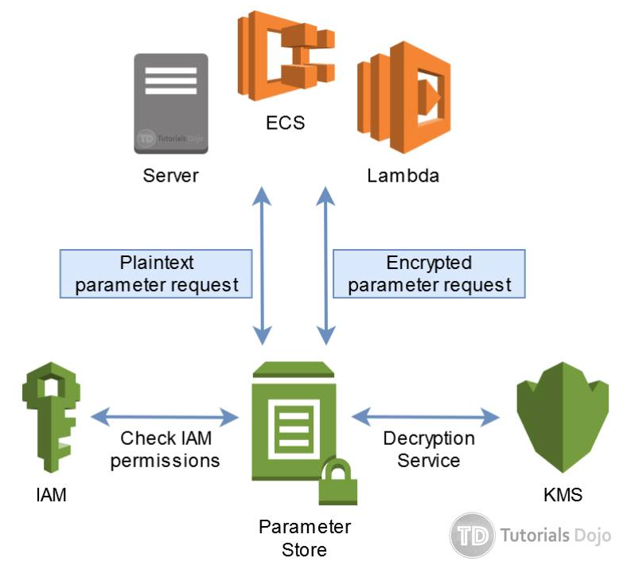

export const Quote = ({ children, color }) => (
	
		{children}
	
)

## I. SSM Parameter Store

1. <Quote>Wider use case than Secrets Manager, can store URLs, DB names, hosts etc apart from just passwords and secrets.</Quote>
2. <Quote>No rotation!</Quote>
3. Secure storage for configuration and secrets.
4. Optional seamless encryption using KMS.
5. Serverless, scalable, durable SDK
6. <Quote>Can be used to store RDS secrets.</Quote>
7. Version tracking of configurations / secrets
8. Config management using path and IAM.
9. Notifications with CloudWatch events.
10. <Quote>Supports integration with Secrets Manager, further blurring the lines between the two.</Quote>
11. <Quote>Integration with CloudFormation</Quote>
12. Standard Tier
    1. Total parameters allowed = 10K
    2. Max size of a parameter value =  4KB
    3. Cost = no additional charge
    4. Storage pricing = free

13. Advanced Tier
    1. Total parameters allowed = 100K
    2. Max size of a parameter value =  8KB
    3. Cost = charges apply
    4. Storage pricing = $0.05 per advanced parameter per month

14. Parameter policies (for advanced parameters)
    1. Allow to assign a TTL to a parameter to force updating or deleting a parameter.
    2. Can assign multiple policies at once.

## II. AWS Secrets Manager

1. <Quote>Newer service solely for storing secrets.</Quote>
2. <Quote>Support cross account access.</Quote>
3. Secrets Manager enables you to replace hardcoded credentials in your code (including passwords), with an API call to Secrets Manager to retrieve the secret programmatically.
4. Also, you can configure Secrets Manager to **automatically rotate the secret** for you according to a schedule that you specify. This enables you to replace long-term secrets with short-term ones, which helps to significantly reduce the risk of compromise.
5. Automate generation of secrets on rotation (uses Lambda).
6. Secrets are encrypted using KMS
7. <Quote>Mostly meant for RDS integration</Quote>
8. Automatically links credentials to AWS database services

## III. AWS Systems Manager

1. Enable auto config and ongoing management at scale
2. <Quote>Across all Windows and linux</Quote>
3. Runs in EC2 and on-prem
4. <Quote>Runs patch management, state management, inventory, session management, maintenance windows</Quote>