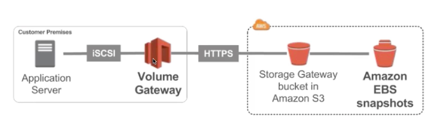
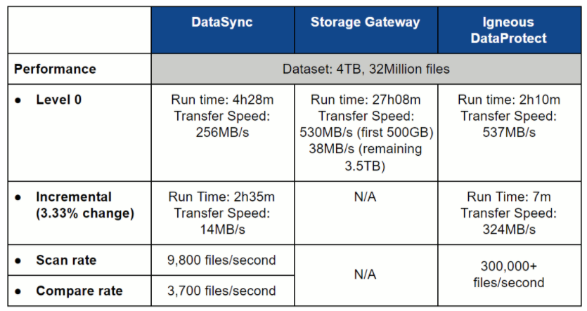

export const Highlight = ({ children, color }) => (
	
		{children}
	
)

export const Quote = ({ children, color }) => (
	
		{children}
	
)

## I. Snowball

1. Physical data transport solution that helps moving TBs/PBs of data in/out of AWS.
2. <Quote>Alt to moving data over network and paying network fee.</Quote>
3. Secure, tamper-resistance, uses KMS 256-bit encryption.
4. <Quote>Tracking using SNS and text messages with e-ink shipping label.</Quote>
5. Pay per data transfer job.
6. Used in large data cloud migrations, Datacenter decommission and disaster recovery.
7. <Quote>If it takes more than a week to transfer over network, consider using Snowball.</Quote>
8. <Quote>Use Snowmobile while transferring more than 10PB</Quote>
9. <Quote>Process</Quote>
    1. Order a snowball from AWS
    2. Install snowball client on your servers
    3. Connect snowball to your server and move files using client
    4. Ship back the device using onboard e-ink shipping label
    5. Data will be loaded to S3 once snowball reaches AWS facility
    6. Snowball is then completely wiped
    7. Tracking of every step using SNS, text and console

10. Snowball edge is a new service that brings compute power to snowball
11. Snowball edge comes with 100TB with two options
    1. Storage optimized: 24 vCPU
    2. Compute optimized: 52 vCPU and optional GPU

12. Glacier cannot import data directly from snowball, must be done through S3

## II. Storage Gateway

1. Bridges gap between on-premise data and cloud data in S3. 
2. <Quote>Hybrid storage between on-prem and cloud.</Quote>
3. Exam tips
    1. On premise data to cloud → Storage Gateway
    2. File access/NFS → File Gateway
    3. Volume/Block Storage/iSCSI → Volume Gateway
    4. VTL tape solution/Backup with iSCSI → Tape Gateway

4. Use cases: disaster recovery, backup & restore

1. Configured S3 buckets are accessible via NFS and SMB protocols
2. Supports S3 standard, S3 IA and One-zone IA
3. Bucket access using IAM roles for each file gateway
4. <Quote>Most recently used data is cached in the file gateway</Quote>
5. Can be mounted on many servers
6. <Quote>Supports S3 object lock enabling WORM</Quote>

1. Block storage using `iSCSI` protocol backed by S3
2. Backed by EBS snapshots which can help restore on-premise volumes
3. Supports up to 32 volumes
4. <Quote>Cached volumes:</Quote> entire dataset on S3 but frequently accessed cached locally (1GB-32TB)
5. <Quote>Stored volumes:</Quote> entire dataset is on-premise, scheduled backups to S3 (1GB-16TB)

3. <Quote>Tape Gateway</Quote>
    1. Used for backing up <Quote>physical tapes</Quote>
    2. Virtual Tape Library (`VTL`) backed by S3 and Glacier
    3. Back up data using existing tape-based processes (and iSCSI interface)
    4. Works with leading backup vendors

4. *File Gateway — hardware appliance*
    1. Using a file gateway means you need virtualization but now you can get a dedicated hardware for that as well.
    2. You can buy a Dell EMC rack from Amazon
    3. helpful for daily NFS backups

## III. Storage comparison

1. **S3:** Object storage
2. **Glacier:** Object archival
3. **EFS:** NFS for POSIX-compliant systems, shared across EC2s
4. **FSx for Windows:**NFS for Windows servers
5. **FSx for Lustre:** HPC linux file system
6. **EBS:** Network storage for one EC2 at a time
7. **Instance Storage:**Physical storage for EC2 (high IOPS)
8. **Storage Gateway:** File, Volume and Tape for on-prem to cloud connection
9. **Snowball/Snowmobile:** Physically move large amounts of data to cloud
10. **Database:** For specific workloads, querying and indexing

## IV. S3 Transfer Acceleration

1. Fast and secure way of copying files over large distance between you and S3
2. Leverages CloudFront's global edge network
3. Good choice if you are uploading to a centralized bucket from various locations
4. Each time you use acceleration, S3 will first check if it's actual faster than regular upload
5. Can be used along with Storage Gateway

## IV. S3 Transfer Acceleration

1. Fast and secure way of copying files over large distance between you and S3
2. Leverages CloudFront's global edge network
3. Good choice if you are uploading to a centralized bucket from various locations
4. Each time you use acceleration, S3 will first check if it's actual faster than regular upload
5. Can be used along with Storage Gateway

## V. Transfer comparisons

