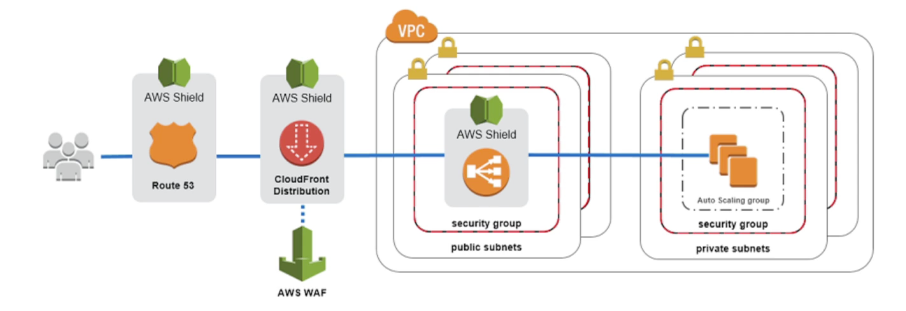
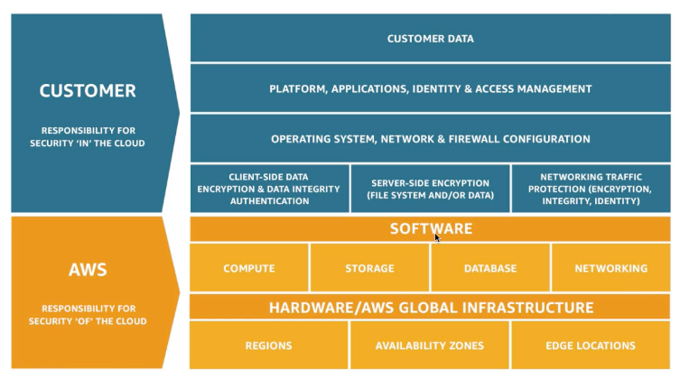

export const Quote = ({ children, color }) => (
	
		{children}
	
)

<!--  -->

## I. Shield → DDoS

1. Standard shield
    1. Free service activated by default for every AWS customer
    2. Layer 4 DDoS protection
    3. Provides protection from attacks such as SYN/UDP floods, Reflection attacks and other Layer 3/4 attacks.
    4. **You CANNOT use Shield to protect against XSS attacks, use WAF for that. Shield is used to protect against DDoS attacks.**

2. Advanced shield
    1. Optional DDoS mitigation service ($3k per month per org)
    2. Protection against more sophisticated attacks (layer 3, 4 and 7)
    3. 24/7 access to DDoS response team

## II. WAF → XSS, CSRF, SQL Injection

1. Protects your web apps against common web exploits (Layer 7 aka HTTP)
2. <Quote>Can only be deployed on ALB, CloudFront and API Gateway</Quote>
3. <Quote>Configure rules that allow, block or monitor web requests based on a condition</Quote>
4. Provides real-time metrics and captures raw requests that include details about IP addresses, **geo locations**, URIs, User-Agent and referrers.
5. Layer 7 DDoS protection
6. Charges based on number of web ACLs created
7. You can use WAF to protect sites not hosted on AWS
8. Pre-configured rules (AWS WAF Managed Rules) available to protect against common security vulnerabilities like OWASP Top 10
9. <Quote>Best option to quickly and temporarily block malicious IPs when compared to CloudFront ACL, EC2 ACL or EC2 security group.</Quote>
10. Defining Web ACL
    1. Rules can include IP address, HTTP headers, HTTP body or URI strings
    2. Protects from common attacks — SQL injection and XSS
    3. Size constraints, geo match (block countries)
    4. Rate-based rules for DDoS protection
    5. Block countries based on geo match

11. Firewall Manager
    1. Manage rules in all accounts of an AWS org
    2. Common set of security rules
    3. WAF rules (ALB, API Gateway, CloudFront)
    4. AWS Shield Advanced (ALB, CLB, Elastic IP, CloudFront)
    5. Security groups for EC2 and ENI resources in VPC 

## III. Shared Responsibility Model

1. AWS is responsible for protecting the cloud including all the underlying infrastructure.
2. <Quote>Customer is responsible for managing guest OS patching, firewall and network configuration, IAM etc.</Quote>
3. In case of S3:
    1. AWS is responsible for guaranteeing unlimited storage, encryption, separation of data.
    2. Customer is responsible for bucket config, policy, IAM, encryption

