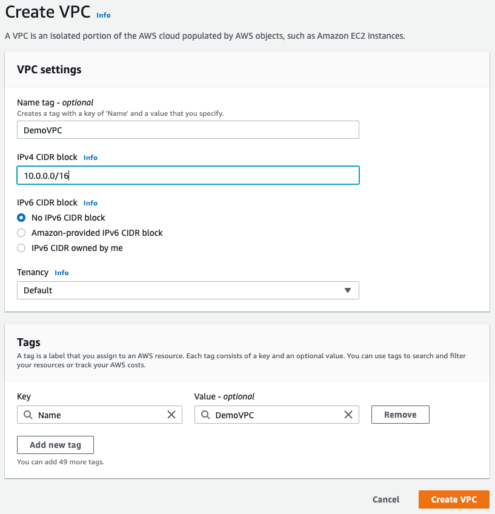

export const Quote = ({ children, color }) => (
	
		{children}
	
)

<!--  -->
## I. Introduction

1. VPC lets you provision a logically isolated section of the AWS Cloud where you can launch AWS resources in a virtual network that you define. It provides complete control over networking environment, including selection of your own IP address range, creation of subnets and configuration of route tables and network gateways.

2. Uses of VPC

- Launch instances into a subnet of your choosing
- Assign custom IP address ranges in each subnet
- Configure route tables between subnets
- Create internet gateway and attach it to your VPC
- Much better security control over your AWS resources
- Instance security groups
- Subnet ACLs

3. Default VPC is user-friendly, allowing you to immediately deploy instances. 

4. All subnets in default VPC have a route out to the internet.

## II. Creating a VPC

1. **When you create a VPC, a route table, network ACL and security group is created by default. You have to create subnet manually. If you don't specify a different security group when you launch the instance, AWS associates the default security group with your instance.**
2. AWS reserves five addresses for its own us while creating a VPC.
3. `10.0.0.0/16` is the biggest CIDR block allowed.
4. Only one internet gateway (IGW) per VPC.
5. Keep your main route table private.

## III. Peering (Do this after section XV)

1. Allows you to connect one VPC with another via a direct network route using private IP addresses.
2. The two VPCs must have non-overlapping CIDRs.
3. No bandwidth bottlenecks, traffic always stays on global AWS backbone.
4. Instances behave as if they were on the same private network.
5. You can peer VPC with other AWS accounts as well as with other VPCs in the same account.
6. No transitive peering. 
7. You can peer between regions.
8. **You must update route tables in each VPC's subnet** to ensure instances can communicate. 

## IV. Default VPC Walkthrough

1. All new accounts have a default VPC.
2. New instances are launched into default VPC if no subnet is specified.
3. Default VPC have internet connectivity and all instances have public IP.
4. We also get a public and a private DNS name.

## V. VPC in AWS

1. You can have multiple VPCs in a region (max 5 per region — soft limit).
2. Max CIDR per VPC is 5. For each CIDR
    1. Min size is /28 = 16 IPs
    2. Max size is /16 = 65536 IPs

3. Because VPC is private, only the private IP ranges are allowed.
    1. 10.0.0.0 - 10.255.255.255 (or 10.0.0.0/8)   
    2. 172.16.0.0 - 172.31.255.255 (172.16.0.0/12)
    3. 192.168.0.0 - 192.168.255.255 (192.168.0.0/16)

4. Your VPC CIDR should not overlap with your other networks e.g. corporate
5. The public subnet CIDR is smaller because it only includes ELB/ALB whereas the private subnet includes all our services.
6. Every time you create a subnet, you are going to lose 5 IPs as AWS reserves them for its own purposes (first four and last one).
    1. 10.0.0.0 → Network address
    2. 10.0.0.1 → VPC router
    3. 10.0.0.2 → Mapping to AWS-provided DNS
    4. 10.0.0.3 → Reserved for future use
    5. 10.0.0.255 → Usually the network broadcast address but AWS doesn't provide that

7. For instance, if you need 29 IPs then you can't use /27 subnet mask.

## VI. Internet Gateways (IGW aka Modem)

1. IGW help our VPC instance connect to the internet.
2. **It scales horizontally and is both HA and redundant.**
3. Must be created separately from VPC.
4. **Unlimited bandwidth!**
5. **One VPC can only be attached to one IGW and vice versa.**
6. IGW is also a NAT for the instances that have a public IPv4.
7. IGW on their own do not allow internet access, route table must be edited as well.
8. Route Table (aka Router)
    1. A set of rules (called routes) to determine where the network traffic is directed.
    2. Default VPC comes with a route table.
    3. Can have multiple active route tables in a VPC.
    4. Cannot delete a route table if it has dependencies (associated subnets)

## VII. NAT Instances (Outdated)

1. Allows instances in the private subnets to connect to the internet.
2. Must be launched in the public subnet.
3. Must disable EC2 flag: Source/Destination check
4. Must have elastic IP attached to it
5. Route table must be configured to route traffic from private subnets to NAT instance

## IX. NAT Gateways (New)

1. New way, AWS-managed NAT
2. **Limited bandwidth, up to 45 Gbps**
3. **Can scale across a single AZ**
4. **Higher throughput, high availability, no admin needed**
5. **NAT is created in a specific AZ, uses elastic IP**
6. Pay by the hour for usage
7. Cannot be used by an instance in the same subnet (only from other subnets)
8. **Requires an IGW (Private subnet (Route Table) → NAT → IGW)**
9. 5 Gbps of bandwidth with auto scaling to 45Gbps
10. No security group to manage
11. NAT Gateway is resilient within a single AZ. Must create multiple gateways in multiple AZs for fault tolerance. 

## X. DNS resolution in VPC

1. DNS resolution setting → `enableDnsSupport`
    1. True by default
    2. Helps decide if DNS resolution is supported for the VPC
    3. If True, queries the AWS DNS server at 169.254.169.253

2. DNS hostname setting → `enableDnsHostname`
    1. False by default for newly created VPC
    2. True by default for default VPC
    3. Won't do anything unless `enableDnsSupport` = True
    4. If True, assign public hostname to EC2 instance if it has a public IP

3. If you use custom DNS domain name in a private zone in Route 53, you must set both of the above attributes true. 

## XI. Network ACL and Security Group

1. **ACL = Firewall for subnet**
2. **Security Group = Firewall for EC2 instance**
3. **Default NACL allows everything outbound and everything inbound.**
4. One NACL per subnet, new subnets are assigned the default NACL.
5. ACL:Subnet = 1:Many
6. Define NACL rules
    1. Rules have a number (1-32766)
    2. Lower number = Higher precedence
    3. AWS recommends adding rule in steps of 100

7. **Newly created NACL will deny everything (inbound and outbound).**
8. Network ACL Rules are evaluated by rule number, **from lowest to highest, and executed immediately** when a matching allow/deny rule is found.
9. **NACL are a great way of blocking a specific IP at the subnet level.**
10. Ephemeral ports: In practice, to cover the different types of clients that might initiate traffic to public-facing instances in your VPC, you can open ephemeral ports (1024 - 65535). 

8. You can daisy chain security groups

## XII. VPC Endpoints

1. VPC endpoints allow you to connect to AWS services using a private network instead of going the public network route (igw).
2. They scale horizontally and are redundant.
3. They remove the need of IGW, NAT etc to access AWS services.
4. **Interface endpoint**
    1. **Provisions an ENI** (private IP address) as an entry point (must attach security group) — most AWS services
    2. Endpoints do not support endpoint policies
    3. Can be accessed through AWS VPN or AWS DX
    4. IPv4 traffic only
    5. Same region only

5. **Gateway endpoint**
    1. **Provisions a target and must be used in a route table**
    2. **S3 and DynamoDB** are the two services have a Gateway endpoint, all the other ones have an interface endpoint (powered by PrivateLink - means a private IP)
    3. Uses route table entry for the endpoint and igw
    4. IPv4 traffic only
    5. Same region only

6. In case of issues
    1. Check DNS setting resolution in your VPC
    2. Check route tables 
    3. CLI is in correct region

## XIII. VPC Flow Logs

1. Capture information about IP traffic going into your interfaces (**like Wireshark**)
    1. VPC flow logs
    2. Subnet flow logs
    3. Elastic Network Interface (ENI) logs

2. Helps monitor and troubleshoot connectivity issues.
3. **Flow logs data can go directly to S3 or CloudWatch logs.**
4. Can be consumed by GuardDuty for threat detection
5. Captures network information from AWS managed interfaces too e.g. ELB, RDS etc 
6. Flow log syntax
    1. `srcaddr`, `dstaddr`: help identify problematic IP
    2. `srcport`, `dstport`: help identify problematic ports
    3. `Action`: success or failure of the request due to SG/ACL

7. Can be used for analytics on usage patterns or malicious behavior
8. **Query VPC flow logs using Athena on S3 or CloudWatch logs insights**

## XIV. Bastion hosts

1. We can use a bastion host to SSH into our private instances.
2. The bastion is in the public subnet which in turn is connected to all other private subnets.
3. Bastion host security group must be tightened.
4. Exam tip: Make sure the bastion host only has port 22 traffic form the IP you need, not form the security groups of other instances.
5. **Create a small EC2 instance** with a security group which only allows access on port 22 via the IP address of the corporate data center. Use a private key (`.pem`) file to connect to the bastion host.
6. You don't need a large EC2 instance for a bastion host as it does not require much CPU resources.

## XV. Virtual Private Gateway (aka AWS VPN)

1. A Virtual Private Gateway (VPG) is a logical, fully redundant distributed edge routing function that sits at the edge of your VPC.
2. **You must create a VPG in your VPC before you can establish an AWS Managed site-to-site VPN connection.** The other end of the connection is the customer gateway which must be established on the customer side of the connection. 

1. AWS side
    1. VPN concentrator on the AWS side of the VPN connection.
    2. VGW is created and attached to the VPC from which you want to create the site-to-site VPN connection.
    3. Possibility to customize the ASN.
    4. Runs at 1.25GB/s

2. Customer Gateway
    1. Software or hardware device on customer side of VPN connection
    2. IP address
        1. Use static, internet-routable IP address for your customer gateway device.
        2. If behind a CGW behind NAT (with NAT-T), use the public IP of the NAT 

## XVI. Direct Connect (DX)

1. Provides a dedicated **private connection** from a remote network (corporate datacenter) to your VPC.
2. Dedicated connections must be setup between your DC and AWS Direct Connect locations.
3. **You still need to setup a VPG on your side on the VPC.**
4. **There is no option to enable IPSec encryption on the Direct Connect connection.**
5. Access public resources (S3) and private (EC2) on same connection.
6. Supports both IPv4 and IPv6.
7. Reduce data transfer cost.
8. **Provide backup and add resilience to existing DX → Implement IPSec VPN connection using the same BGP**
9. DX + VPN = IPSec enabled
10. **Continually transfer large data sets (to S3) using DataSync**
11. Network performance and predictability
12. **Data in-transit is not encrypted like in VGW because it traverses public internet**
13. Compliance and security
14. Use cases
    1. Increase bandwidth throughput — working with large data sets — lower cost
    2. More consistent network experience — apps using real-time data feeds
    3. Hybrid envs (on prem + cloud) 

15. **If you want to connect to multiple DX-VPC groups at once, you can use the Direct Connect Gateway. It is the perfect solution to link your physical office with multi-region VPCs.**
16. The connecting VPCs must not have overlapping CIDRs.

**11. Types of Direct Connect**

1. Dedicated connection: 1Gbps or 10Gbps
    1. Physical ethernet port dedicated to a customer
    2. Request made to AWS first, then completed by AWS Direct Connect partners
    3. Might take long because AWS has to expose a port for you

2. Hosted connection: 50Mbps, 500Mbps, 10Gbps
    1. Connection requests are made via AWS Direct Connect partners
    2. Capacity can be added or removed on-demand
    3. 1, 2, 5, 10 Gbps available at select AWS Direct Connect partners

**12. Lead times are often 1 month+ to establish a new connection.**

13. Data in transit is not encrypted but is private.

15. Good for an extra level of security but slightly more complex to put in place. 

## XVII. Egress only IGW

1. This is a NAT counterpart in IPv6.
2. In IPv6, all IPs are public by default. There's no concept of private IPs. Thus, all IPs are publicly accessible.
3. Egress-only-IGW gives our IPs access to internet but they won't be directly reachable by internet. This sort of mimics the private IPs in IPv4.
4. You must edit the route tables after creating the egress.

## XVIII. AWS PrivateLink

1. **Also known as Endpoint Service (where you are the service provider)**
2. Problem: We have an app on our VPC that we want to expose to other VPCs.
3. Possible solutions — 1) Make it public or 2) VPC peering (image below)

3. AWS solves this problem by PrivateLink — you can expose a service to 1000s of VPC (your or other account) securely.

4. Does not require VPC peering, IGW, NAT etc. Better when you have a public facing (DNS hostname enabled) app that you want to share with world. If all you want is to talk between private VPCs over AWS backbone, use TGW or Peering.

**5. It requires a Network Load Balancer (NLB) on the app VPC and ENI on the user VPC**

6. If the NLB and ENI are in multiple AZs, then the solution is fault-tolerant

**7. Supports both inter and intra region connections!**

## XIX. EC2 Classic and AWS ClassicLink (deprecated)

Previously, EC2 instances used to run on a single network which was shared with other customers. Then came VPC that made logical isolation of services within accounts. 

AWS Classic Link is a way of connecting Classic EC2s to VPC in your account.

## XX. VPN CloudHub

1. Provides **secure** communication between sites if you have multiple VPN connections.
2. **Low cost hub and spoke model for primary or secondary connectivity between locations.**
3. It's a VPN connection so it **goes over public internet**.

## XXI. Transit Gateway

1. Better than peering if you have a lot of VPCs
2. With AWS Transit Gateway, you only have to create and manage a single connection from the central gateway to each Amazon VPC, on-premises data center, or remote office across your network.
3. It acts as a **regional virtual router** for traffic flowing between your virtual private clouds (VPC) and VPN connections. A transit gateway scales elastically based on the volume of network traffic.
4. Routing through a transit gateway operates at layer 3, where the packets are sent to a specific next-hop attachment, based on their destination IP addresses.
5. A transit gateway attachment is both a source and a destination of packets. You can attach the following resources to your transit gateway:
    1. One or more VPCs
    2. One or more VPN connections
    3. One or more AWS Direct Connect gateways
    4. One or more transit gateway peering connections

6. The AWS network topology can get very complex as number of devices/VPC grow.
7. **Transit Gateway is a star connector to simplify all VPCs, Direct Links, on-prem servers that provide a transitive way of connection.**
8. **Regional resource, can work cross-region**
9. **Share cross-account using Resource Access Manager (RAM)**
10. You can peer transit gateways across regions
11. Route Tables: limit which VPC can talk to which ones
12. Works with Direct Connect Gateway, VPN connections
13. Supports IP Multicast (only AWS service to do so) 

## XXII. Networking cost in AWS per GB

1. Use private IP for talking between EC2 instances within the same region (different AZ).
2. Try using same AZ for max savings (compromise HA) e.g. create read-replicas in same AZ.

## XXIII. Subnets

1. **A "default subnet" of your VPC is actually a public subnet, because the main route table sends the subnet's traffic that is destined for the internet to the internet gateway.**
2. **You can make a default subnet into a private subnet by removing the route from the destination 0.0.0.0/0 to the internet gateway. However, if you do this, any EC2 instance running in that subnet can't access the internet.**
3. **Instances that you launch into a default subnet receive both a public IPv4 address and a private IPv4 address, and both public and private DNS hostnames.** Instances that you launch into a non-default subnet in a default VPC don't receive a public IPv4 address or a DNS hostname. You can change your subnet's default public IP addressing behavior
4. Non-default subnets have the IPv4 public addressing attribute set to `false`, and default subnets have this attribute set to `true`.
5. **Route table:Subnet = 1:Many**
6. You cannot delete the main route table but replace it with another one.
7. **Route tables use `LongestPrefixMatch` to direct traffic.**
8. Each subnet in your VPC must be associated with a route table, which controls the routing for the subnet (subnet route table). You can explicitly associate a subnet with a particular route table. Otherwise, the subnet is implicitly associated with the main route table.
9. **A subnet can only be associated with one route table at a time**, but you can associate multiple subnets with the same subnet route table.
10. **You can optionally associate a route table with an internet gateway or a virtual private gateway (gateway route table)**. This enables you to specify routing rules for inbound traffic that enters your VPC through the gateway
11. ELB nodes have public IPs and route traffic to the private IP addresses of the EC2 instances. You need one public subnet in each AZ where the ELB is defined and the private subnets are located.
12. In a default VPC, instances will be assigned a public and private DNS hostname. In a non-default VPC, instances will be assigned a private but not a public DNS hostname.
13. You can do the following to provide a highly available, fault-tolerant network connection
    1. Establish a hardware VPN over the Internet between the VPC and the on-premises network.
    2. Establish another AWS Direct Connect connection and private virtual interface in the same AWS region.

14. **Security Groups do a UNION of all rules.**
15. **To access an instance on public subnet (incoming)**
    1. An Internet Gateway attached to the VPC and route table attached to the public subnet pointing to it
    2. A **Public or Elastic IP** address on the EC2 instance
    3. Subnet route table updated to point to the Internet Gateway
    4. **NAT Gateway is not needed!**
    5. **Security groups and ACLs must be configured to allow the SSH traffic on port 22**

16. **EC2 to internet (outgoing)**
    1. EC2 in private subnet
    2. NAT Gateway
    3. NAT Gateway attached to IGW with corresponding route table entry
    ****
17. To connect a physical datacenter to multiple VPCs
    1. Create a Direct Connect connection to the closest region
    2. Create a Direct Connect Gateway and connect rest of the VPCs

18. To create a VPN connection, you must create a customer gateway resource in AWS, which provides information to AWS about your customer gateway device. A customer gateway is a physical device or software application on your side of the VPN connection. Next, you have to set up an Internet-routable IP address (static) of the customer gateway's external interface. You set up the routing so that any traffic from the VPC bound for your network is routed to the virtual private gateway.

8. You can connect EC2 instances (in private subnet) to an ELB (in public subnet) to allow incoming connection. 

<!--  -->

## XXV. VPC Tips

1. Launching an EC2 in a VPC ensures that the static private IP assigned to the instance does not change even after restart.
2. **VPN = Virtual Private Gateway + Customer Gateway**
3. AWS site-to-site VPN connections can be moved from a VPG to Transit Gateway without having to make changes on customer side.
4. If your VPN device supports BGP, specify **dynamic** routing when you configure your VPN else put **static** routing.
5. You are charged for 
    1. VPN connection-hour
    2. NAT Gateway-hour
    3. Data in/out
    4. Unused or inactive elastic IPs

## Resources

[Creating a VPC](notes_vpc_r1)

[Networking](notes_vpc_n)

