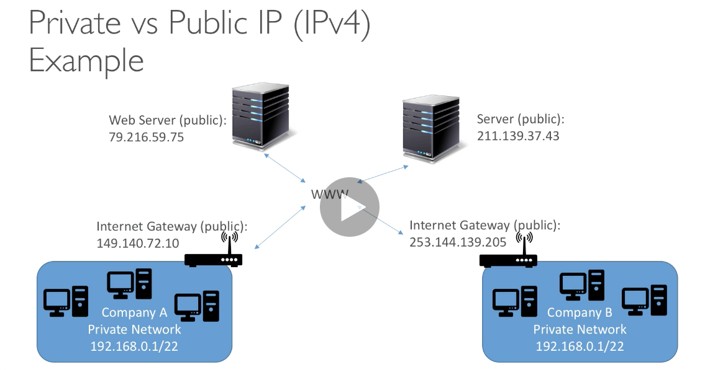
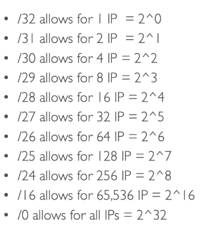
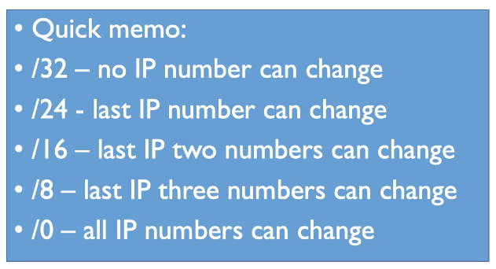

import Button from "@material-ui/core/Button"
import { withStyles } from "@material-ui/core/styles";

export const StyledButton = withStyles({
	root: {
		background: "linear-gradient(315deg, #fc9842 0%, #fe5f75 74%)",
		borderRadius: 7,
		border: 0,
        color: "inherit",
		height: 35,
		padding: "0 30px",
		boxShadow: "0 3px 5px 2px rgba(255, 105, 135, .3)",
	},
	label: {
		textTransform: "capitalize",
	},
})(Button)

## I. Basics

1. There are two types of IPs - Public and Private
    1. Public IP: It is unique and can be easily identified on the internet
    2. Private IP: It is not unique and can only be identified in a private network

2. Private IPs can talk on internet when attached to NAT + Internet Gateway.
3. **An elastic IP is a static IP unless you delete it. AWS provides up to 5 elastic IPs. Avoid it and use DNS name instead.**
4. An example IP is written as 192.168.1.0. The Classless Inter-Domain Routing  (CIDR) notation would be 192.168.1.0/24
5. We can then find out the subnet mask from /24. Here, 24 means the first 24 bits are on. 
6. /24 = 11111111.11111111.11111111.00000000 = 255.255.255.0
7. Hence, the subnet mask for our network is 255.255.255.0 which means that we can add 254 devices to our network without worrying about gateways etc.

## II. CIDR

1. They help define an IP address range
2. A CIDR has two components
    1. Base IP (1.2.3.4)
    2. Subnet mask (/26)

3. The base IP represents an IP contained in a range
4. Subnet CIDR cannot overlap
5. All subnets must have an associated route table
6. Max CIDR size in AWS is /16 
7. The subnet mask defines how many bits can change in the IP
8. The subnet mask can take two forms
    1. 255.255.255.0 (less common)
    2. /24 (more common) 

## III. Private vs Public

1. IANA mandates certain blocks of IPv4 addresses to private and rest to public.
2. For private IPs, 
    1. Big networks → 10.0.0.0 — 10.255.255.255 (10.0.0.0/8)
    2. Default AWS VPC → 172.16.0.0 — 172.31.255.255 (172.16.0.0/12)
    3. Home networks → 192.168.0.0 — 192.168.255.25 (192.168.0.0/16)

3. Everything else is public IP.
4. **You cannot change the size of an existing CIDR block!**
5. When you associate a CIDR block with your VPC, a route table entry is automatically created with the target as **local**
6. The CIDR block is ready for use when it is in the `associated` state.
7. Elastic IPs are static IPs that you own unless you release them. Avoid using it.
8. Try using random public IPs and associate them with a DNS name.
9. **Best way is to use ELB and not use public IP at all.**
10. **Private subnets do not have a routing table entry to an internet gateway.** They are not directly accessible from the public internet. Typically use a NAT gateway to support restricted, outbound public internet access. NAT gateways MUST be on public subnet.
11. For public subnets, they include a routing table entry to an IGW to support inbound/outbound access to the public internet.
12. Security Groups are stateful (automatically allow response after a request)
13. NACL act as firewall for subnet. They intake rule based on numbers (100, 200 etc). There's a default NACL for every subnet.

<StyledButton href="/docs/notes_vpc">Back to VPC</StyledButton>
