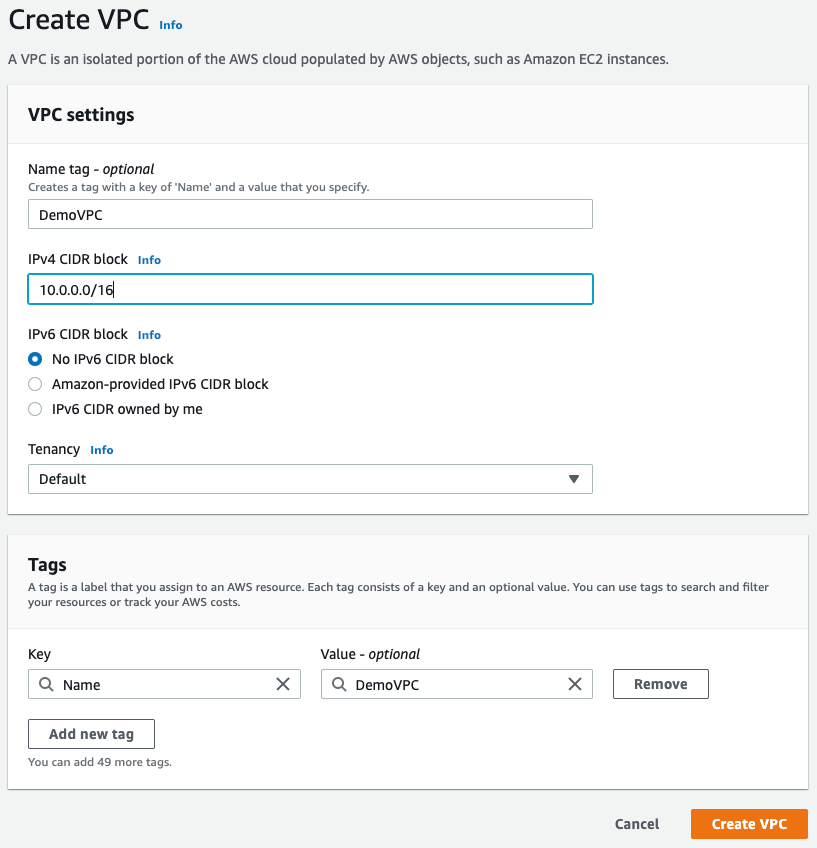
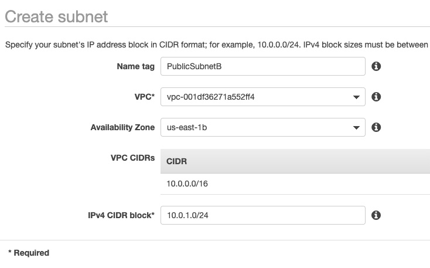
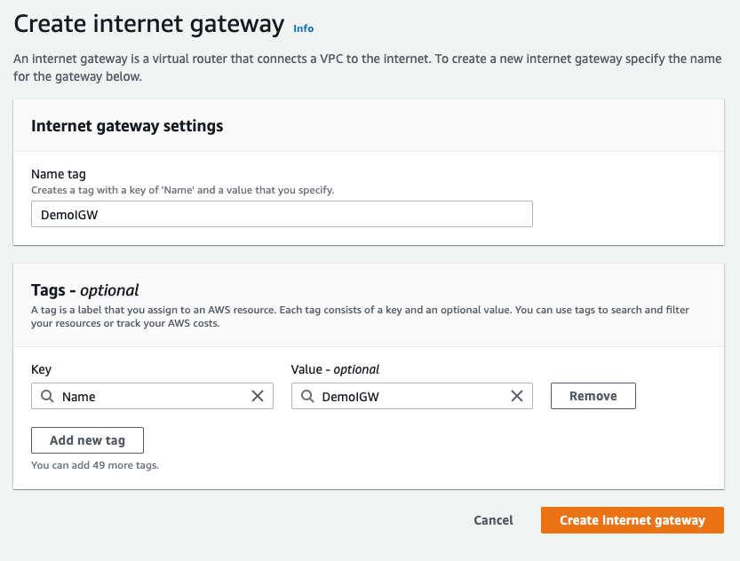
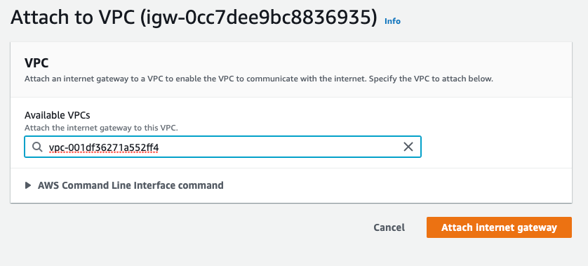
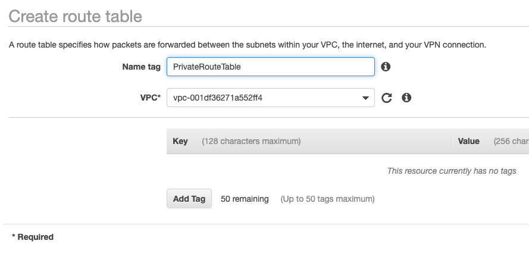
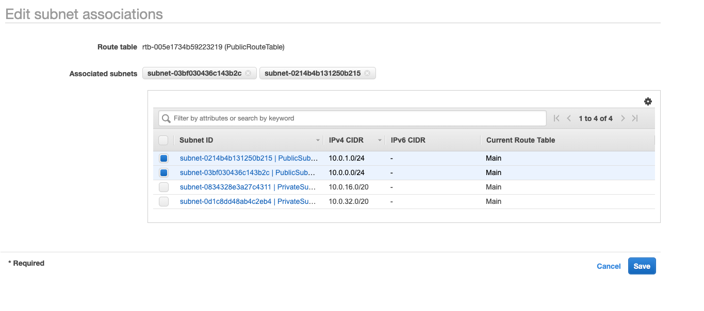
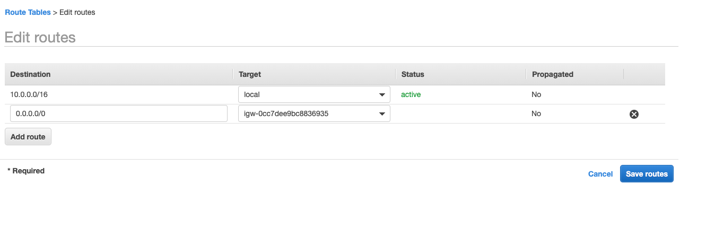
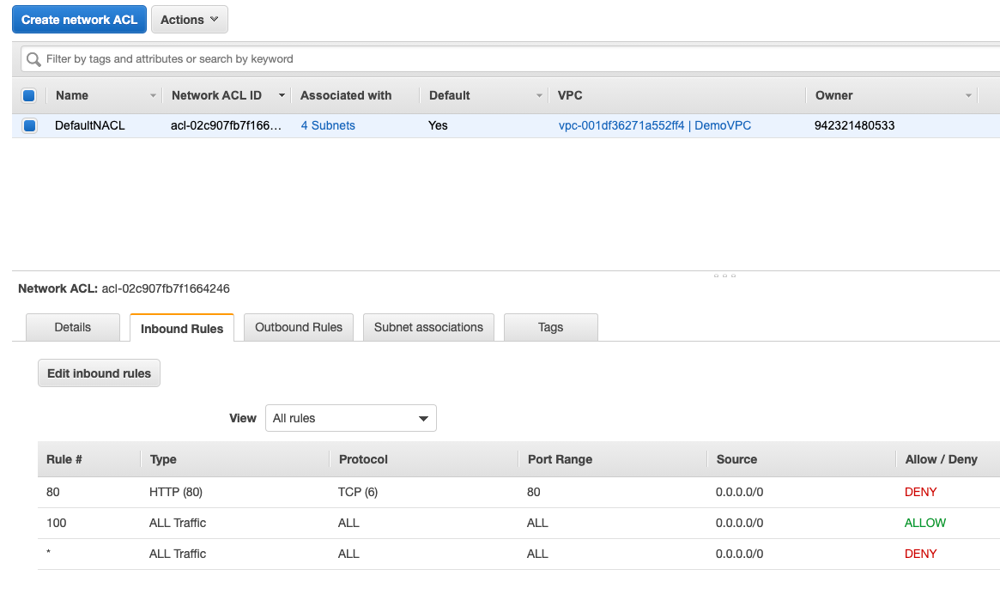

import Button from "@material-ui/core/Button"
import { withStyles } from "@material-ui/core/styles";

export const StyledButton = withStyles({
	root: {
		background: "linear-gradient(315deg, #fc9842 0%, #fe5f75 74%)",
		borderRadius: 7,
		border: 0,
		color: "inherit",
		height: 35,
		padding: "0 30px",
		boxShadow: "0 3px 5px 2px rgba(255, 105, 135, .3)",
	},
	label: {
		textTransform: "capitalize",
	},
})(Button)


## Creating a VPC

Step-by-step instructions on creating a VPC.

### Step 1: Create a VPC



### Step 2: Add subnets

Two public and two private subnets across two AZs.



### Step 3: Create EC2 and attach VPC to it

Make sure to enable auto assign IPs for each public subnet before attaching them to EC2.





### Step 4: Create route table and associate it to subnet

One each for public and private





**Edit route for public route table to associate any request from 0.0.0.0 to igw**



Now you should be able to connect to the EC2 instance through SSH. 

The public subnet is now also the **bastion host**.

### Step 5: Allow HTTP access with NACL

Edit security group of EC2 (launch-wizard-xyz) to allow HTTP on port 80.

```bash
# Sample Apache server
sudo su
yum install httpd -y
systemctl enable httpd
systemctl start httpd
echo "hello world" > /var/www/html/index.html
```

This will display the page on EC2 URL.

You can then explicitly deny it by setting a new inbound rule in NACL of the VPC.



1. Rules are evaluated starting with the lowest numbered rule. As soon as a rule matches traffic, it's applied immediately regardless of any higher-numbered rule that may contradict it.
2. In the above example, Rule 80 will be evaluated and then won't go further to Rule 100 or the default rule (*).


<StyledButton href="/docs/notes_vpc">Back to VPC</StyledButton>
